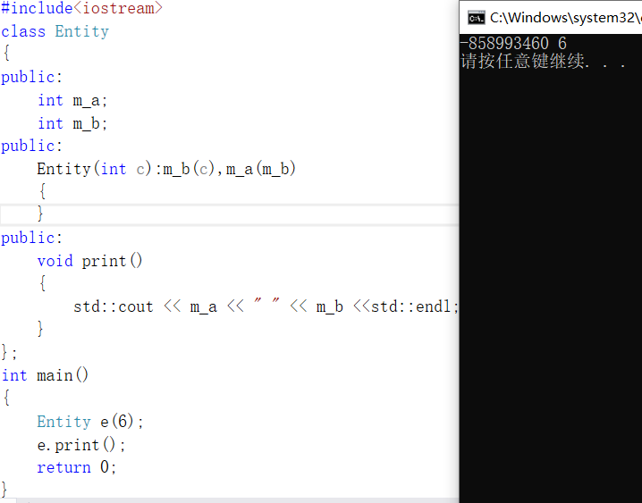
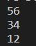

### VSCODE+CLANG+CLANGD+CMAKE

+ 安装llvm+clang，在github上下载

  

+ 安装任意版本的vs，打开x64 Native Tools Command Prompt控制台，输入code打开vscode（不是必须，这样可以防止后续生成窗口程序，链接windows库的时候出现错误）

+ 在vscode中ctrl+shift+p，打开CMake:Edit User-Local CMake Kits

  

  

+ 选择使用clang编译器

  

+ 终端输入ninja --version，查看是否安装上了ninja构建工具

+ 

  按F7，成功生成

+ 安装clangd插件

+ 配置clangd

  ```
  "clangd.arguments": [
  "--background-index",
  "--compile-commands-dir=build",  //compile_command.json相对路径，cmake默认生成在build，自行配置
  "-j=12",
  "--all-scopes-completion",
  "--completion-style=detailed",
  "--header-insertion=iwyu",
  "--pch-storage=memory",
  "--cross-file-rename",
  "--enable-config",
  "--fallback-style=WebKit",
  "--pretty",
  "--clang-tidy"
  // 网上别人配置clang++，但我这边windows、linux实测不加这行也没啥问题，可能mac可能需要另外加
  "--query-driver=clang++",
  ],
  ```

+ 下载语言服务器

  

#### 程序的生成过程

+ **预处理（.c—.i）处理宏**

  + #ifndef #ifdef 条件预处理
  + #include 将头文件的内容复制到当前位置
  + #define 简单文本替换
  + 对文件进行序号标识
  + 删除 /**/ // （注释）
  + 对于#pragma保留不做处理

+ **编译（.i—.s）转换为汇编语言文件**

  对预处理后的文件，进行词法分析、语法分析、语义分析、代码优化、目标代码生成（汇编代码）

+ **汇编（.s—.o）得到机器语言**

  将汇编代码转换为机器码语言文件（二进制文件）

+ **链接**

  将机器码语言文件转换为.exe,装入到内存中

#### **预处理**

​	gcc -E main.cpp > main.i

#### 编译

​	gcc -c main.cpp

​	将cpp文件转换成一种称为目标文件的中间格式，这些obj(.o)（包含机器代码的文件，以及其他我们定义的常数数据）文件可以传递到链接

​	编译时的基本单位是源文件（因为头文件是以复制粘贴的方式，被粘贴到了源文件中再编译） 

#### 链接

​	找到符号和函数在哪里，并把它们连接起来。（程序要有入口点，不一定是main()，否则会发生链接错误）

​	当前编译单元所调用到的函数它的实现不一定在当前编译单元中


#### 	头文件与源文件

头文件不参与编译，而每一个源文件自上而下独立编译

头文件：类型的声明、函数的声明、宏的定义、类定义

源文件：变量初始化、函数的实现

静态常量成员一定要在源文件中进行初始化。 

常函数数在头文件中声明，在源文件中实现除了要加类名:: ，要保留const关键字。

静态函数在头文件中声明，在源文件中实现除了要加类名:: ，要去掉static 关键字。

虚函数数在头文件中声明，在源文件中实现除了要加类名:: ，要去掉virtual关键字。


“ "这种形式的头文件优先搜索当前目录下有没有这个文件，找不到再搜索系统目录

<>这中形式的头文件表示不要在当前目录下搜素，只在系统目录搜索

**<cstdio>可以理解为C++中的<stdio.h>,它会在变量及函数前加上std::**

**C++需要声明**


让编译器知道hello是一个函数，不是一个变量或者类的名字，也需要知道函数的参数和返回值类型，这样才能支持重载，隐式类型转换等特性，在链接的时候找到hello的定义

**为什么需要头文件**

​	里面存放函数的声明，这样当cpp文件需要使用函数时，只需要导入头文件即可。 


#### extern

​	表明变量或者函数是定义在其他文件中的

1. **一个c文件需要调用另一个c文件里的变量或者函数，而不能从.h文件中调用变量**

   

   

2. **引用函数**

   如果需要调用其他.c文件中的函数，在文件中的函数声明前加extern即可，不加extern而直接声明函数也可以，因为声明全局函数默认前面带有extern

3. **extern "C"**

   C++在编译的时候为了解决函数的重载问题，会将函数名和参数联合起来生成一个中间的函数名称，而C语言则不会，因此会造成链接时找不到对应C语言函数的情况，此时C函数就需要用extern “C”进行链接指定，这告诉编译器，请保持我的名称，不要给我生成用于链接的中间函数名。

   ```c++
   //在.h文件的头上
   #ifdef __cplusplus
   #if __cplusplus
   extern "C"{
   　#endif
   　#endif /* __cplusplus */ 
   　…
   　…
   　//.h文件结束的地方
   　#ifdef __cplusplus
   　#if __cplusplus
   }
   #endif
   #endif /* __cplusplus */
   ```

   

### C

#### 反码 补码

**有符号整数、无符号整数**

00000000表示0，10000000表示-0，同一个数有两个二进制表示，是不对的。而且原码加减运算复杂，一个数加上它的相反数也不等于0，因此产生了反码。我们可以将负数平移一下，10000000表示-1，11111111表示-128（理解反码），这样0的二进制就不重复了

**反码：**正数的反码还是原码，负数的反码就是它的原码除符号位外，取反，这样做，一个数加上它的相反数等于0，但是两个负数相加的结果还是不对，在运算时还要针对有无符号数制作两种电路板，因此产生了补码。

**补码：**正数的补码等于它的原码，负数的补码等于反码加1。10000000表示-128，11111111表示-1，


虽然64位计算机的寄存器能处理64位的整数，处理器去读写内存的时候靠的是寄存器提供的地址，因此寄存器的大小（也就是字的大小）决定了它能读写的内存大小，实际上的内存地址并没有64位

实际上地址的高16位始终和第48位一致（符号扩展），也就是虚拟地址空间只有48位。

而经过MMU映射后实际给内存的地址只有39位，因此如今的x64架构实际上只能访问**512GB内存**，如果插了超过这个大小的内存条它也不会认出来

16位计算机实际上能通过额外的段寄存器访问到20位的内存地址（1MB）

32位计算机还能通过PAE技术（物理地址扩展）访问到36位的内存地址（64GB）

64位计算机反而是因为16777216TB太大，内存地址被阉割到了39位（512GB）


#### 类型位数


**字面常量：通过修饰符来确定**

+ 在数字后面加上U和L可以表示不同类型的字面常量
+ 32是 int 类型
+ 32L是 long 类型
+ 32LL是 long long 类型
+ 32U是unsigned int 类型
+ 32ULL是 unsigned long long 类型


**标准化的类型：stdint.h**

+ 实际上，尽管主流操作系统上int都是32位的，C语言标准并没有规定int 就是32位的
+ int甚至可以是16位的，只不过主流操作系统一致认为是32位而已，并不是标准所保证的
+ 为了解决不同操作系统上对类型定义混乱的问题，C语言标准引入了stdint.h这个头文件。
+ 他里面包含一系列类型别名（typedef），这些别名保证不论是什么操作系统什么架构，都是固定的大小
+ typedef char int8_t
+ typedef short int16_t
+ typedef int int32_t
+ typedef long long int64_t 
+ typedef unsigned char uint8_t
+ 这样不论操作系统对类型的定义如何混乱，这些标准化的类型都是确定的大小，这样就避免了跨平台的麻烦


**intptr_t和uintptr_t：自动随系统位数决定大小**

+ intptr_t在32位平台上等价于int32_t，在64位平台上等价于int64_t
+ uintptr在32位平台上等价于uint32_t，在64位平台上等价于uint64_t
+ size_t：表示大小的整数类型，其实等价于uintptr_t
+ ssize_t等价于intptr_t，是Unix/Linux系统特有的，Windows上不存在


**整数互转**

源类型<目的类型：有符号->符号扩展，无符号->零扩展

char<short -128 10000000->11111111 10000000

​					  127 01111111->00000000 01111111


**浮点数的二进制表示**

+ float由4个字节组成 ，也就是32位
+ 最高位是符号位，接着是8位指数位（e）
+ 剩下的23位是底数位（m）
+ 值得注意的是指数位（e）是+127以后表示的
+ 浮点数实际表示的值是  &plusmn;1.mmmmmmm 2^e


**abs()**


​	printf不知道参数是什么类型，会误认为是float参数，直接把int类型的4个字节推到栈上作为printf的参数，而printf会把这4个字节作为浮点数来处理，由于浮点数的指数位在高位，但整数是3，导致高位都是0，所以printf误读出来的float会是一个很小的数

cmath和math.h的区别（其他头文件类似）：cmath会有std::，是C++版本的math.h，例如上面的图片中，想要用C++有重载的abs()，需要头文件cmath


一般再栈上不能定义动态数组（gcc编译器可以，msvc不行）


#### 字符串

```c++
int main()
{
    // char *str = "asdasdasd"         指向字符常量区的指针不能修改
    char *str = new char [10];
    //str = "asdasdasd";             //str由指向堆区变为指向字符常量区 
    strcpy_s(str,10,"aaaaaaaaa");
    std::cout << str << std::endl;
    delete[] str;                    //不能删除字符常量区
    str = 0;
    return 0;
}
```

```c++
char str[10] = "asdasdasd";		//在栈区定义一个字符数组，然后将字符常量区的字符串拷贝过来，可以指定数组长度，也可以不指									  定，字符数组只有在定义时才能将整个字符串拷贝过来
//str = "aaaaaaaaa";			//str为地址常量不能赋值
strcpy_S(str,10,"aaaaaaaaa");
```


#### **strcpy memcpy区别**

```c++
char *strcpy(char *_Destination, const char *_Source);		//仅用于字符串的复制
void *memcpy(void *_Dst, const void *_Src, size_t _Size);	//用于一般内存的复制，字符数组、结构体、类等
```

1. 复制的内容不同。strcpy只能复制字符串，而memcpy可以复制任意内容，例如字符数组、整型、结构体、类等。
2. 复制的方法不同。strcpy不需要指定长度，它遇到被复制字符的串结束符"\0"才结束，所以容易溢出。memcpy则是根据其第3个参数决定复制的长度。
3. 用途不同。通常在复制字符串时用strcpy，而需要复制其他类型数据时则一般用memcpy
   


#### namespace 

​	命名空间主要用于区分同一个作用域下的相同成员。

```c++
//定义命名空间
namespace A{
    namespace functions{
        void print(const std::string &text)
        {
            std::cout << text << std::endl;
        }
    }
    void print_a() {}
}
namespace B{
    void print(const char *text)
    {
        std::string temp = text;
        std::reverse(temp.begin(),temp.end());
        std::cout << temp << std::endl;
    }
}
int main()
{
    //使用命名空间的两种方法
    //using namespace A::functions;
    namespace a = A::functions;     //给命名空间取别名
    // using namespace A;
    // using namespace B;
    a::print("hello");
    A::print_a();
}
```


#### new

​	动态分配内存（堆区）

​	指针变量 = new 数据类型

```c++
//定义指针变量，去掉*和指针变量名，剩下的是指针要操作的数据类型
//new 整形指针
int * (*p) = new int*;
delete p;
p = 0;
//new 整形指针数组
int *(*p1) = new int*[3];
delete[] p1;
p1 = 0;
//new 整形二维数组
int (*p2)[3] = new int[2][3];
delete[] p2;
p2 = 0;
//new 数组指针
int (**p3)[3] = new (int (*)[3]);

int *p1 =new int;
int *p2 =new int(10); //申请空间并初始化

int *p1 =new int[10];
int *p2 =new int[10](); //新建int类型数组并初始化，每个元素为0
char *p3 =new char[10](); //新建char类型数组并初始化，每个元素为空字符'\0'
```

#### **new malloc区别**

1. new、delete是关键字，需要C++编译器的支持，malloc()、free()是函数，需要头文件支持
2. new申请空间不需要指定申请大小，根据类型自动计算，new返回的是申请类型的地址，不需要强转，malloc()需要显示的指定申请空间大小（字节），返回void*，需要强转成我们需要的类型
3. new申请空间的同时可以设置初始化，而malloc需要手动赋值
4. new申请类、结构体对象内存空间会自动调用构造函数，delete会自动调用类、结构体的析构函数，单独的malloc()和free()则不会调用构造、析构函数。

#### 函数

​	函数是为了让代码不重复，频繁调用函数会让程序速度变慢（编译器会生成一个call指令，创建一个堆栈结构，跳到二进制文件的不同部分，执行函数指令，通过返回地址，回到函数调用前）

```c++
//函数默认参数，要从后面的参数给出，中间不能有空缺，在函数声明中给出，不能在定义中给出
void show(int a,int b,int c = 3,int d = 4);
int main()
{
   show(1,2);
   return 0;
}
void show(int a,int b,int c,int d)
{
    std::cout << a << " " << b << " " << c << " " << d << std::endl;
}
```

**函数重载**：在同一作用域，函数名相同，参数列表不同（参数的个数或者参数的类型）、返回值可以不同

```c++

//void show(char *p) { printf("char *p\n"); }
//void show(char p[]) { printf("char p[]"); }		//不是重载，参数都是地址

void set(int a) { printf("int a"); }
void set(int &a) { printf("int &a"); }				//是重载，通过函数指针调用

void(*pfun1) (int a) = &set;
void(*pfun2) (int &a) = &set;

int main()
{
	//char *p = new char[6]();
	//show(p);
	//char cArr[9] = { 2,0,0,1 };
	//show(cArr);
	
	int a = 20;
	(*pfun1)(18);
	(*pfun2)(a);  
	return 0;

}
```

**函数重写（覆盖）**：父类与子类之间的虚函数，要求函数名参数列表（个数和类型），返回值都要相同

**函数隐藏**：是指**派生类**的函数屏蔽了与其同名的基类函数，注意只要同名函数，不管参数列表是否相同，基类函数都会被隐藏。

**隐藏，指的是派生类类型的对象、指针、引用访问基类和派生类都有的同名函数时**

**调用函数方法：**	1. 函数名()	2.函数指针调用

```c++
void Print(const char *str)
{
    std::cout << str << std::endl;
}
int main()
{
    void (*pfn) (const char *str);  //定义一个函数指针变量
    pfn = &Print;                   //给函数指针赋值
    (*pfn)("hello");                //调用函数指针
    return 0;
}
```

**如果给函数指针赋值的函数地址是类中的成员函数，那么这个函数应该是static类型的**

1. 类中的普通成员函数是有隐藏参数的
2. 调用类中的任意成员都需要用对象调用，如果普通成员函数可以给函数指针赋值，那么就可以不用通过对象调用，直接通过函数指针调用

```c++
class Entity
{
public:
    static void Print(const char *str)
    {
        std::cout << str << std::endl;
    }
};
int main()
{
    typedef void (*PFUN) (const char *str);
    //PFUN是一个函数指针类型
    PFUN pfn = &Entity::Print; 
    (*pfn)("hello");
    return 0;
}
```

**如果成员函数不能设置为静态的，就需要定义成员函数指针（将成员函数指针看作是类中的成员）**

```c++
//C++中提供新的操作符 ::* .* ->* 支持成员函数指针的操作
class Entity
{
public:
    void Print(const char *str)
    {
        std::cout << str << std::endl;
    }
};
int main()
{
    typedef void (Entity::*PFUN) (const char *str);  //定义一个成员函数指针的类型
    PFUN pfn = &Entity::Print;
    Entity e;
    (e.*pfn)("hello");
    Entity *pe = new Entity;
    (pe->*pfn)("hello");
    return 0;
}
```

#### **inline**

+ 宏在预编译阶段被替换，内联函数在编译阶段被替换
+ inline函数是给编译器的一个建议，而不是必须
+ 牺牲空间换取的时间，（提高函数调用的效率）
+ 函数体代码量少并且逻辑简单（没有for、while）递归等

```c++
inline int add(int a,int b)
{
    return a+b;
}
```

#### 引用

​	引用是C++语言的一个特殊的数据类型描述（给变量起别名）

​	用于在程序的不同部分使用两个以上的变量名指向同一个地址，使得对其中人一个变量的操作实际上都是对同一个地址单元进行的

**注意：**

1. 对引用进行操作，实际上就是对被引用的变量进行操作
2. 引用不是值，不占存储空间，声明引用时，目标的存储状态不会改变
3. 引用一旦被初始化，就不能在重新引用其他空间

**引用与指针的区别：**

1. 引用定义就要初始化
2. 引用初始化后就不能在重新引用其他的空间
3. 引用不占存储空间
4. 不能给引用赋NULL

如果要修改函数传入的参数，堆区的变量用指针，栈区的变量用引用


### 类

**访问修饰符：**

+ public：在任何一个地方都可以见到
+ protected：本类和派生类中可以见到
+ private：只有本类可以见到

**类和结构体的区别：**类默认的访问修饰符是private，结构体默认的访问修饰符是public


**接口：**规定别人必须按照某个过程执行

**如何规定别人必须按照你的规则执行？**

1. 所有能完成这件事的方式屏蔽掉（private）
2. 提供一个唯一可以完成这件事的接口（接口函数）


**构造函数：**

+ 创建对象的时候自动调用构造函数

+ 构造函数可以有多个，但是一个对象只能调用一个
+ 类中如果没有构造，会有一个默认的无参构造

**析构函数：**

​	对象的生命周期结束，自动调用析构函数，清理内存

+ 析构函数不允许有返回值
+ 析构函数不允许带参数
+ 一个类中只能由一个析构函数

+ 类中如果没有析构，会有一个默认的什么都不做的析构函数


**类的大小**

空类的大小为1B,用来占位

类中的成员变量是在创建对象的时候存在，每个对象都有一份

类中的成员函数是在编译的时候存在，只有一份，所有对象公用

**类的大小与构造函数、析构函数、静态成员变量、以及其他成员函数无关，与普通成员变量、虚函数（指向虚函数表的指针，vptr，4/8字节）、继承（子类加父类）有关，虚继承会有一个指向虚基类表的指针，4/8个字节。**


**this**

​	每个非static的成员函数都有一个隐藏的指针，是当前这个类的，this，用来存储调用者对象的地址	


**对象的种类** 

我们最常见的就是在函数内（包含参数）定义的栈区的**局部对象**和 使用关键字 new 在**堆区申请的对象**，局部对象在函数调用完毕或遇到}时生命周期结束，内存空间自动被系统回收，但new出来 对象直到执行delete操作时生命周期结束，内存才会被释放。

 还有一种经常遇见的**全局对象**，他的生命周期比较早，在程序运行时会先调用构造函数初始化全局 对象，然后再执行main函数，直到程序退出前，要回收全局对象内存，调用其析构。

**静态全局对象** 他的声明周期与全局对象是一样，都是伴随着程序的运行开始，直到程序退出。如 果存在多个对象那么哪个对象写在前面先被定义，则先执行其构造，最后在退出时执行析构与构造 的顺序相反。局部对象亦是如此。 

**静态全局对象**与全局对象的区别不在于生命周期，而是在于作用域。 静态全局对象作用于所属源文件里，不能作用到其它源文件文件里，即被static关键字修饰过的对 象具有文件作用域。这样即使两个不同的源文件都定义了相同名字的静态全局对象，它们也是不同 的变量。而全局对象则在所有源文件中共享。 

**静态局部对象**是定义在某个函数中的对象，但它并不是程序已创建就被初始化，而是第一次执行该 函数定义对象时被初始化，以后再调用该函数并不会创建新的对象，此对象只会存在一份。如果函 数一直没有被执行，那么该静态局部对象也不会被初始化。 与静态全局对象对象相比，静态局部对象 创建的晚些，但都是在程序退出前被回收，这也就意味 着我们可以在函数外使用静态局部对象，前提是此对象已经被创建了。

#### **初始化列表**

​	初始化列表初始化内容：父类的构造（遗传自父亲的那份空间），成员（对象成员，const成员，成员初值）的构造或给初值

在C++98中，支持了在类声明中使用等号“=”加初始值的方式，来初始化类中静态成员常量。这种声明方式我们也称之为“就地”声明。就地声明在代码编写时非常便利，不过C++98对类中就地声明的要求却非常高。如果静态成员不满足常量性，则不可以就地声明，而且即使常量的静态成员也只能是整型或者枚举型才能就地初始化。而非静态成员变量的初始化则必须在构造函数中进行。这非常不方便，所以在C++11中，标准允许非静态成员变量的初始化有多种形式。具体而言，除了初始化列表外，在C++11中，标准还允许使用**等号=** 或者 **花括号{}** 进行就地的非静态成员变量初始化。

​	**const常量需要在初始化列表初始化** 

```c++
class Entity
{
public:
	const int m_a;
	int m_b;
public:
	Entity():m_a(6),m_b(6)	//初始化列表
	{
	}
public:
	void print()
	{
		std::cout << m_a << " " << m_b <<std::endl;
	}
};
```

​	**初始化列表执行顺序是变量定义顺序**



​	**一个类中包含另一个类的对象，这个类的初始化列表默认执行另一个类的无参构造，如果在构造函数中初始化对象，而不是在初始化列表初始化对象，会创建两次对象，造成性能浪费**


#### **类之间的关系**

**横向：**

1. 组合：直接要求包含对象对被包含对象的拥有以及包含对象与被包含对象生命期的关系（人与器官的关系，在类内定义另一个类的对象）
2. 依赖：某个对象的功能依赖于另外的某个对象，而被依赖的对象只是作为一种工具在使用，而并不持有对它的引用（人与电脑的关系，在方法中将另一个类的对象通过参数传入）
3. 关联：某个对象会长期的持有另一个对象的引用，而二者的关联往往也是相互的。它们在生命期问题上没有任何约定。被关联的对象还可以再被别的对象关联。（人与朋友的关系，在类中定义另一个类的指针）
4. 聚合：聚合是更强版本的关联，它暗示着一种所属关系以及生命期关系。被聚合的对象还可以在被别的对象关联。（家庭和人的关系）

**纵向：**

**继承（泛化）**

​	继承的优点：提高了代码的复用性

​	继承关系中，同名的成员要类名::区分

​	继承关系中，执行父类的指定构造函数要在初始化列表中调用

#### **继承后父类成员在子类中的访问情况                      **

+ public继承	public->不变	protected->不变	private->不可访问
+ protected继承    public->protected    protected->不变    private->不可访问
+ private继承    public->private    protected->private    private->不可访问
+ 无论怎么继承，除了private在派生类不能访问，其余都可以用，继承的方式不同不影响派生类，影响派生类的对象的访问


子类和父类如果由同名的成员，定义子类对象，默认使用的是子类成员，son.CSon::成员，如果想使用父类的成员，son.CFather::

定义子类对象，在内存中不仅包含子类的成员，也包含父类的成员属性，内存空间首地址开始是父类成员属性，后面是子类的成员属性

**定义子类对象，父类的成员在父类的构造中被初始化，先执行父类的构造（子类构造函数的初始化列表），再执行子类的构造，先执行子类的析构，在执行父类的析构**

**将父类中的析构函数置为虚函数，这样就先执行子类的虚函数，发现子类中有父类的成员（继承），然后在执行父类的析构函数**

在继承关系下，子类和父类中有同名的成员，他们之间的关系为隐藏


**父类的指针可以指向任意一个子类的对象**

+ 优点：统一类型，提高复用性
+ 缺点：只能使用父类的成员

```c++
class Entity
{
public:
	float X,Y;
	Entity()
	{
		X = 6;
		Y = 6;
	}
	void Move(float xa,float xb)
	{
		X+=xa;
		Y+=xb;
	}
};
class Player : public Entity
{
public:
	const char *Name;
};
int main()
{
	Entity *pe = new Player;			//创建一个堆区的对象
	std::cout << pe->X << std::endl;
	pe->Move(6,6);
	return 0;
}

```

**解决父类的指针只能使用父类成员的办法：父类的指针调用指向子类函数的一个函数指针**

```c++
class Entity
{
public:
    void Print()
    {
        std::cout << "Entity" << std::endl;
    }
};
class Player : public Entity
{
public:
    void Print()
    {
        std::cout << "Player" << std::endl;
    }

};
int main()
{
    typedef void (Entity::*PFUN) ();  //定义一个成员函数指针的类型
    PFUN pfn = (PFUN)&Player::Print;
    Entity *pe = new Player;
    (pe->*pfn)();
    return 0;
}
```

#### **虚函数**

​	通过父类的指针调用实际的子类的成员函数，虚函数的作用主要是为了实现多态的机制。

**虚函数与普通函数的区别：**普通函数可以直接找到函数的地址来进行调用，虚函数需要通过虚指针和和虚函数列表来找到虚函数地址进行调用 （空指针可以直接调用普通函数而不能调用虚函数）  

#### **多态**

​	用父类型的指针指向其子类的实例，然后通过父类的指针调用实际子类的成员函数。这种技术可以让父类的指针有“多种形态”，这是一种泛型技术。

**多态的条件：**

+ 存在继承关系
+ 父类的指针指向子类对象
+ 父类中存在虚函数，子类重写了虚函数

重写：子类中存在和父类一摸一样的虚函数

**动态多态的具体实现过程：**

1. 父类要有虚函数，父类就有一个虚函数表

2. 子类继承父类，子类就有一个虚函数表

   子类重写虚函数，就会覆盖虚函数表里面虚函数地址

3. 定义子类对象，子类对象的前4个字节就会有一个虚指针，虚指针指向虚函数表

   父类指针指向子类对象

4. 父类指针调用虚函数，就会根据子类对象的前四个字节，得到虚指针，进而得到虚函数表的入口地址，通过遍历虚函数表，找到对应的虚函数并调用，从而完成多态

在定义对象的内存空间的前面分配__vfptr,在执行构造函数的初始化参数列表进行了初始化，指向了虚函数列表

**虚函数多态，可以利用引用实现多态**


```c++
class EntityBase
{
public:
	virtual std::string GetName() { return "EntityBase"; };                     
};

class Entity : public EntityBase
{
private:
	std::string m_Name;
public:
	Entity(const std::string& name)
		:m_Name(name) {}
	std::string GetName() { return m_Name; }
};

void PrintName(EntityBase *eb)
{
	std::cout << eb->GetName() << std::endl;
}

int main()
{
	EntityBase *eb = new EntityBase;
	PrintName(eb);
    
	EntityBase *e = new Entity("ZH");
	PrintName(e);
    
	system("pause");
	return 0;
}
```


```c++
class Father
{
public:
	virtual void AA()
	{
		std::cout << "Father::AA" << std::endl;
	}
	virtual void BB()
	{
		std::cout << "Father::BB" << std::endl;
	}
	void CC()
	{
		std::cout << "Father::CC" << std::endl;
	}
};
class Son : public Father
{
public:
	virtual void AA()
	{
		std::cout << "Son::AA" << std::endl;
	}
	void CC()
	{
		std::cout << "Son::CC" << std::endl;
	}
	virtual void DD()
	{
		std::cout << "Son::DD" << std::endl;
	}
};
int main()
{
	Father *p = new Son;	
	typedef void (*PFUN) ();
	PFUN pfn1 = (PFUN)*((int*)*(int*)p+0);//函数指针不能偏移
	PFUN pfn2 = (PFUN)*((int*)*(int*)p+1);
	PFUN pfn3 = (PFUN)*((int*)*(int*)p+2);
	PFUN pfn4 = (PFUN)*((int*)*(int*)p+3);//第一次强转(int*)是取对象前四个字节的内容也就是vfptr，第二次强转是取函数指针数组的前四个字节的内容
	(*pfn1)();
	system("pause");
	return 0;
}
```


#### 虚继承

​		虚继承是解决C++多重继承问题的一种手段，从不同途径继承来的同一基类，会在子类中存在多份拷贝。这将存在两个问题：其一，浪费存储空间；第二，存在二义性

​		虚继承的引入主要是为了解决多继承环境下有歧义的层次组合问题（通常被称为“钻石问题”）

```c++
class Base
{
public:
    Base(int n) : value(n)
    { 
        std::cout << "Base(" << n << ")"<< std::endl; // 输出传入值：Base(N)
    }
    Base() : value(0)
    { 
        std::cout << "Base()"<< std::endl; // 没有传入值：Base()
    }
    ~Base() { std::cout << "~Base()"<< std::endl; }
    int value;
};
class One : public Base
{
public:
    One() : Base(1) 
    { 
        std::cout << "One()"<< std::endl; 
    }
    ~One() { std::cout << "~One()"<< std::endl; }
};
class Two : public Base
{
public:
    Two() : Base(2)
    { 
        std::cout << "Two()"<< std::endl; 
    }
    ~Two() { std::cout << "~Two()"<< std::endl; }
};
class Leaf : public One, public Two
{
public:
    Leaf() : { std::cout << "Leaf()"<< std::endl; }
    ~Leaf() { std::cout << "~Leaf()"<< std::endl; }
};
```


在这个实现中，`Leaf`实例持有两个`Base`类的拷贝：第一个来自于`One`，第二个来自于`Two`。这样的实现使得下面语句：

```c++
Leaf lf;
lf.value = 0; // 编译错误！
```

通常，我们会尽量避免一个`Leaf`对象持有多个`Base`类。这可以通过使用虚继承实现：我们可以在继承的子类添加`virtual`关键字：`class One : public `**virtual**` Base…`以及`class Two : public `**virtual**` Base…`。使用`virtual`关键字，`Leaf`类仅会调用一次`Base`类的构造函数，因而也就只构建了一个`Base`。`Leaf`内部只持有一个`Base`子对象（该子对象也会被`One`和`Two`“共享”）。这就是我们所需要的。

那么问题来了，“编译器怎么知道该给`Base`的构造函数传哪个参数？”的确，我们有两个选择：`One`的构造函数调用了`Base(1)`，`Two`的构造函数调用了`Base(2)`。那么，我们究竟该选哪个？答案很明显：哪个都不选。`Leaf`的构造函数**直接**调用时，编译器选择的是`Base()`的默认构造函数，而不是`Base(`**1**`)`或者`Base(`**2**`)`。 

编译器会隐式在`Leaf`初始化列表中添加`Base()`的调用，并忽略其它`Base()`构造函数的调用。因此，初始化列表类似这样：

```c++
class Leaf : public Base(), public One, public Two
{
    ...
}
//当然，我们也可以给Leaf的初始化列表显式添加Base(...)语句，例如，我们需要给构造函数传入参数 3，那么就可以这么写：
//class Leaf : public Base(3), public One, public Two
{
    ...
}
```

**虚继承应用**

+ 最终类

所谓“最终类”，是一种能够在堆上或者栈上创建实例，但是不能被继承的类。换句话说，下面的代码是合法的：

```c++
Final fd;
Final *pd = new Final();
//但是，下面的代码则会给出一个编译错误：
class Derived : public Final{};

//在 C++ 标准引入final关键字之前的很长一段时间，最终类问题都是通过虚继承解决的。例如More C++ Idioms/Final Class这里所阐述的。其解决方案如下所示：

class Seal
{
    friend class Final;
    Seal() {}
};
class Final : public virtual Seal
{
public:
    Final() {}
};
//继承Final会引发一个编译错误“不能访问Seal类的私有成员”：

class Derived : public Final
{
public:
    Derived() {} // 编译错误：
                 // cannot access private member of class Seal
};
```

这个技巧的关键是虚继承：`Derived`构造函数必须直接调用`Seal`的构造函数，而不能通过`Final`的构造函数间接调用。但是，这又是不允许的：`Seal`类只有私有构造函数，而`Derived`类又不是像`Final`那样是`Seal`的友元。`Final`类本身允许调用`Seal`的私有构造函数，因为它是`Seal`的友元。这就是为什么`Final`可以在栈上或者堆上创建对象。

这个解决方案建立在虚继承的基础之上。如果移除继承声明`class Final : public `**virtual**` Seal`中的`virtual`关键字，`Derived`类就可以通过`Final`类间接调用`Seal`的构造函数（因为后者是`Seal`的友元），这个魔法就消失了。

+ 在构造函数中调用虚函数

#### **抽象类和接口类**

+ 含有纯虚函数的类就是抽象类
+ 所有函数都是纯虚函数的类就是接口类

C++阻止一个类被实例化：

+ 抽象类
+ private构造函数

**接口（纯虚函数）**

​	在基类中定义没有实现的函数，然后强制子类去实现该函数

​	创建一个类，只有未实现的方法组成，然后强制子类去实际实现它们，这就叫接口，接口中只包含未实现的方法，由于这个接口类实际上并不包含方法实现，所以并不能实例接口类

```c++
class Printable
{
public:
	virtual std::string GetClassName() = 0;
};
class EntityBase : public Printable
{
public:
	std::string GetClassName() override { return "EntityBase"; }
};
class Entity : public EntityBase
{
public:
	std::string GetClassName() override { return "Entity"; }
};
void PrintClassName(Printable *obj)
{
	std::cout << obj->GetClassName() << std::endl;
}
int main()
{
	EntityBase *p1 = new EntityBase;
	EntityBase *p2 = new Entity;
	PrintClassName(p1);
	PrintClassName(p2);
	system("pause");
	return 0;
}
```

#### **虚析构**

​	通过父类的指针完整删除一个子类的对象

```c++
class EntityBase
{
public:
	EntityBase()
	{
		std::cout << "EntityBase" << std::endl;
	}
	virtual ~EntityBase()
	{
		std::cout << "~EntityBase" << std::endl;
	}
};
class Entity : public EntityBase
{
public:
	Entity()
	{
		std::cout << "Entity" << std::endl;
	}
	~Entity()
	{
		std::cout << "~Entity" << std::endl;
	}
};
int main()
{
	{
		EntityBase *p = new Entity;
		delete p;
	}
	system("pause");
	return 0;
}
```

 **多态是基于虚函数实现的，虚函数要基于重写才可以**

#### **虚函数实现多态原理**

1. 函数指针
2. 需要维护一个由函数指针组成的虚函数列表（vtable），还需要记录使用那个列表的指针（vfptr）
3. 当调用一个虚函数，通过vfptr找到对应的vtable，调用表里的函数指针，如果在子类中重写了，表中装的就是子类的函数（覆盖），调用的也就是子类
4. vtable每个类包含一个编译期存在，vfptr是在创建对象的时候存在，每个对象有一个，在构造函数里初始化，指向对应的虚函数列表

**多态的优缺点：**

+ 优点：调高复用性和扩展性
+ 缺点：空间（虚指针，虚表）、效率（调用）、安全性（私有函数不能定义为虚函数，在类外可以调用）

**C++面向对象**

​	把有关系的数据和算法封装到类中，类是抽象的，实际存在的是对象。

**封装、继承、多态**


#### **const**

+ 不能改变指针指向的内容（常量指针）


+ 不能改变指针本身（指针常量）


+ 既不能改变指针本身也不能改变指针指向的内容（常函数常量）


**常函数，不能修改类中的成员属性**


**const方法中需要修改变量，用mutable来定义变量**

```c++
class Entity
{
private:
	int m_X;
	mutable int m_Y;

public:
	int GetX() const
	{
		m_Y = 6;
		return m_X;
	}
	int GetX()
	{
		return m_X;
	}
};
void PrintEntity(const Entity& e)			//不能修改e中的成员属性
 {
	std::cout << e.GetX() << std::endl;		//使用GetX的const版本
}
```


**常量对象只能调用const方法**


#### static

+ **类内**
  + 不依赖对象，类公用的，在类外初始化，不能在.h文件初始化（重定义）要在.cpp文件初始化，而不管创建了多少个该类的对象。所有这些对象的静态数据成员都共享这一块静态存储空间。	
  + 修饰成员函数：没有this指针，可以不依赖对象调用，类公用的，不可以声明为虚函数，不能直接调用类中的非静态成员
  + **在类中使用static的原因：**
    1. 可以让所有类实例之间共享数据
    2. static与类有关

+ **类外**

  + 在类或结构体外部使用static，链接将只是在内部，只能在定义它的cpp文件可见

  + static修饰类外变量：修饰全局，是全局静态变量(当前源文件)，生命周期到程序退出时结束，(存在静态区/全局区)

    ​									修饰局部，是局部静态变量(只能在所在函数中使用)，生命周期到程序退出时结束，(存在静态区/全局区)

  + static局部变量不初始化时，默认值为0；

  + 普通局部变量不初始化时，默认值为随机值。

  + static局部变量在编译阶段，函数还未执行的时候，就已经分配了变量空间。


**local static**

```c++
class Singlaton
{
private:
	int m_num;
	static Singlaton *s_Instance;
public:
	Singlaton()
		:m_num(6) {}
	static Singlaton& Get() { return *s_Instance; }
	void Print() { std::cout << m_num << std::endl; }
};

Singlaton *Singlaton::s_Instance = new Singlaton;

int main()
{
	Singlaton::Get().Print();
	system("pause");
	return 0;
}

/*--------------------------------------------------------*/

class Singlaton
{
private:
	int m_num;
public:
	Singlaton()
		:m_num(6){}
	static Singlaton& Get() {
		static Singlaton instance;
		return instance;
	}
	void Print() {std::cout << m_num << std::endl; }
};
int main()
{
	Singlaton::Get().Print();
	system("pause");
	return 0;
}
```

​	

#### 枚举

```c++
enum Example : unsigned char
{
    A = 9,B = 17,C
};
int main()
{
    Example e = C;  
    std::cout << (e == 18) << std::endl;
    return 0;
}
```

#### define

**缺点：没有类型检查**

```c++
// \代表和下一行连接
// 宏的参数也是替换
// ##是连接符
// #代表字符串

#define A(ThisClass)\
	ThisClass ps##ThisClass;\
	ps##ThisClass.show();

#define B(ThisClass) std::cout<<#ThisClass<<std::endl;
int main()
{
	A(CPerson);
	B(CPerson);
	system("pause");
}
```

```c
#define mul(X,Y) X*Y
printf("%d\n",mul(6+6,6+6));
//输出48而不是144,说明只是简单的机械替换,应该把参数加上括号
mul(X,Y) (X)*(Y);

#define add(X,Y) (X)+(Y);
printf("%d\n",10*add(6,6));
//输出66而不是120,因该把整个宏定义加上括号
add(X,Y) ((X)+(Y));
```


#### union

​	成员变量是共享同一块内存的。找到联合体中最大的数据类型，还必须满足是所有数据成员的整数倍（字节对齐，每四个字节对齐）


+ 修改一个成员的值会影响其他成员

  

#### 重载操作符

​	必须要对象参数，而且需要返回值，这个返回值急需的和其他符号结合

**重载操作符方式有两种：**

1. 类内重载，对象一定要在符号的左边

```c++
int operator=(int num);
int CPerson::operator=(int num)
{
	m_Age = num;
}
CPerson ps;
ps = 100;
std::cout<<ps.m_Age<<std::endl;
```

```c++
int  CPerson::operator+(CPerson &ps)	
{
	return m_Age+ps.m_Age;
}
CPerson ps2;
ps2 = ps1+ps;					//对象在重载操作符的左边，在类内重载，函数参数只关系重载操作符右边变量的类型
std::cout<<ps2.m_Age<<std::endl;
```

```c++
CPerson &operator=(const CPerson &ps)	//类默认的operator= 浅拷贝
{
	this->m_Age = ps.m_Age;
	return *this;
}
```

```c++
CPerson &operator=(const CPerson &ps)	operator=深拷贝
{
	//删除原有的空间
	delete this->m_Age;
	this->m_Age = new int;
	*(this->m_Age) = *(ps.m_Age);
	return *this;
}
```


2. 类外重载，对象要在符号的右边（双目运算符）

```c++
int operator+(int num,CPerson &ps)	//参数的顺序就是重载操作符左右边的顺序
{
	return num+ps.m_Age;
}
ps2 = 100+ps1;
std::cout<<ps2.m_Age<<std::endl;
```

```c++
std::istream& operator>>(std::istream &is,CPerson& ps)
{ 
	is >> ps.m_Age;
	return is;
}
std::ostream& operator<<(std::ostream &os,CPerson &ps)
{
	os<<ps.m_Age;
	return os;
}
std::cin>>ps1;
std::cout<<ps1;
```

```c++
int CPerson::operator++(int a)	//右加加，参数的作用是区分左加加和右加加
{
	int flag = m_Age;
	m_Age+=1;
	return flag;
}
int CPerson::operator++()		//左加加
{
	m_Age+=1;
	return m_Age;
}
```

迭代器是通过类和重载操作符实现的

#### 拷贝构造函数

​	构造函数的参数是当前这个类的一个const类型的引用，默认是浅拷贝（复制一个对象，把类中的成员变量复制一份，如果成员变量中有指针，会使两个指针指向同一块空间，对象生命周期结束时会调用两次析构函数，释放两次，引发错误），避免浅拷贝的方法是参数为指针或者引用，或者深拷贝。

```c++
class CPerson
{
public:
	int *m_Age;
public:
	CPerson(){
		m_Age = new int(100);
	}
	CPerson(const CPerson &ps){    //默认的是浅拷贝		
		m_Age = ps.m_Age;		   //把ps的m_Age赋值给ps1的m_Age 
	}
	CPerson(const CPerson *ps){    // 深拷贝
		this->m_Age = new int;
		*(this->m_Age) = *(ps->m_Age);
	}
	~CPerson(){
		delete m_Age;
		m_Age = 0;
	}
};
int main()
{
	CPerson ps;
	CPerson ps1(ps);
	system("pause");
	return 0;
}
```

```c++
void QQ(CPerson ps1)	//CPerson ps1相当于CPerson ps1(ps)改成CPerson &ps1可以避免浅拷贝
{
	
}
CPerson ps;
QQ(ps);
```

**何时调用构造函数**

1. 类名 新对象 （已存在的对象）
2. 类名 新对象 = 已存在的对象
3. 类名 *新对象 = new 类名(已存在的对象)
3. 函数参数传递时，将实参传递给形参
3. 函数返回一个对象时

#### 转换构造函数

```c++
#include<iostream>
class Entity
{
public:
	int m_a;
	int m_b;
	char m_c;
public:
	//Entity(int a)			 //转换构造函数，隐式类型转换
	//{
	//	m_a = a;
	//}
	//Entity(int a, int b = 7) //转换构造函数，隐式类型转换
	//{
	//	m_a = a;
	//	m_b = b;
	//}
	//explicit Entity(int a, int b = 7)	//explicit	禁止隐式类型转换
	//{
	//	m_a = 6;
	//}

};
int main()
{
	/*Entity e = 6;*/
	/*Entity e(6);*/
	Entity e = { 6,7,'c' };
	std::cout << e.m_a <<" " << e.m_b << " " << e.m_c << std::endl;
	return 0;
}
```

#### **空类中默认的函数**

​	默认无参构造、析构、拷贝构造、operator=   

​	拷贝构造、operator=这两个默认的都是浅拷贝

#### 变参模板

可以让函数或者类的方法有接受任意个参数的能力

**typename...：**修饰变参模板的模板参数

**Args...：**告诉编译器函数的参数是可变的

```c++
#include<iostream>

void myprint() {}

template<typename T,typename... Args>
void myprint(T firstArg, Args... args) {
	std::cout << firstArg << std::endl;
	myprint(args...);
}

int main()
{
	myprint(2001, 6, 6, "zh");
	return 0;
}
```

**Args、args 解包(pack expansion)：**第一次调用myprint时，第一个参数firstArg被推导成了int型的，Args...被推导成了int型的E1、int型的E2、const char *型的E3.剩下的情况一样，直到最后myprint()的参数为空，函数结束，这也就是为什么在上面定义了myprint()的原因


**sizeof...**

​	帮助我们在编译的时候就知道函数被调用时到底传了几个参数

```c++
template<typename... Args>
void func(Args... args) {
	std::cout << "sizeof...(Args)" << sizeof...(Args) << std::endl;
	std::cout << "sizeof...(args)" << sizeof...(args) << std::endl;
	std::cout << "---------------" << std::endl;
}
int main()
{
    func(2001,6,6,"zh");
    func(2001, 6, 6);
	func(2001, 6);
	func(2001);
	func();
	return 0;
}
```


#### 函数模板

**template：**定义模板的关键字

**typename：**定义模板类型的关键字

**<>：**模板的参数列表 

如果函数的声明和定义分开，那么在声明和定义处都需要加上模板，如果模板存在默认值，那么只 在函数声明时指定即可。

**注意事项：**如果函数的声明和定义分开，因为源文件是单独编译的，如果模板函数定义所在的源文件中并没有使用模板函数，那么模板函数就不会被实例化，在主函数就会找不到模板函数的定义。

**模板实例化：**编译器由函数模板自动生成模板函数的过程叫模板的实例化

**隐式实例化：**编译器能够根据实参自动推导出模板类型，并生成对应的类型的函数

**优先级：手动显示指定 > 通过实参自动推导 > 模板类型默认值**

```c++
#include<iostream>

template<typename X,typename Y=float,typename Z>	//默认模板参数
X add(Y y, Z z) {
	std::cout << typeid(y).name() << std::endl;
	std::cout << typeid(z).name() << std::endl;
	X x = 666;
	std::cout << typeid(x).name() << std::endl;
	return y + z;
}
//优先级：手动显示指定 > 通过实参自动推导 > 模板类型默认值
int main()
{
	int a = 1;
	double b = 6.6;
	/*std::cout << add<int, double, long long>(a, b) << std::endl;*/	//显示地指定模板参数类型
	/*std::cout << add(a, b) << std::endl;*/
	std::cout << add<long long>(a, b) << std::endl;
	return 0;
} 
```

​	不同于函数参数的默认值，模板参数默认值指定的顺序可以是任意的，因为参数类型由多种因素决定，但在显示指定模板类型时必须从左向右依次指定，不能有间断

​	编译器能够自动推导出来的模板参数放于最后，有默认值的模板参数放于中间，无默认值则放于前面。（不是必须，只是可以减少显示地指定）

**显示实例化：**由编程者决定生成指定模板类型 的函数，不管其是否被使用到。（即使不调用模板，也可以生成实例化的函数）

```c++
template <typename T>
T a(T t1, T t2)
{
	return t1 > t2 ? t1 : t2;
}

template int a(int, int);
```

**static_assert：**C++11新语法，在编译时做必要的检查，如果检查不通过，直接打断编译，并且给出错误信息

​	模板函数具有一定的局限性，同一功能并不是所有类型的操作都是一致的，比如 int类型 和 struct 类型的swap功能。所以有时需要为特定的类型指定特定的操作，而不是千篇一律使用通用的模板 函数，此时可以 显式具体化。

**显示具体化（显示专用化、特例）：**与显式实例化不同，告诉编译器不要使用模板函数来生成对应模板类型的函数定义， 而使用模板类型重新生成新的函数定义，所以显式具体化一定要有函数的定义，在函数前加上 template<>，其必须依赖于模板函数才能成立。

虚函数依赖的是运行时刷新虚表，查询虚表，才能达到多态的效果，模板特化在编译时就完成了分支的选择，不占用运行时的资源，所以它的性能更优

**全特化：**<>中没有任何模板参数，表示所有的模板参数都被特别指定了。

```c++
#include<stdio.h>
#include<string.h>
#include<type_traits>

template <typename T>
T MYMAX(T a, T b)
{
	static_assert(std::is_integral<T>::value || std::is_floating_point<T>::value,
		"T must be integral or floating point");
	return a > b ? a : b;
}
template<> double MYMAX(double a, double b)		//显示具体化，针对某一具体的类型，有专用的实现
{
	return a > b ? b : a;
}
int main()
{
	printf("%d\n", MYMAX(6, 7));
	printf("%lf\n", MYMAX(1.2, 3.4));
	//printf("%s\n", MYMAX("zh", "zhong"));		//比较内存地址
	return 0;
}

```

**同类型的显示专用化模板函数和全局函数可以同时存在**

**同类型的显示实例化模板函数和显示专用化模板函数不能同是存在**

**优先级：**全局函数>显示专用化>普通模板函数

```c++
template<typename T>
void show(T t) {
	std::cout << "普通函数" << std::endl;
}

template void show(int n);				//显示实例化

//template void show(char c);
template<> void show(char c) {
	std::cout << "模板特化" << std::endl;
}
void show(char c) {
	std::cout << "全局函数" << std::endl;
}

int main()
{
	show(1);
	show('a');			//模板特化
	show<>('b');		//不调用全局函数，调用模板特化
	show(1.2);
	std::cin.get();
	return 0;
}
```


```c++
#include<iostream>

bool rule1(int x,int y)
{
    return x>y;
}
bool rule2(double x,double y)
{
    return x<y;
}
template <typename BS>  //定义一个函数模板，BS是一个模板类型
void BubbleSort(BS *arr,int nlen,bool (*pfun)(BS,BS))	//模板函数
{
    if(arr == NULL || nlen <= 0)    return;
    int i,j,flag;
    BS temp;
    for(i=0;i<nlen-1;i++){
        for(j=0;j<nlen-1-i;j++){
            if(pfun(arr[j],arr[j+1])){
                temp = arr[j];
                arr[j] = arr[j+1];
                arr[j+1] = temp;
                flag = j+1;
            }
        }
        if(flag == 0)   break;
        i = nlen-flag-1;
    }
}
int main()
{
    int arr[] = {3,4,1,2,0,7,9};
    BubbleSort(arr,sizeof(arr)/sizeof(arr[0]),rule1);
    for(auto ite:arr){
        std::cout <<ite<< " ";;
    }
	std::cout <<std::endl;
    double arr1[] = {12.3,12.4,12.4,45.2,44.2,1.7,99.9,22.2};
    BubbleSort(arr1,sizeof(arr1)/sizeof(arr1[0]),rule2);
    for(auto ite1:arr1){
        std::cout <<ite1<< " ";
    }
	std::cout <<std::endl;
    return 0;
}
```

#### 类模板

​	类模板不能自动推导模板参数类型，只能显示地指定，所以默认的模板参数只能从右向左不能间断

```c++
template<typename T,typename K=int>		//类模板不能自动推导模板参数类型，只能显示地指定，
										//所以默认的模板参数只能从右向左不能间断
class Entity {
public:
	T m_a;
	K m_b;
	Entity(){
		m_a = 6;
		std::cout << typeid(m_a).name() << std::endl;
	}
	Entity(T &t) {
		m_a = t;
		std::cout << typeid(m_a).name() << std::endl;
	}
	Entity(const T &t,const K &k) {
		m_a = t;
		m_b = k;
		std::cout << typeid(m_a).name() << std::endl;
		std::cout << typeid(m_b).name() << std::endl;
	}
public:
	void show();

	template<typename P>
	void play(T t);

	template<typename G>
	void get(G g);
};

template<typename T, typename K>
void Entity<T,K>::show()
{
	std::cout << "show()" << std::endl;
	std::cout << typeid(T).name() << std::endl;		//T、K的类型由<double,long>决定
	std::cout << typeid(K).name() << std::endl;
}

template<typename T,typename K>
template<typename P>
void Entity<T, K>::play(T t)
{
	P p;
	std::cout << typeid(p).name() << std::endl;
	std::cout << typeid(t).name() << std::endl;
}

template<typename T,typename K>
template<typename G>
void Entity<T, K>::get(G g)
{
	std::cout << typeid(g).name() << std::endl;
}

int main()
{
	Entity<double> e;
	std::cout << e.m_a << std::endl;

	char c = 'a';
	Entity<char> e1(c);
	std::cout << e1.m_a << std::endl;

	Entity<long, double> e2(6, 6.06);	//<>指定类模板类型
	std::cout << e2.m_a << std::endl;
	std::cout << e2.m_b << std::endl;

	e2.show();
	e2.play<char>(666);					//<>指定函数模板类型
	e2.get("ZH");						//函数模板自动推导

	system("pause");
	return 0;
}
```

```c++
template<typename T>
class CA
{
public:
	T m_a;
	CA(){
		m_a = 65;
	}
	CA(const T &a) {
		m_a = a;
	}
};

template<typename K>
class CB
{
public:
	CA<K> a;
	CB() {}
	CB(CA<K> &a) {
		this->a = a;
	}

};

template<typename C>
class CC
{
public:
	C c;
};
int main()
{
	CA<double> a(20);
	CB<double> b(a);
	std::cout << b.a.m_a << std::endl;

	CB<char> b1;
	std::cout << b1.a.m_a << std::endl;

	CC<CA<double>> c;
	std::cout << c.c.m_a << std::endl;
	system("pause");
	return 0;

}
```


```c++
template <typename E>
class Entity
{
public:
    E m_mem;
public:
    Entity(E e){
        m_mem = e;
    }
};
int main()
{
    Entity<int> e(606);
    std::cout<< e.m_mem << std::endl;
    return 0;
    
};
//==============================================

template <typename E>
class Entity
{
public:
    E m_mem;
public:
    Entity(E e){
        m_mem = e;
    }
};
template<typename EE>
class EEntity
{
public:
    EE m_mem;
}
int main()
{
    EEntity<int> EE();
    Entity<EEntity<int>> e(EE);
    return 0;
    
};

```


#### 类型转换

​	强调类型安全，收到编译时的检查，减少在尝试强制类型转换时可能会意外犯的错误，比如类型不兼容，还可以帮助我们搜索在哪使用了类型转换

隐式转换

显示转换

**static_cast**：编译时确定的，相关内容的转换，（向下转换，没有检查，会出现问题）

**dynamic_cast**：只适用于继承链上的两个类之间转换，向上转换等同于static_cast

向下转换需要进行校验，向下转换安全（即父类指针要转换为子类指针，恰巧这个父类指针指向这个子类对象），向下转换不安全（即父类指针要转换为子类指针，恰巧这个父类指针不指向这个子类对象），返回为空，向下转换父类中要包含虚函数

特殊情况：即父类指针要转换为子类指针，恰巧这个父类指针指向这个子类的子类对象

**reinterpret_cast**：重解释类型转换，是C++里的强制类型转换。

**const_cast**：去常转换 const->非const volatile->非volatile

**为什么调用dynamic_cast？**

父类指针指向子类对象，可以正确的调用子类特有方法

```c++
class Entity
{
	virtual void PrintName() {}
};
class Player : public Entity{};
class Enemy : public Entity{};
int main()
{
	Player *player = new Player();
	Entity *e = player;						//隐式转换
	Entity *e1 = new Enemy();
	Entity *e2 = new Entity;
	Player *p = dynamic_cast<Player*>(e);   
	Player *p1 = dynamic_cast<Player*>(e1);	//NULL
	Player *p2 = dynamic_cast<Player*>(e2);	//NULL
	system("pause");
	return 0;
}
```


### STL(标准模板库)

+ 迭代器
+ 容器 ：序列容器（数组、列表、栈、队列）关联容器
+ 算法
+ 空间配置器：一级配置器（malloc）二级配置器（内存池）
+ 配接器：给外面留下了接口，可以改变里面的结构
+ 仿函数：

#### **vector**

​	当退出作用域时，自动释放，比较安全。

​	注意当用push_back 向vector 尾部加元素的时候,如果当前的空间不足,vector 会重新申请空间，这次申请的空间是原来的空间大小的1.5（看编译器，gcc是2倍）倍，也就是新的可用空间将增加为原来的1.5倍

​	注意当用pop_back 删除尾部的元素时,vector 的capacity 是不会变化的

+ 插入: O(N)
+ 查看: O(1)
+ 删除: O(N)

**reserve和resize的区别是什么？**

reserve只是开辟空间并不创建元素。而resize重新开辟空间并自动初始化元素。

**vector内部实现？**

Vector是一个类，它里面有三个指针myfirst,mylast,myend.分别表示首地址，元素容量地址，容器容量地址。通过这三个指针分别表示容器的所有操作。

**优点：**

1. 动态数组，当空间大小不够时，可以自动扩增，每次扩增大小为原来的3倍或者1.5倍。

2. 查询效率很高。

**缺点：**

1. 扩增空间的时候需要重新指向一个连续的内存空间，效率低。

2. 插入删除需要移动元素，效率低。

##### vector和list区别

1）vector底层实现是数组；list是双向 链表。

2）vector支持随机访问，list不支持。

3）vector是顺序内存，list不是。

4）vector在中间节点进行插入删除会导致内存拷贝，list不会。

5）vector一次性分配好内存，不够时才进行2倍扩容；list每次插入新节点都会进行内存申请。

6）vector随机访问性能好，插入删除性能差；list随机访问性能差，插入删除性能好。

初始化

```c++
std::vector<int> v(8);
//C++11
std::vector<int> v = { 2,0,0,1,0,6,0,6 };
```

```c++
void show(int a)
{
    std::cout << a << std::endl;
}
bool rule(int a,int b)
{
    return a>b;
}
int main()
{
    // vector<int> vec[10];      	//10个数组
    //std::vector<int> vec(4,233);	//4个233的数组
    std::vector<int> vec(10);    //一个数组有10个元素
    srand((unsigned int)time(0));
    // for(int i=0;i<10;i++){
    //     vec.push_back(i);
    // }
    for(int i=0;i<10;i++){
        vec[i] = i;
    }
    random_shuffle(vec.begin(),vec.end());  	//迭代器是算法与容器的桥梁
    sort(vec.begin(),vec.end(),&rule);
    std::cout<< count(vec.begin(),vec.end(),1); //统计1的个数
    for_each(vec.begin(),vec.end(),&show);
}

```

```c++
int main()
{
	std::vector<int> a = {2,0,0,1,0,6,0,6};
	int *p = a.data();							//获取首地址指针
	int n = a.size();
	memset(p,-1,sizeof(int)*n);
	// std::cout << p[0] << std::endl;
	// std::cout << p[1] << std::endl;
	std::cout << a[0] << std::endl;
	std::cout << a[7] << std::endl;
	return 0;
}
```

```c++
int main()
{
	int *p;
	std::vector<int> holder;
	{
		std::vector<int> a = {1,2,3};
		p = a.data();
		holder = std::move(a);			//移动赋值
	}
	std::cout << p[0] << std::endl;
}
```

```c++
//resize:除了可以在构造函数中指定数组的大小，还可以之后再通过resize函数设置大小
int main()
{
	std::vector<int> vec(4,233);
	for(auto num: vec){
		std::cout << num << " ";
	}
	std::cout << std::endl;
	vec.resize(5);
	for(auto num: vec){
		std::cout << num << " ";
	}
	return 0;
}
//clear:清空数组，相当于把长度设置为0，等价于:vec.resize(0)
//reserve:预留一定容量，避免之后重复分配，会移动元素
int main()
{
	std::vector<int> a = {2,0,0,1,0,6,0,6};
	std::cout << a.data() << " " << a.size() << " " << a.capacity() << std::endl;
	a.reserve(15);
	std::cout << a.data() << " " << a.size() << " " << a.capacity() << std::endl;
	a.resize(3);
	std::cout << a.data() << " " << a.size() << " " << a.capacity() << std::endl;
	a.resize(10);
	std::cout << a.data() << " " << a.size() << " " << a.capacity() << std::endl;
	a.resize(15);
	std::cout << a.data() << " " << a.size() << " " << a.capacity() << std::endl;
	return 0;
}
//shrink_to_fit:释放多余容量，只保留刚好为size()大小的容量，会移动元素，迭代器和指针失效
```


```c++
struct Vertex
{
    float x,y,z;
};

std::ostream& operator <<(std::ostream& os,const Vertex& vertex)
{
    os << vertex.x << "," << vertex.y << "," << vertex.z;
    return os;
}

int main()
{
    std::vector<Vertex> vertices;
    vertices.push_back({1,2,3});
    vertices.push_back({4,5,6});
    for(int i=0;i<vertices.size();i++){
        std::cout << vertices[i] << std::endl;
    }
    return 0;
    
}
```

```c++
struct Vertex
{
    float x,y,z;
    Vertex(float x,float y,float z)
        :x(x) , y(y) , z(z)
        {}
    Vertex(const Vertex &vertex)
    {
        std::cout << "copied" << std::endl;
    }
};
int main()
{
    std::vector<Vertex> vertices;
    vertices.push_back(Vertex(1,2,3));
    vertices.push_back(Vertex(4,5,6));
    vertices.push_back(Vertex(4,5,6));
    return 0;
    
}
```

**使用优化**

```c++
struct Vertex
{
    float x,y,z;
    Vertex(float x,float y,float z)
        :x(x) , y(y) , z(z)
        {}
    Vertex(const Vertex &vertex)
    {
        std::cout << "copied" << std::endl;
    }
};
int main()
{
    std::vector<Vertex> vertices;
    // std::vector<Vertex> vertices(3);    //会构造三个Vertex对象   
    vertices.reserve(3);                   //创建3个Vertex大小的内存
    // vertices.push_back(Vertex(1,2,3));  //在main()的当前栈帧中构造一个Vertex对象
    // vertices.push_back(Vertex(4,5,6));  //把这个对象拷贝到vector中
    // vertices.push_back(Vertex(7,8,9));  //vector不断改变大小，里面的对象需要重新拷贝，所以会发生六次拷贝
    vertices.emplace_back(1,2,3);          //在vector内存中使用传进去的构造函数参数列表，创建一个Vertex对象
    vertices.emplace_back(4,5,6); 
    vertices.emplace_back(7,8,9); 
    return 0;                           
    
}
```

emplace 效率更高，没有拷贝构造，直接在vector的内存中创建一个对象


#### list

​	是一个双向链表，迭代器具备前移和后移的能力

插入: O(1)

查看: O(N)

删除: O(1)

```c#
void show(int a)
{
    std::cout << a << " ";
}
int main()
{
    std::list<int> lst;
    lst.push_back(0);
    lst.push_back(6);
    lst.push_back(0);
    lst.push_back(6);
    
    std::list<int>::reverse_iterator ite = lst.rbegin();
    while(ite != lst.rend()){
        if(*ite == 0){
            lst.erase(--(ite.base()));                          //将迭代器转为正向的
            break;                                              //正向和反向的迭代器相差一
        }
        ite++;
    }
    for_each(lst.begin(),lst.end(),&show);
    return 0;
}
```

####  map

​	map内部实现了一个红黑树（红黑树是非严格平衡二叉搜索树，而AVL是严格平衡二叉搜索树），红黑树具有自动排序的功能，因此map内部的所有元素都是有序的，红黑树的每一个节点都代表着map的一个元素。因此，对于map进行的查找，删除，添加等一系列的操作都相当于是对红黑树进行的操作。map中的元素是按照二叉搜索树（又名二叉查找树、二叉排序树，特点就是左子树上所有节点的键值都小于根节点的键值，右子树所有节点的键值都大于根节点的键值）存储的，使用中序遍历可将键值按照从小到大遍历出来。

插入: O(logN)

查看: O(logN)

删除: O(logN)

**map优点：**

+ 有序性，这是map结构最大的优点，其元素的有序性在很多应用中都会简化很多的操作

+ map的查找、删除、增加等一系列操作时间复杂度稳定，都为logn

**缺点：**

+ 查找、删除、增加等操作平均时间复杂度较慢，与n相关

##### **map底层红黑树与AVL**

平衡性方面（查找效率）， 插入节点方面，删除节点方面。

因为avl树是**高度平衡**，而红黑树通过增加节点颜色从而实现**部分平衡**，这就导致，插入节点两者都可以最多两次实现复衡，而删除节点，红黑树最多三次旋转即可实现复衡，旋转的量级是O（1），而avl树需要维护从被删除节点到根节点这几个节点的平衡，旋转的量级是O（logn）,所以红黑树效率更高，开销更小，**但是因为红黑树是非严格平衡，所以它的查找效率比avl树低。**

RB-Tree是功能、性能、空间开销的折中结果。

总结：实际应用中，若搜索的次数远远大于插入和删除，那么选择AVL，如果搜索，插入删除次数几乎差不多，应该选择RB。

```c++
void show(std::pair<char,int> pr)
{
    std::cout << pr.first << " " << pr.second << std::endl;
}
int main()
{
    std::map<char,int> mp;
    mp['a'] = 6;
    mp['s'] = 0;
    mp['d'] = 2;

    std::map<char,int>::iterator ite = mp.begin();
    while(ite != mp.end())
    {
        std::cout <<  ite->first << " " << ite->second << std::endl;
        ite++;
    }

    mp['a'] = 606;                          //修改
    for_each(mp.begin(),mp.end(),&show);
    
    ite = mp.find('s');
    mp.erase(ite);                          //删除
    for_each(mp.begin(),mp.end(),&show);

    std::pair<char,int> pr('c',2001);       //插入
    mp.insert(pr);
    for_each(mp.begin(),mp.end(),&show);

    std::cout << mp.count('b') << std::endl;//查找是否存在该键值
    return 0;
}
```

#### unordered_map

​	unordered_map内部实现了一个哈希表（也叫散列表，通过把关键码值映射到Hash表中一个位置来访问记录，查找的时间复杂度可达到O(1)，其在海量数据处理中有着广泛应用）。因此，其元素的排列顺序是无序的。

查看: O(1)，最坏情况O(N)

删除: O(1)，最坏情况O(N)

**unordered_map优点：**

+ 查找、删除、添加的速度快，时间复杂度为常数级O(c)

**缺点：**

+ 因为unordered_map内部基于哈希表，以（key,value）对的形式存储，因此空间占用率高
+ Unordered_map的查找、删除、添加的时间复杂度不稳定，平均为O(c)，取决于哈希函数。极端情况下可能为O(n)

#### set

​	集合（基于红黑树实现，相当于二分查找树）

插入: O(logN)

查看: O(logN)

删除: O(logN)

#### **set和vector的区别** 

+ 都是能存储一连串数据的容器
+ set会自动给其中的元素从小到大排序，而vector会保持插入时的顺序
+ set会把会把重复的元素去除，只保留一个，即去重
+ vector中的元素在内存上是连续的，可以高效地按索引随机访问，set则不行
+ set中的元素可以高效地按值查找，而vector则低效，查找复杂度是O(log n)


set的排序：string类型会按字典序来排序，所谓字典序就是优先比较两者第一个字符（按ASCII码比较），如果相等则继续比较下一个。


```c++
int main()
{
	std::set<int> s = {2,0,0,1,0,6,0,6};
	//std::set<int>::iterator s_it = s.begin()+3;	vector提供了+和+=的重载，而set没有。
	std::set<int>::iterator s_it = s.begin();
	++s_it;
	++s_it;
	++s_it;
	std::cout << "s[3] " << *s_it << std::endl;
	return 0;
}
```

**std::next等价于+，支持负数**

内部实现：

```c++
auto next(auto it,int n=1){
	if(it is random_access){
        return it+n;
    }else{
        if(it is bidirectional && n < 0){
            while(n++)
                --it;
        }
    	while(n--)
        	++it;
    	return it;
    }
}

s_it = std::next(s_it,3);
std::cout << "s[3] " << *s_it << std::endl;
```

**std::advance等价于+=，支持负数**

内部实现：

```c++
auto advance(auto &it,int n){
	if(it is random_access){
		it+=n;
    }else{
        if(it is bidirectional && n < 0){
            while(n++)
                --it;
        }
        while(n--)
        ++it;
    }
}

std::advance(s_it,3);
std::cout << "s[3] " << *s_it << std::endl;
```


**查找元素**

```c++
std::set<int> s = {2,0,0,1,0,6,0,6};
auto it = s.find(2);
std::cout << "2的位置: " << *it << std::endl;
std::cout << "小于2的数: "   << *std::prev(it) << std::endl;
std::cout << "大于2的数: "   << *std::next(it) << std::endl; 
// if(s.find(8) != s.end())	std::cout << "8存在 " << std::endl;
// else	std::cout << "8不存在" << std::endl;
if(s.count(8))	std::cout << "8存在 " << std::endl;
else	std::cout << "8不存在 " << std::endl;
```

**删除元素**

```c++
std::set<int> s = {2,0,0,1,0,6,0,6};
auto it = s.find(2);
s.erase(1);
s.erase(it);
for(auto it = s.begin();it != s.end();it++){
	std::cout << *it << " ";
}
return 0;
```


**从set中删除指定范围内的元素**

​	erase支持输入两个迭代器作为参数

​	set.erase(beg,end)可以删除集合中从beg到end之间的元素，包含beg,不包含end，[beg,end)。

lower_bound(x)：找第一个大于等于x的元素

upper_bound(x)：找第一个大于x的元素

```c++
s.erase(s.lower_bound(2),s.upper_bound(4));
//删除set中所有满足2<=x<=4的元素
```

**set和其他容器之间的转换**

​	vector的构造函数也能接受两个前向迭代器作为参数，set的迭代器符合这个要求

```c++
std::set<int> s = {2,0,0,1,0,6,0,6};
std::vector<int> v = {s.lower_bound(1),s.upper_bound(6)}; 
```

​		vector转成set让元素自动排序和去重

```c++
std::vector<int> v = {9,8,5,2,1,1};
std::set<int> s(v.begin(),v.end());
v.assign(s.begin(),s.end());
for(auto value:v){
	std::cout << value << " ";
}
std::cout << std::endl;
```

​	清空set

```c++
s.clear();
s = {};
s.erase(s.begin(),s.end());
```

set的不去重版本：multiset

equal_range():一次性求出两个边界，获得等值区间

pair<iterator,iterator> equal_range(int const &val) const;

```c++
std::multiset<int> ms = {9,8,5,2,1,1};
auto r = ms.equal_range(1);
ms.erase(1);
for(auto value:ms){
	std::cout << value << " ";
}
return 0;
```

**C++11新增：unordered_set**

​	unordered_set不会排序，里面的元素都是完全随机的顺序，和插入的顺序也不一样，基于哈希散列表实现

+ vector适合按索引查找，通过运算符[]
+ set适合按值相等查找，按值大于/小于查找，分别通过find()、lower_bound()、upper_bound()
+ unordered_set适合按值相等查找，通过find()


### 设计模式

#### **单例模式**

​	单例模式顾名思义，保证一个类仅可以有一个实例化对象，并且提供一个可以访问它的全局接口。实现单例模式必须注意一下几点：

- 单例类只能有一个实例化对象。
- 单例类必须自己提供一个实例化对象。
- 单例类必须提供一个可以访问唯一实例化对象的接口。

**单例模式分为懒汉和饿汉两种实现方式。**

+ 懒汉单例模式

​	懒汉：故名思义，不到万不得已就不会去实例化类，也就是说在第一次用到类实例的时候才会去实例化一个对象。在访问量较小，甚至可能不会去访问的情况下，采用懒汉实现，这是以时间换空间。

**非线程安全**

```c++
* 关键代码：构造函数是私有的，不能通过赋值运算，拷贝构造等方式实例化对象。
*/

//懒汉式一般实现：非线程安全，getInstance返回的实例指针需要delete
//缺点：会有内存泄漏的问题，解决办法可以用智能指针或者使用静态的嵌套类对象
    
class Singletion
{
private:
	static Singletion* m_pSingletion;
private:

	Singletion() {}
	//~Singletion() {}
	//Singletion(const Singletion&) {}	//防止拷贝构造创建新的对象
	
public:
	int m_a;
	static Singletion* GetSingletion() {
		if (m_pSingletion == nullptr) {
			m_pSingletion = new Singletion;
			return m_pSingletion;
		}
		return m_pSingletion;
	}
	static void DestroySingletion(Singletion* & p) {
		if (m_pSingletion) {
			delete m_pSingletion;
			m_pSingletion = nullptr;
		}
		p = nullptr;
	}
};

Singletion* Singletion::m_pSingletion = nullptr;

int main()
{
	Singletion *s1 = Singletion::GetSingletion();
	s1->m_a = 10;
	std::cout << s1->m_a << std::endl;
	Singletion s2(*s1);
	s2.m_a = 20;
	std::cout << s2.m_a << std::endl;
	Singletion s3 = *s1;
	s3.m_a = 30;
	std::cout << s3.m_a << std::endl;
	return 0;
}

//class Singleton
//{
//private:
//	static Singleton* instance;
//private:
//	Singleton() { };
//	~Singleton() { };
//	Singleton(const Singleton&);
//	Singleton& operator=(const Singleton&);
//private:
//	class Deletor {
//	public:
//		~Deletor() {
//			if(Singleton::instance != NULL)
//				delete Singleton::instance;
//		}
//	};
//	static Deletor deletor;
//public:
//	static Singleton* getInstance() {
//		if(instance == NULL) {
//			instance = new Singleton();
//		}
//		return instance;
//	}
//};
//
//// init static member
//Singleton* Singleton::instance = NULL;
```

**线程安全**

```c++
std::mutex mt;
       
class Singleton
{
public:
    static Singleton* getInstance();
private:
    Singleton(){}                                    //构造函数私有
    Singleton(const Singleton&) = delete;            //明确拒绝
    Singleton& operator=(const Singleton&) = delete; //明确拒绝

    static Singleton* m_pSingleton;
    
};
Singleton* Singleton::m_pSingleton = NULL;

Singleton* Singleton::getInstance()
{
    if(m_pSingleton == NULL)
    {
        mt.lock();
        if(m_pSingleton == NULL)
        {
            m_pSingleton = new Singleton();
        }
        mt.unlock();
    }
    return m_pSingleton;
}
```

+ 饿汉单例模式

​	饿汉：饿了肯定要饥不择食。所以在单例类定义的时候就进行实例化。在访问量比较大，或者可能访问的线程比较多时，采用饿汉实现，可以实现更好的性能。这是以空间换时间。

```c++
class Singletion
{
private:
	static Singletion m_Singletion;		//C++类的静态成员变量，声明但未定义
public:
	int m_a;
	static Singletion& getInstance()
	{
		return m_Singletion;
	}
private:
	Singletion() {}
	~Singletion(){}
	Singletion(const Singletion &) {}
	
};
Singletion Singletion::m_Singletion;		//定义

int main()
{
	Singletion &s = Singletion::getInstance();
	s.m_a = 6;
	std::cout << s.m_a << std::endl;
	return 0;
}

//静态成员变量的初始化/定义是被看做为它自身的类域中
//私有构造函数的目的并不是禁止对象构造，其目的在于控制哪些代码能够调用这个构造函数，进而限制类对象的创建。私有的构造函数可以被该类	的所有成员函数（静态或非静态的）调用，该类的友元类或友元方法也能访问该类的私有函数
//饿汉模式有一个缺点，m_Singletion是动态初始化（通过执行期间的Singletion构造函数调用），而懒汉模式的m_pSingletion是静态初始化（可通过编译期常量来初始化）。程序的第一条assembly（汇编语言）语句被执行之前，编译器就已经完成了静态初始化（通常静态初始化相关数值或动作（static initializers）就位于“内含可执行程序"的文件中，所以，程序被装载（loading）之际也就是初始化之时）。然而面对不同编译单元（translation unit:大致上你可以把编译单元视为可被编译的C++源码文件）中的动态初始化对象，C++并未定义其间的初始化顺序，这就是麻烦的主要根源，当调用getInstance()时可能返回一个尚未构造的对象）
//简单来说，潜在问题在于no-local static对象（函数外的static对象）在不同编译单元中的初始化顺序是未定义的，如果在初始化完成之前调用 getInstance() 方法会返回一个未定义的实例。
```

**local static**

```c++
//多线程安全 C++11后
class Singleton
{
private:
	Singleton() { };
	~Singleton() { };
	Singleton(const Singleton&);
	Singleton& operator=(const Singleton&);
public:
	static Singleton& getInstance() 
        {
		static Singleton instance;
		return instance;
	}
};
```


#### **模板方法模式**

​	定义一个操作中的算法的骨架，而将一些步骤延迟到子类中。模板方法使得子类可以不改变一个算法的结构即可重定义该算法的某些特定步骤。

当多个类有相同的方法，并且逻辑相同，只是细节上有差异时，可以考虑使用模板模式。具体的实现上可以将相同的核心算法设计为模板方法，具体的实现细节有子类实现。

缺点:每一个不同的实现都需要一个子类来实现，导致类的个数增加，使得系统更加庞大。

```c++
class CPerson
{
public:
	virtual void kind() = 0;
public:
	void print()
	{
		std::cout << "who " <<std::endl;
		std::cout << "are " <<std::endl;
		std::cout << "you: " <<std::endl;
		this->kind();
	}
};
class CChina : public CPerson
{
public:
	void kind()
	{
		std::cout << "China" << std::endl;
	}
};
class CJapan : public CPerson
{
public:
	void kind()
	{
		std::cout << "Japan" << std::endl;
	}
};
int main()
{
	CChina c;
	c.print();
	CJapan j;
	j.print();
	return 0;
}
```

####  **工厂模式**

​	在工厂模式中，我们在创建对象时不会对客户端暴露创建逻辑，并且是通过使用一个共同的接口来指向新创建的对象。工厂模式作为一种创建模式，一般在创建复杂对象时，考虑使用。

+ 简单工厂模式

​	**主要特点是需要在工厂类中做判断，从而创造相应的产品，**当增加新产品时，需要修改工厂类。使用简单工厂模式，我们只需要知道具体的产品型号就可以创建一个产品。

缺点：工厂类集中了所有产品类的创建逻辑，如果产品量较大，会使得工厂类变的非常臃肿。

```c++
//定义产品类型信息
typedef enum
{
    Tank_Type_56,
    Tank_Type_96,
    Tank_Type_Num
}Tank_Type;
//抽象产品类
class Tank
{
public:
    virtual const string& type() = 0;
};
//具体的产品类
class Tank56 : public Tank
{
public:
    Tank56():Tank(),m_strType("Tank56")
    {
    }
    const string& type() override
    {
        cout << m_strType.data() << endl;
        return m_strType;
    }
private:
    string m_strType;
};
//具体的产品类
class Tank96 : public Tank
{
public:
    Tank96():Tank(),m_strType("Tank96")
    {
    }
    const string& type() override
    {
        cout << m_strType.data() << endl;
        return m_strType;
    }
private:
    string m_strType;
}; 
//工厂类
class TankFactory
{
public:
    //根据产品信息创建具体的产品类实例，返回一个抽象产品类
    Tank* createTank(Tank_Type type)
    {
        switch(type)
        {
        case Tank_Type_56:
            return new Tank56();
        case Tank_Type_96:
            return new Tank96();
        default:
            return nullptr;
        }
    }
};
```

+ 工厂方法模式

​	定义一个创建对象的接口，其子类去具体现实这个接口以完成具体的创建工作。如果需要增加新的产品类，只需要扩展一个相应的工厂类即可。

缺点：产品类数据较多时，需要实现大量的工厂类，这无疑增加了代码量。

**在简单工厂的基础上，进一步将工厂类进行抽象，拆分多个类型的工厂，每个工厂创建对应类型的 类对象。**

```c++
class Tank
{
public:
    virtual const string& type() = 0;
};

//具体的产品类
class Tank56 : public Tank
{
public:
    Tank56():Tank(),m_strType("Tank56")
    {
    }

    const string& type() override
    {
        cout << m_strType.data() << endl;
        return m_strType;
    }
private:
    string m_strType;
};

//具体的产品类
class Tank96 : public Tank
{
public:
    Tank96():Tank(),m_strType("Tank96")
    {
    }
    const string& type() override
    {
        cout << m_strType.data() << endl;
        return m_strType;
    }

private:
    string m_strType;
}; 

//抽象工厂类，提供一个创建接口
class TankFactory
{
public:
    //提供创建产品实例的接口，返回抽象产品类
    virtual Tank* createTank() = 0;
};

//具体的创建工厂类，使用抽象工厂类提供的接口，去创建具体的产品实例
class Tank56Factory : public TankFactory
{
public:
    Tank* createTank() override
    {
        return new Tank56();
    }
};

//具体的创建工厂类，使用抽象工厂类提供的接口，去创建具体的产品实例
class Tank96Factory : public TankFactory
{
public:
    Tank* createTank() override
    {
        return new Tank96();
    }
};
```

+ 抽象工厂模式

​	抽象工厂模式提供创建一系列相关或相互依赖对象的接口，而无需指定它们具体的类。

当存在多个产品系列，而客户端只使用一个系列的产品时，可以考虑使用抽象工厂模式。

缺点：当增加一个新系列的产品时，不仅需要现实具体的产品类，还需要增加一个新的创建接口，扩展相对困难。

**抽象工厂（Abstract Factory Pattern）和工厂方法的模式基本一样，区别在于，工厂方法是生产一 个具体的产品，而抽象工厂可以用来生产一组相同，有相对关系的产品，重点在于一组，一批，一 系列**

```c++
//抽象上衣类
class Coat
{
public:
    virtual const string& color() = 0;
};

//黑色上衣类
class BlackCoat : public Coat
{
public:
    BlackCoat():Coat(),m_strColor("Black Coat")
    {
    }

    const string& color() override
    {
        cout << m_strColor.data() << endl;
        return m_strColor;
    }
private:
    string m_strColor;
};

//白色上衣类
class WhiteCoat : public Coat
{
public:
    WhiteCoat():Coat(),m_strColor("White Coat")
    {
    }
    const string& color() override
    {
        cout << m_strColor.data() << endl;
        return m_strColor;
    }

private:
    string m_strColor;
}; 

//抽象裤子类
class Pants
{
public:
    virtual const string& color() = 0;
};

//黑色裤子类
class BlackPants : public Pants
{
public:
    BlackPants():Pants(),m_strColor("Black Pants")
    {
    }
    const string& color() override
    {
        cout << m_strColor.data() << endl;
        return m_strColor;
    }

private:
    string m_strColor;
};

//白色裤子类
class WhitePants : public Pants
{
public:
    WhitePants():Pants(),m_strColor("White Pants")
    {
    }
    const string& color() override
    {
        cout << m_strColor.data() << endl;
        return m_strColor;
    }

private:
    string m_strColor;
};

//抽象工厂类，提供衣服创建接口
class Factory
{
public:
    //上衣创建接口，返回抽象上衣类
    virtual Coat* createCoat() = 0;
    //裤子创建接口，返回抽象裤子类
    virtual Pants* createPants() = 0;
};

//创建白色衣服的工厂类，具体实现创建白色上衣和白色裤子的接口
class WhiteFactory : public Factory
{
public:
    Coat* createCoat() override
    {
        return new WhiteCoat();
    }

    Pants* createPants() override
    {
        return new WhitePants();
    }
};

//创建黑色衣服的工厂类，具体实现创建黑色上衣和白色裤子的接口
class BlackFactory : public Factory
{
    Coat* createCoat() override
    {
        return new BlackCoat();
    }

    Pants* createPants() override
    {
        return new BlackPants();
    }
};
```

#### **策略模式**

​	策略模式是指定义一系列的算法，把它们单独封装起来，并且使它们可以互相替换，使得算法可以独立于使用它的客户端而变化，也是说这些算法所完成的功能类型是一样的，对外接口也是一样的，只是不同的策略为引起环境角色环境角色表现出不同的行为。

相比于使用大量的if...else，使用策略模式可以降低复杂度，使得代码更容易维护。

缺点：可能需要定义大量的策略类，并且这些策略类都要提供给客户端。

+ 传统的策略模式实现

```c++
 //抽象策略类，提供一个接口
class Hurt
{
public:
    virtual void blood() = 0;
};

//具体的策略实现类，具体实现接口， Adc持续普通攻击
class AdcHurt : public Hurt
{
public:
    void blood() override
    {
        cout << "Adc hurt, Blood loss" << endl;
    }
};

//具体的策略实现类，具体实现接口， Apc技能攻击
class ApcHurt : public Hurt
{
public:
    void blood() override
    {
        cout << "Apc Hurt, Blood loss" << endl;
    }
};

//环境角色类， 游戏角色战士，传入一个策略类指针参数。
class Soldier
{
public:
    Soldier(Hurt* hurt):m_pHurt(hurt)
    {
    }
    //在不同的策略下，该游戏角色表现出不同的攻击
    void attack()
    {
        m_pHurt->blood();
    }
private:
    Hurt* m_pHurt;
};

//定义策略标签
typedef enum
{
    Hurt_Type_Adc,
    Hurt_Type_Apc,
    Hurt_Type_Num
}HurtType;

//环境角色类， 游戏角色法师，传入一个策略标签参数。
class Mage
{
public:
    Mage(HurtType type)
    {
        switch(type)
        {
        case Hurt_Type_Adc:
            m_pHurt = new AdcHurt();
            break;
        case Hurt_Type_Apc:
            m_pHurt = new ApcHurt();
            break;
        default:
            break;
        }
    }
    ~Mage()
    {
        delete m_pHurt;
        m_pHurt = nullptr;
        cout << "~Mage()" << endl;
    }

    void attack()
    {
        m_pHurt->blood();
    }
private:
    Hurt* m_pHurt;
};

//环境角色类， 游戏角色弓箭手，实现模板传递策略。
template<typename T>
class Archer
{
public:
    void attack()
    {
        m_hurt.blood();
    }
private:
    T m_hurt;
};

int main()
{
    Archer<ApcHurt>* arc = new Archer<ApcHurt>;
    arc->attack();

    delete arc;
    arc = nullptr;
    
    return 0;
}
```

+ 使用函数指针实现策略模式

```c++
void adcHurt()
{
    std::cout << "Adc Hurt" << std::endl;
}

void apcHurt()
{
    std::cout << "Apc Hurt" << std::endl;
}

//环境角色类， 使用传统的函数指针
class Soldier
{
public:
    typedef void (*Function)();
    Soldier(Function fun): m_fun(fun)
    {
    }
    void attack()
    {
        m_fun();
    }
private:
    Function m_fun;
};
int main()
{
    Soldier* soldier = new Soldier(apcHurt);
    soldier->attack();
    delete soldier;
    soldier = nullptr;
    return 0;
} 
```

#### **中介者模式**

​	用一个中介对象来封装一系列的对象交互，中介者使各对象不需要显示地相互引用，从而使其耦合松散，而且可以独立地改变它们之前的交互。

#### **观察者模式**

​	观察者模式：定义对象间的一种一对多的依赖关系，当一个对象的状态发生改变时，所有依赖于它的对象都要得到通知并自动更新。

观察者模式从根本上讲必须包含两个角色：观察者和被观察对象。

- 被观察对象自身应该包含一个容器来存放观察者对象，当被观察者自身发生改变时通知容器内所有的观察者对象自动更新。
- 观察者对象可以注册到被观察者的中，完成注册后可以检测被观察者的变化，接收被观察者的通知。当然观察者也可以被注销掉，停止对被观察者的监控。

```c++
 class View;
 ​
 //被观察者抽象类   数据模型
 class DataModel
 {
 public:
     virtual ~DataModel(){}
     virtual void addView(View* view) = 0;
     virtual void removeView(View* view) = 0;
     virtual void notify() = 0;   //通知函数
 };
 ​
 //观察者抽象类   视图
 class View
 {
 public:
     virtual ~View(){ cout << "~View()" << endl; }
     virtual void update() = 0;
     virtual void setViewName(const string& name) = 0;
     virtual const string& name() = 0;
 };
 ​
 //具体的被观察类， 整数模型
 class IntDataModel:public DataModel
 {
 public:
     ~IntDataModel()
     {
         m_pViewList.clear();
     }
 ​
     virtual void addView(View* view) override
     {
         shared_ptr<View> temp(view);
         auto iter = find(m_pViewList.begin(), m_pViewList.end(), temp);
         if(iter == m_pViewList.end())
         {
             m_pViewList.push_front(temp);
         }
         else
         {
             cout << "View already exists" << endl;
         }
     }
 ​
     void removeView(View* view) override
     {
         auto iter = m_pViewList.begin();
         for(; iter != m_pViewList.end(); iter++)
         {
             if((*iter).get() == view)
             {
                 m_pViewList.erase(iter);
                 cout << "remove view" << endl;
                 return;
             }
         }
     }
 ​
     virtual void notify() override
     {
         auto iter = m_pViewList.begin();
         for(; iter != m_pViewList.end(); iter++)
         {
             (*iter).get()->update();
         }
     }
 ​
 private:
     list<shared_ptr<View>> m_pViewList; 
 };
 ​
 //具体的观察者类    表视图
 class TableView : public View
 {
 public:
     TableView() : m_name("unknow"){}
     TableView(const string& name) : m_name(name){}
     ~TableView(){ cout << "~TableView(): " << m_name.data() << endl; }
 ​
     void setViewName(const string& name)
     {
         m_name = name;
     }
 ​
     const string& name()
     {
         return m_name;
     }
 ​
     void update() override
     {
         cout << m_name.data() << " update" << endl;
     }
 ​
 private:
     string m_name;
 };
 ​
 int main()
 {
     /*
     * 这里需要补充说明的是在此示例代码中，View一旦被注册到DataModel类之后，DataModel解析时会自动解析掉     * 内部容器中存储的View对象，因此注册后的View对象不需要在手动去delete，再去delete View对象会出错。
     */
     
     View* v1 = new TableView("TableView1");
     View* v2 = new TableView("TableView2");
     View* v3 = new TableView("TableView3");
     View* v4 = new TableView("TableView4");
 ​
     IntDataModel* model = new IntDataModel;
     model->addView(v1);
     model->addView(v2);
     model->addView(v3);
     model->addView(v4);
 ​
     model->notify();
 ​
     cout << "-------------\n" << endl;
 
     model->removeView(v1);
 
     model->notify();
 
     delete model;
     model = nullptr;
 
     return 0;
 }
 
```

### C++11

```c++
//范围for
int arr[3] = {0,1,2};
for(auto val:arr){
    std::cout << val << std::endl;
}
```

**auto**

​	自动推导出数据的类型

**优点：**

1. 当数据类型过长或者迭代器名字过长时可以用auto
1. 当使用lamda时可以用auto
2. 当改变数据类型不需要对数据类型做出改变

**缺点：**

1. 减低代码可读性，不知道数据的类型
2. 会破坏依赖于特定类型的代码  

```c++
char *GetName()
{
	return "Skr";
}
int main()
{
	std::string str = GetName();
	//auto str1 = GetName();
	int n = str.size();
	std::cout << n << std::endl;
	std::cin.get();
	return 0;
}
```

#### **右值引用**

​	解决了移动语义、完美转发

**左值**：有内存地址的表达式，可以出现在等号的左边、右边

**右值：**没有内存地址的表达式，只能出现在等号的右边

**右值的情况：**

1. 常量字面量（没有地址）如10、"hello"
2. 函数调用返回的值或对象（返回的是左值引用除外）
3. 构造的无名对象

对以上三种情况取地址都会出错

为了实现**移动语意，**C++ 增加了与拷贝构造函数（copy constructor）和拷贝赋值操作符（copy assignment operator）对应的移动构造函数（move constructor）和移动赋值操作符（move assignment operator），通过函数重载机制来确定应该调用拷贝语意还是移动语意（参数是左值引用就调用拷贝语意；参数是右值引用就调用移动语意）

右值引用和std::move被广泛用于在STL和自定义类中**实现移动语义，避免拷贝，从而提升程序性能**

在STL的很多容器中，都实现了以右值引用为参数的移动构造函数和移动赋值重载函数，或者其他函数，最常见的如std::vector的push_back和emplace_back。参数为左值引用意味着拷贝，为右值引用意味着移动

**移动构造：**形参是一个右值引用，把被移动对象的成员指针置为空（以避免移动过来的内存被析构），减少深拷贝操作	

**std::move:**强制执行表达式为右值，

```c++
#include<iostream>
#include<string>
class CMyString
{
public:
	char *m_pBuffer;
	int m_iLen;
	CMyString(const char *pString)
	{
		m_iLen = strlen(pString)+1;
		m_pBuffer = new char[m_iLen];
	}
	~CMyString()
	{
		m_iLen = 0;
		if(m_pBuffer != nullptr)
			delete[] m_pBuffer;
	}
	CMyString(const CMyString& other)
	{										//深拷贝
		this->m_iLen = other.m_iLen;
		this->m_pBuffer = new char[m_iLen];
		strcpy_s(m_pBuffer, m_iLen, other.m_pBuffer);
	}
	CMyString(CMyString&& other)			//	移动构造，形参是一个右值引用
	{
		//this->m_iLen = other.m_iLen;
		//this->m_pBuffer = other.m_pBuffer;
		std::cout << "移动构造" << std::endl;
	} 
	void operator=(CMyString && other) {
		std::cout << "重载=" << std::endl;
	}
};
template<class T>
void swap(T& a, T& b)
{
	T tmp(std::move(a));			//执行的是深拷贝，如果是移动拷贝效率更高
	a = std::move(b);
	b = std::move(tmp);
}
int main()
{
	//CMyString str(CMyString("hello world"));//被拷贝的对象是一个无名对象，生命周期只有这一行，开辟的空间可以直接给str,												叫偷资源
	CMyString str1("hello");
	CMyString str2("world");
	swap<CMyString>(str1, str2);
	return 0;
}
```

**move**：本质上是做了一个类型转换，remove_reference将我们传入的参数去掉&，最后加上&&

**注意事项：**返回局部变量时不要使用move

```c++
template<class _Ty>
	_NODISCARD constexpr remove_reference_t<_Ty>&&
		move(_Ty&& _Arg) noexcept
	{	// forward _Arg as movable
	return (static_cast<remove_reference_t<_Ty>&&>(_Arg));
	}

template<class _Ty>
	struct remove_reference
	{	// remove reference
	using type = _Ty;
	};

template<class _Ty>
	struct remove_reference<_Ty&>
	{	// remove reference
	using type = _Ty;
	};

template<class _Ty>
	struct remove_reference<_Ty&&>
	{	// remove rvalue reference
	using type = _Ty;
	};
```

#### **lambda**

​	只要有函数指针就可以使用lamda

​	**函数作为一个参数出现时，需要在函数外写函数的实现，以前无法在函数内实现另一个函数，lamda表达式，可以定义函数的对象，可以在函数内部实现函数定义**

​	**当函数作为一个参数出现时，可以直接写函数的定义**

[ ]（）mutable ->type {  }

1. 捕获列表：捕获（lamda表达式）外面的局部变量，以及this指针（静态和全局的不用捕获，直接能用）

​	[=]	捕获外面的非静态局部的全部变量的副本，值传递，以及this指针

​	[&]	捕获外面的非静态局部的全部变量的副本，引用传递，以及this指针

​	[val]  捕获val变量，值传递

​	[&val]  捕获val变量，引用传递

​	[this] 	捕获this指针

​	[=,&val]	捕获val是引用，其他变量的捕获是指传递

​	[&,val]	捕获val是指传递，其他事引用传

2. 参数列表：与函数的参数列表是一样的，不过可以省略，但是如果有mutable修饰时，列表不能省略，是少要有（）
3. 是否为常函数：限制的是值传递，如果没有就为常函数
4. 返回值类型
5. 函数体：与函数写法一致

```c++
void ForEach(const std::vector<int>& values,void(*func)(int))
{
    for(int value:values)
        func(value);
}

int main()
{
    std::vector<int> values = {1,2,3,4,5};
    ForEach(values,[](int value){std::cout << "value:"<< value << std::endl;});
    return 0;
}
```

**为什么想要用lambda**

**std::function是函数模板类**

**find_if：用来在某种迭代器中找到值，返回第一个符合条件的迭代器**

```c++
void ForEach(const std::vector<int>& values,const std::function<void(int)> &func)		//func是一个函数对象
{
    for(int value:values)
        func(value);
}
int main()                                                    
{
    std::vector<int> values = {1,2,3,4,5};
    auto ite =  std::find_if(values.begin(),values.end(),[](int value){return value > 1; });
    std::cout << *ite << std::endl;
    int a = 5;
    auto lambda = [&a](int value){a = 6;std::cout << "value:" << a << std::endl;};//当使用值传递或者引用传递时不																					能用原始函数指针来调用lambda
    ForEach(values,lambda);
    return 0;
}
```

**野指针**

​	指针指向的位置是不正确的

产生原因：释放内存后指针没有置为NULL

危害：会出现非法访问的错误

避免方法：

+ 初始化置NULL	
+ 申请内存判断是不是为NULL
+ 指针释放后置NULL
+ 使用智能指针

#### **智能指针**

​	万物皆可对象，指针封装成类，构造，析构回收指针所指向的空间

**智能指针是RAII(Resource Acquisition Is Initialization，资源获取即初始化)机制对普通指针进行的一层封装。这样使得智能指针的行为动作像一个指针，本质上却是一个对象**

作用：防止忘记delete释放内存，造成内存泄漏

+ **auto_ptr(c++98之后)：**使用交出的太随意了，交出后，原指针为空，失效

+ **unique_ptr：**作用域指针，超出作用域会被销毁，独享被管理对象指针所有权，不能拷贝和赋值，没有拷贝构造函数（转移指针控制权std::move()，可以通过移动构造函数，如果只是单纯想使用，函数传参（不可以直接传，会触发拷贝），可以用get来获取指针），如果其中一个失效，那么就会释放指向的内存。

  ```c++
  void f1() {
      unique_ptr<int> p(new int(5));
      unique_ptr<int> p2 = std::move(p);
      //error，此时p指针为空: cout<<*p<<endl; 
      cout<<*p2<<endl;
  }
  ```

  + delete p;
  + p = nullptr;
  + unique_ptr将他们封装成一个操作，只需要p = nullptr，即可，不会保留一个空悬指针
  + 

+ **shared_ptr（原子操作，多线程安全）**：多个指针指向同一个堆空间，通过引用计数(use_counts)，来记录有所有权的指针个数，当引用计数为0时，回收这个堆空间，存在循环引用，空间不释放

+ ```c++
  struct Father
  {
      shared_ptr<Son> son_;
  };
  
  struct Son
  {
      shared_ptr<Father> father_;
  };
  
  int main()
  {
      auto father = make_shared<Father>();
      auto son = make_shared<Son>();
  
      father->son_ = son;
      son->father_ = father;
  
      return 0;
  }
  //1.main 函数退出之前，Father 和 Son 对象的引用计数都是 2。
  //2.son 指针销毁，这时 Son 对象的引用计数是 1。
  //3.father 指针销毁，这时 Father 对象的引用计数是 1。
  //4.由于 Father 对象和 Son 对象的引用计数都是 1，这两个对象都不会被销毁，从而发生内存泄露。
  ```

+ 解决循环引用

+ ```c++
  struct Father
  {
      shared_ptr<Son> son_;
  };
  
  struct Son
  {
      weak_ptr<Father> father_;
  };
  
  int main()
  {
      auto father = make_shared<Father>();
      auto son = make_shared<Son>();
  
      father->son_ = son;
      son->father_ = father;
  
      return 0;
  }
  ```

  

+ 
+ **weak_ptr：**弱引用计数的共享使用权的智能指针，指向同一个空间引用计数不会加1，弱引用的拷贝与析构不会影响其引用计数器
+ 可以通过lock()随时产生一个新的shared_ptr作为强引用，但不lock的时候不影响计数
+ 如果失效（计数器归零）则expired()会返回false，且lock()也会返回nuullptr
+ 

#### 完美转发

​	参数转发，例如将参数arg通过factory传递给T的构造

```c++
template <typename T,typename Arg>
shared_ptr<T> factory(Arg arg)			//会有拷贝构造		
{
	return shared_ptr<T>(new T(arg));
}
```

```c++
template <typename T,typename Arg>
shared_ptr<T> factory(Arg& arg)			//不会拷贝构造，但是参数不能为右值
{
	return shared_ptr<T>(new T(arg));
}
```

```c++
template <typename T,typename Arg>
shared_ptr<T> factory(Arg const& arg)	//参数可以为右值，但是当有多个参数时，针对每个形参，既要实现const版本又要实现非												const版本
{
	return shared_ptr<T>(new T(arg));	//本质缺点，参数还是左值，无法触发move语义
}
```

+ 调用wrapper时传递的是左值，内层函数被调用时得到的就是左值
+ 调用wrapper时传递的是右值，内层函数被调用时得到的就是右值

```c++
class CTemp
{
public:
	int m_iData;
public:
	CTemp(int& arg):m_iData(arg){
		std::cout<< "&" << std::endl;
	}
	CTemp(int&& arg):m_iData(arg){
		std::cout << "&&" <<std::endl;
	}
};

template <typename T,typename Arg>
std::shared_ptr<T>factory(Arg&& arg)			
{
	return std::shared_ptr<T>(new T(std::forward<Arg>(arg)));	//完美转发
}
 
int main()
{
	int value = 6;
	auto p1 = factory<CTemp>(6);
	auto p2 = factory<CTemp>(value);
	return 0;
}
```

**std::forward实现原理**

1. 万能引用

   ```c++
   template<typename T>
   void func(T&& arg){
   
   }
   ```

2. 引用折叠

   简化规则

   ```c++
   T& &   -> T&;
   T& &&  -> T&;
   T&& &  -> T&;
   T&& && -> T&&;
   ```

   ```c++
   template<typename T>                            
   void foo(T&& arg){                              //万能引用
       std::cout << "foo(T&& arg)" << std::endl;
   }
   
   int main()
   {
       int value = 6;
       foo(value); //左值，模板T被展开为 int&
       foo(5);     //右值，模板T被展开为 int
       return 0;
   }
   ```

### 现代C++中的多线程：std::thread

+ 错误：找不到符号pthread_create
+ std::thread是基于pthread
+ 
+ 迅雷下载多线程，下载的时候，可以操作UI界面
+ 主线程等待子线程结束：join()
+ 

**std::thread的析构函数会销毁线程**

+ 作为一个C++类，std::thread同样遵循RAII思想和三五法则：因为管理着资源，他自定义了析构函数，删除了拷贝构造/赋值函数，但是提供了移动构造/赋值函数
+ 因此，当t1所在的函数退出时，就会调用std::thread的析构函数，就会销毁t1线程，t1线程的资源会被销毁，download函数用到的栈也会被销毁，出现错误。

**析构函数不再销毁线程：detach()**

+ 调用成员函数detach()分离该线程——意味着线程的声明周期不再由当前std::thread对象管理，而是在线程退出以后自动销毁自己
+ 但是进程退出时还是会自动销毁
+ 
+ 解决办法1：移动到全局线程池
+ 
+ 解决办法2：main()退出后自动join全部线程
+ 

+ C++20引入了std::jthread类，和std::thread不同在于：他的析构函数里会自动调用join()。

**互斥量**

**std::lock_guard：符合RAII思想的上锁和解锁**

+ 构造函数中会调用mtx.lock()，析构函数中会调用mtx.unlock()。从而退出函数作用域时能够自动解锁
+ 

**std::unique_lock：也符合RAII思想，但自由度更高**

+ std::lock_guard严格在析构时unlock()，但是有时候我们会希望提前unlock()。这时可以用std::unique_lock，它额外存储了一个flag表示是否已经被释放。他会在析构检测这个flag，如果没有释放，则调用unlock()，否则不调用。
+ 可以直接调用unique_lock的unlock()来提前解锁，即使忘记解锁也没关系，退出作用域时候它还会自动检查一遍要不要解锁
+ 
+ 用std::defer_lock作为参数
+ std::unique_lock的构造函数还可以有一个额外参数，那就是std::defer_lock
+ 指定了这个参数的话，std::unique_lock不会在构造函数中调用mtx.lock()，需要之后再手动调用grd.lock()才能上锁
+ 好处依然是即使忘记grd.unlock()也能够自动调用mtx.unlock()。
+ 用std::try_to_lock做参数，和无参数相比，会调用mtx.try_lock()而不是mtx.lock()。之后可以通过grd.owns_lock()判断是否上锁成功
+ 
+ 用std::adopt_lock做参数，如果当前mutex已经上锁了，但是之后仍然希望用RAII思想在析构时自动调用unlock()，可以用std::adopt_lock作为std::unique_lock或std::lock_guard的第二个参数，这时他们会默认mtx已经上锁
+ 

**std::unique_lock和std::mutex具有同样的接口**

+ 其实std::unique_lock具有mutex的所有成员函数：lock()、unlock()、try_lock()、try_lock_for()等。除了他会在析构时自动调用unlock()。
+ 因为std::lock_guard无非是调用其构造参数名为lock()的成员函数，所以std::unique_lock也可以作为std::lock_guard的构造参数

多个对象，每个对象一个mutex即可

**如果上锁失败，不要等待：try_lock()**

+ lock()如果发现mutex已经上锁，会等到它解锁
+ 也可以用无阻塞的try_lock()，上锁失败时返回false，成功返回true
+ 
+ 等待一段时间：try_lock_for()
+ 超过最长等待时间，返回false，如果上锁成功返回true
+ 

**死锁**

+ 保证双方上锁顺序一致
+ 用std::lock同时对多个上锁，接受任意多个mutex作为参数
+ std::lock的RAII版本：std::scoped_lock
+ 即使只有一个线程，在lock()之后又调用lock()，也会造成死锁
+ 可以用recursive_mutex。它会自动判断是不是同一个线程lock()了多次同一个锁，如果是则让计数器+1，之后unlock()会让计数器-1，减到0时才真正解锁，会有性能损失
+ 

**读写锁	**

+ std::shared_mutex
+ 
+ 正如std::unique_lock针对lock()，也可以用std::shared_lock针对lock_shared()。这样就可以在函数体退出时自动调用unlock_shared()了
+ 同样支持defer_lock做参数，owns_lock()判断等

**只需要一次上锁，且符合RAII思想：访问者模式**


**条件变量**

+ cv.wait(lck)将会让当前线程陷入等待
+ 在其他线程中调用cv.notify_one()则会唤醒那个陷入等待的线程
+ 还可以额外指定一个参数，变成cv.wait(lck,expr)的形式，其中expr是个lambda表达式，返回值为假时才会阻塞线程，阻塞线程后，只有其返回值为true时才会真正唤醒，否则继续等待。
+ 
+ cv.notify_all()会唤醒全部
+ 这就是为什么wait()需要一个unique_lock作为参数，因为要保证多个线程被唤醒，只有一个能够被启动。
+ 

### **C/C++比较**

- c的程序比较小且快
- 面向对象三大特性 封装（行为和特征封装在一起）、继承、多态
- 编译
- 结构体，c中的结构体没有函数，C++中struct与类差不多，默认访问属性不一样
- C++有STL，写代码更容易
- new malloc区别
- 指针与引用的区别    
  1. 引用初始化要给初值
  2. 引用不可以改变值
  3. 引用不占空间
  4. 引用不能为空 


### **C和C++结构体的区别**

（1）C的结构体内不允许有函数存在，C++允许有内部成员函数，且允许该函数是虚函数。

（2）C的结构体对内部成员变量的访问权限只能是public，而C++允许public,protected,private三种。

（3）C语言的结构体是不可以继承的，C++的结构体是可以从其他的结构体或者类继承过来的。

（4）C 中使用结构体需要加上 struct 关键字，或者对结构体使用 typedef 取别名，而 C++ 中可以省略 struct 关键字直接使


### **内存是怎样分配的？**

**按区分：代码区、全局/静态区、常量区、堆栈区**

代码区：存放程序的代码，即CPU执行的机器指令，一般只读。

静态区（全局区）：存放静态变量和全局变量。

常量区：存放常量(程序在运行的期间不能够被改变的量，例如: 10，字符串常量”abcde”， 数组的名字等)

堆区：由程序员调用malloc()函数来主动申请的，需使用free()函数来释放内存。

栈区：存放函数内的局部变量，形参和函数返回值。


### 迭代器失效

  用过，常用容器迭代器失效情形如下。

1. 对于序列容器vector，deque来说，使用erase后，后边的每个元素的迭代器都会失效，后边每个元素都往前移动一位，erase返回下一个有效的迭代器。
2. 对于关联容器map，set来说，使用了erase后，当前元素的迭代器失效，但是其结构是红黑树，删除当前元素，不会影响下一个元素的迭代器，所以在调用erase之前，记录下一个元素的迭代器即可。
3. 对于list来说，它使用了不连续分配的内存，并且它的erase方法也会返回下一个有效的迭代器，因此上面两种方法都可以使用。

### 构造函数可以是虚函数吗？

虚函数相应一个指向vtable虚函数表的指针，但是这个指向vtable的指针事实上是存储在对象的内存空间的。假设构造函数是虚的，就须要通过 vtable来调用，但是对象还没有实例化，也就是内存空间还没有，怎么找vtable呢？所以构造函数不能是虚函数。

**静态成员函数可以设置为virtual吗？为什么？**

1. static成员不属于任何类对象或类实例，所以即使给此函数加上virutal也是没有任何意义的。

2. 静态与非静态成员函数之间有一个主要的区别。那就是静态成员函数没有this指针。


### **结构体对齐**

经过内存对齐后，CPU的内存访问速度大大提升，因为如果没有内存对齐的话，CPU在访问一个数据时可能会进行多次访问然后拼接在一起。 

规则一.： 每个**成员变量**在其结构体内的**偏移量**都是**成员变量类型**的大小的倍数。

规则二： 如果有**嵌套结构体**，那么内嵌结构体的第一个成员变量在外结构体中的**偏移量**，是内嵌结构体中那个数据类型大小**最大**的成员变量的倍数。

规则三： **整个结构体**的大小要是这个结构体内数据类型大小**最大**的成员变量的**倍数**。如果有内嵌结构体，那么取内嵌结构体中数据类型大小最大的成员变量作为计算外结构体整体大小的依据。

```c
typedef struct TEST{
	int na;
    char cb;
    char cc;
    int nd;
    char cf;
    struct TT{
        int ng;
        long long llh;
    }tt;
    char ci;
}test;
```


### Top K 问题

+ 冒K个泡

+ 先用前k个元素生成一个小顶堆，这个小顶堆用于存储，当前最大的k个元素。接着，从第k+1个元素开始扫描，和堆顶（堆中最小的元素）比较，如果被扫描的元素大于堆顶，则替换堆顶的元素，并调整堆，以保证堆内的k个元素，总是当前最大的k个元素。

  + **优化**：可以通过并行计算（多线程或者分布式运算）的方式进一步提高算法效率：

    - 通过Hash方法将n个数据随机切分成m份，需要的时间复杂度为 ![[公式]](https://www.zhihu.com/equation?tex=O%28n%29)
    - 对于m份数据并行使用小顶堆选出最大的k个数据，需要的时间复杂度为 ![[公式]](https://www.zhihu.com/equation?tex=O%28%5Cfrac%7Bn%7D%7Bm%7Dlog_2k%29) ，运算完后得到m组长度为k的**小顶堆**
    - 并行对上步每一个小顶堆进行堆排序，得到m个长度为k的有序序列，时间复杂度为 ![[公式]](https://www.zhihu.com/equation?tex=O%28klog_2k%29)
    - 二分查找取出m个有序序列中最大的数，遍历k次即可，时间复杂度为 ![[公式]](https://www.zhihu.com/equation?tex=O%28klog_2m%29)

    由于第二步和第三步可以并行计算，因此总的时间复杂度为：![[公式]](https://www.zhihu.com/equation?tex=O%28n+%2B+%28%5Cfrac%7Bn%7D%7Bm%7D+%2B+k%29+log_2k+%2B+k+log_2m%29+)

**哈希表**

哈希表就是数组+哈希函数，其核心思想是利用数组可以按照下标索引随机访问数据的特性。

### **解决哈希冲突**

开放寻址法，就是当发生哈希冲突时，重新找到空闲的位置，然后插入元素。寻址方式有多种，常用的有线性寻址、二次方寻址、双重哈希寻址：

线性寻址，当需要插入元素的位置被占用时，顺序向后寻址，如果到数组最后也没找到一个空闲位置，则从数组开头寻址，直到找到一个空闲位置插入数据。线性寻址的每次寻址步长是1，寻址公式hash(key)+n（n是寻址的次数）。
二次方寻址，就是线性寻址的总步长的二次方，即hash(key)+n^2。

双重哈希寻址，顾名思义就是多次哈希直到找到一个不冲突的哈希值。

**当更多的数插入时，哈希表冲突的可能性就更大。**对于冲突，哈希表通常有两种解决方案：第一种是线性探索，相当于在冲突的地方后建立一个单链表，这种情况下，插入和查找以及删除操作消耗的时间会达到O(n)，且该哈希表需要更多的空间进行储存。第二种方法是开放寻址，他不需要更多的空间，但是在最坏的情况下（例如所有输入数据都被map到了一个index上）的时间复杂度也会达到O(n)。	00
