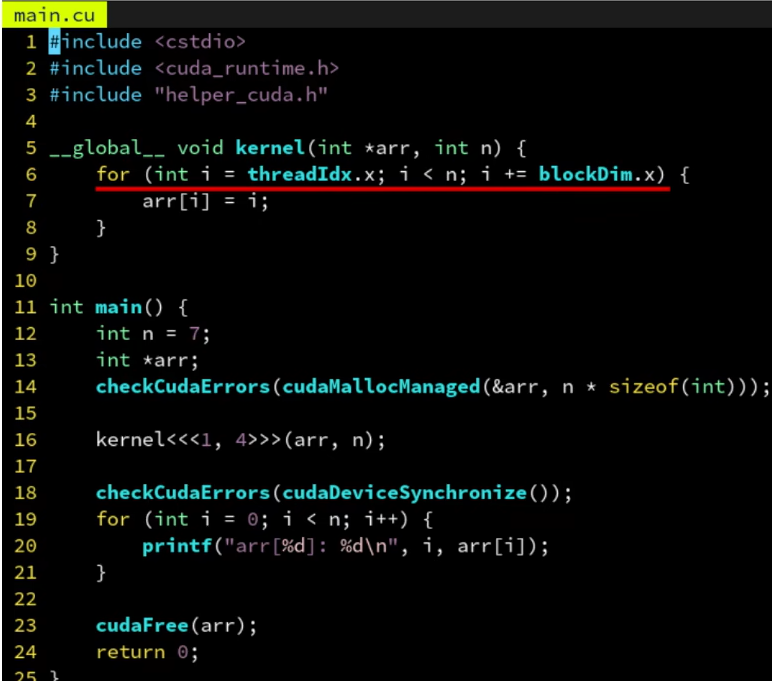

#### CMake中启用CUDA支持

+ 最新版的CMake（3.18以上），只需在LANGUAGES后面加上CUDA即可使用

+ 在add_executable里直接加你的.cu文件，和.cpp一样

  

#### CUDA编译器兼容C++17

+ CUDA的语法，基本完全兼容C++。包括C++17新特性，都可以用。甚至可以把任何一个C++项目的文件后缀名全部改成.cu，都能编译出来。
+ 这是CUDA的一大好处，CUDA和C++的关系就像C++和C的关系一样，大部分都兼容，因此能很方便地重用C++现有的任何代码库，引用C++头文件等
+ host和device代码写在同一个文件内，这是OpenCL做不到的

#### 编写一段在GPU上运行的代码

+ 定义函数kernel，前面加上 __ global __ 修饰符，即可让它在GPU上执行。

+ 不过调用kernel时，不能直接kernel()，而是要用kernel<<<1,1>>>()这样的三重尖括号语法。为什么？这里面的两个1有什么用？

+ 运行以后，就会在GPU上执行printf了

+ 这里的kernel函数在GPU上执行，称为核函数，用  __ global __ 修饰的就是核函数

  

+ 执行上述代码，不会打印hello world

+ 这是因为CPU和GPU之间的通信，为了高效，是异步的。也就是CPU调用kernel<<<1,1>>>()后，并不会立即在GPU上执行完毕，再返回。实际上只是把kernel这个任务推送到GPU的执行队列上，然后立即返回，并不会等待执行完毕

+ 因此可以调用cudaDeviceSynchronize()，让CPU陷入等待，等GPU完成队列的所有任务再返回。从而能够再main()推出前等到kernel再GPU上执行完

  

#### 定义在GPU上的设备函数

+ __ global __ 用于定义核函数，它在GPU上执行，从CPU端通过三重尖括号语法调用，可以有参数，不可以立即返回（异步，不能立即返回）

+ __ device __ 则用于定义设备函数，它在GPU上执行，但是从GPU上调用的（global或device函数）,而且不需要三重尖括号，和普通函数用起来一样，可以有参数，有返回值

+ 即：host可以调用global，global可以调用device，device可以调用device

  

声明为内联函数

+ inline在现代C++中的效果是声明一个函数为weak符号，和性能优化意义上的内联无关
+ 优化意义上的内联指把函数体直接放到调用者那里去
+ 因此CUDA编译器提供了一个”私货”关键字：__ inline __ 来声明一个函数为内联。不论是CPU函数还是GPU都可以使用，只要你用的CUDA编译器，GCC编译器响应的私货则是__ attribute __(("inline"))
+ 注意声明为__ inline __ 不一定就保证内联了，如果函数太大编译器可能会放弃内联化。因此CUDA还提供  __ forceinline __ 这个关键字来强制一个函数为内联。GCC也有响应的 __ attribute __(("always_inline"))
+ 此外，还有 __ noinline __ 来禁止内联优化

#### 定义在CPU上的主机函数

+ __ device __ 将函数定义在GPU上，而 __ host __ 则相反，将函数定义在CPU上
+ CUDA完全兼容C++，因此任何函数如果没有指明修饰符，则默认就是 __ host __ ，即CPU上的函数

#### 同时定义在CPU上和GPU上

+ 通过 __ host __ __ device __ 这样的双重修饰符，可以把函数同时定义在CPU和GPU上，这样CPU和GPU都可以调用

  

#### 让constexpr函数自动变成CPU和GPU都可以调用

+ 这样相当于把constexpr函数自动变成修饰 __ host __ __ device __ ，从而两边都可以调用

+ 因为constexpr通常都是一些可以内联的函数，数学计算表达式之类的，一个个加上太累了，所以产生了这个需求

+ 不过必须指定 --expt-relaxed-constexpr 这个选项才能用这个特性，我们可以用CMake的生成器表达式来实现只对.cu文件开启此选项（不然给到gcc就出错了）

+ 当然，constexpr里没办法调用printf，也不能用 __ syncthreads之类的GPU特有的函数，因此也不能完全替代 __ host __ 和 __ device __。

  

  

```cmake
add_executable(main main.cu)
target_compile_options(main PUBLIC $<$<COMPILE_LANGUAGE:CUDA>:--expt-relaxed-constexpr>)
```

**通过#ifdef指令针对CPU和GPU生成不同的代码**

+ CUDA编译器具有多段编译的特点

+ 一段代码它会先送到CPU上的编译器（通常是系统自带的编译器比如gcc和msvc）生成CPU部分的指定码。然后送到真正的GPU编译器生成GPU指令码。最后再链接成同一个文件，看起来像只编译了一次一样，实际上你的代码会被预处理很多次

+ 它再GPU编译模式下会定义 __ CUDA_ARCH __ 这个宏，利用#ifdef判断该宏是否定义，就可以判断当前是否处于GPU模式，从而实现一个函数针对GPU和CPU生成两份源码级不同的代码。

  

**__ CUDA _ ARCH __ 是个版本号** 

+ 其实 __ CUDA _ ARCH __ 是一个整数，表示当前编译所针对的GPU的架构版本号是多少。这里是520表示版本号是5.2.0，最后一位始终是0不用管，我们通常简称他的版本号为52就行了
+ 这个版本号是编译时指定的版本，不是运行时检测到的版本。编译器默认就是最老的52，能兼容所有GTX900以上显卡

**通过CMake设置架构版本号**

+ 可以用CMAKE_CUDA_ARCHITECTURES这个变量，设置要针对那个架构生成GPU指令码

+ 如果不指定，编译器默认的版本号是52，他是针对GTX900系列显卡的。

+ 英伟达的架构版本都是向前兼容的，即版本号为75的RTX2080也可以运行版本号为52的指令码，虽然不够优化，但至少能用。编译器指定的版本 <= 运行时显卡的版本。

  

**版本号和商品名对照表**


**三重尖括号里的数字代表什么意思？**

+ 第二个参数决定着启动kernel时所用GPU的线程数量
+ GPU是为了并行而生的，可以开启很大数量的线程，用于处理大吞吐量的数据

**获取线程编号**

+ 可以通过threadIdx.x获取当前线程的编号，只有在核函数里才可以访问
+ 线程编号从0开始计数

**获取线程数量**

+ 可以用blockDim.x获取当前线程数量

  

**线程之上：板块**

+ CUDA中还有一个比线程更大的概念，那就是板块（block），一个板块可以有多个线程组成。这就是为什么获取线程数量的变量用的是blockDim，实际上blocKDim的含义是每个板块有多少个线程

+ 要指定板块的数量，只需调节三重尖括号里第一个参数即可

+ <<<板块数量，每个板块中的线程数量>>>

  

​		

#### **获取板块编号和数量**

+ 板块的编号可以用blockIdx.x获取

+ 板块的总数可以用gridDim.x获取

+ 板块之间是高度并行的，不保证执行的先后顺序。线程之间也是，

  

+ 总的线程数量：blockDIm*gridDim

+ 总的线程编号：blockDim*blockIdx+threadIdx

+ 实际上GPU的板块相当于CPU的线程，GPU的线程相当于CPU的SIMD，可以这样理解，但不完全等同

  

#### 三维的板块和线程编号

+ CUDA支持三维的板块和线程区间
+ 只需再三重尖括号内指定的参数改成dim3类型即可。dim3的构造函数就是接受三个无符号整数（unsigned int）。
+ dim3(x,y,z)
+ 这样在核函数里就可以通过threadIdx.y获取y方向的线程编号，以此类推

+ 需要二维只需要把dim3最后一位（Z方向）的值设为1，这样就只有xy方向。

  

**分离 __ device __函数的声明核定义**

+ 开启CMAKE_CUDA_SEPARABLE_COMPILATION选项为ON，即可启用分离声明核定义的支持

+ 全局有效

  

+ 支队main程序启用

  

**核函数调用核函数**

+ 从Kelper架构开始，__ global __ 里可以调用另一个 __ global __ ，也就是核函数可以调用另一个核函数，并且三重尖括号里的板块数核线程数可以动态指定，无需先传回到CPU再进行调用，这是CUDA特有的能力

  

  

**如何从核函数里返回数据？**

+ 我们试着把kernel的返回类型声明为int，视图从GPU返回数据到CPU

+ 这样做编译器会出错

+ kernel的调用是异步的，返回的时候，并不会实际让GPU把核函数执行完毕，必须cudaDeviceSynchronize()等待他执行完毕。所以不可能kernel里通过返回值获取GPU数据，因为kernel返回时核函数并没有真正在GPU上执行。所以核函数返回类型必须是void。

+ 分析错误代码

  

#### **GPU使用独立的显存，不能访问CPU内存**

+ GPU和CPU各自使用着独立的内存。CPU的内存称为主机内存（host），GPU使用的内存称为设备内存（device），他是显卡上板载的，速度更快，又称显存

+ 不论栈还是malloc分配的都是CPU上的内存，所以自然是无法被GPU访问到

+ 因此可以用cudaMalloc分配GPU上的显存，这样就不会出错了，结束时cudaFree释放

+ 注意到cudaMalloc的返回值已经用来表示错误代码，所以返回指针只能通过&pret二级指针

  

**跨CPU/GPU地址空间拷贝数据**

+ 可以用cudaMemcpy，它能够在GPU和CPU内存之间拷贝数据
+ 把GPU上的内存数据拷贝到CPU内存上也就是从设备内存(device)到主机内存(host)，因此第四个参数指定为cudaMemcpyDeviceToHost。
+ 还有cudaMemcpyHostToDevice和cudaMemcpyDevicceToDevice


**cudaMemcpy会自动同步**

+ 注意：cudaMemcpy会自动进行同步操作，即和cudaDeviceSynchronize()等价

#### **统一内存地址技术（Unified Memory）**

+ 把cudaMalloc换成cudaMallocManaged即可，释放时也是通过cudaFree。这样分配出来的地址，不论在CPU还是GPU上都是一样的，都可以访问。而且拷贝也会自动按需进行（当从CPU访问时），无需手动调用cudaMemcpy，大大方便了编程人员。

  

### 数组

#### **分配数组**

+ 如malloc一样，可以用cudaMalloc配合n*sizeof(int)，分配一个大小为n的整型数组。这样就会有n个连续的int数据排列在内存中，而arr则是指向其其实地址。然后把arr指针传入kernel，即可在里面用arr[i]访问他的第i个元素

+ 然后因为我们用的统一内存(managed)，所以同步以后CPU也可以直接读取

  

**网格跨步循环**

+ 无论调用者指定了多少个线程（blockDim），都能自动根据给定的n区间循环，不会越界，也不会漏掉几个元素
+ 
+ 

**网格跨步循环：线程和板块一起**

+ 

### C++封装

#### **std::vector的秘密：第二模板参数**

+ std::vector<T,AllocatorT>
+ 第二个参数默认是std::allocator<T>，也就是std::vector<T>等价于std::vector < T,std::allocator < T >>
+ std::allocator< T >的功能是负责分配和释放内存，初始化T对象等
+ 具有如下几个成员函数
+ T *allocate(size_t n)    //分配长度为n，类型为T的数组，返回其其实地址
+ void deallocate(T *p,size_t n)    //释放长度为n，其实地址为p，类型为T的数组
+ 

**避免初始化为0**

+ vector在初始化的时候（或是之后resize的时候）会调用所有元素的无参构造函数，对int类型来说就是零初始化。然而这个初始化会是在CPU上做的，因此我们需要禁用它。
+ 可以通过给allocator添加construct成员函数。来魔改vector对元素的构造。默认情况下他可以任意多个参数，而如果没有参数则说明是无参构造函数
+ 因此我们只需要判断是不是有参数，然后是不是传统的C语言类型，如果是，则跳过其无参构造，从而避免在CPU上低效的零初始化
+ 

**核函数可以是一个模板函数**


**核函数可以接受函子**

1. 这里的Func不可以是Func const &，那样会变成一个指向CPU内存地址的指针，从而出错。所以CPU和GPU的传参必须按值传

2. 做参数的这个函数必须是一个有着成员函数operator()的类型，即functor类。而不能是独立的函数，否则报错。

3. 这个函数必须标记为 __ device __ ，即GPU上的函数，否则会变成CPU上的函数

   

**函子可以是lambda表达式**

+ 可以直接写lambda表达式，不过必须在[]后，()前，插入 __ device __修饰符
+ 而且需要开启--extended-lambda开关
+ 为了只对.cu文件开启这个开关，可以用CMake的生成器表达式，限制flag只对CUDA源码生效，这样可以混合其他.cpp文件也不会发生gcc报错的情况了
+ 

**捕获外部变量**

+ 不可以用[&]，捕获到的是堆栈（CPU内存）上的变量arr本身，而不是arr所指向的内存地址（GPU内存）
+ 

+ vector的拷贝是深拷贝（绝大多数C++类都是深拷贝，除了智能指针和原始指针）。使用[=]只会把vector整个地拷贝到GPU上，而不是浅拷贝其其实地址指针
+ 

+ 正确的做法是先获取arr.data()的值到arr_data变量，然后用[=]按值捕获arr_data，函数体里面也通过arr_data来访问arr。
+ data()返回一个其实地址的原始地址，而原始地址是浅拷贝的，所以可以拷贝到GPU上、这样和之前作为核函数参数是一样的，不过是作为Func结构体统一传入了
+ 

### 并行地求sin值

+ sin是double类型的正弦函数，sinf是float类型的正弦函数
+ 

**稍微快一些，但不完全精确的__sinf**

+ 两个下划线的__sinf是GPU intrinstics，精度相当于GLSL里的那种。适合对精度要求不高，但有性能要求的图形学任务
+ 类似的这样的低精度内建函数还有 __ expf、__ logf、__ cosf、__ powf等
+ 还有 __ fdividef(x,y)，提供更快的浮点除法，和一般的除法有相同的精确度，但是在2^216 < y < 2^218时会得到错误的结果

### 编译器选项：--use_fast_math

+ --use_fast_math选项，所有sinf的调用都会自动被替换成 __sinf
+ --ftz=true 会把极小数（denormal）退化为0
+ --prec-div=false降低除法的精度换取速度
+ --prec-sqrt=false降低开方的精度换取速度
+ --fmad因为非常重要，所以默认就是开启的，会自动把a*b+c优化成乘加(FMA)指令
+ 开启--use_fast_math后会自动开启上述所有

### thrust库

+ universal_vector会在统一内存上分配，因此不论是GPU还是CPU都可以直接访问到

+ 

  

+ device_vector则是在GPU上分配内存，host_vector在CPU上分配内存

+ 可以通过=运算符在device_vector和host_vector之间拷贝数据，他会自动帮你调用cudaMemcpy，非常智能

+ 


**模板函数：trust::generate**

+ thrust提供了很多类似于标准库里的模板函数，比如thrust::generate(b,e,f)对标std::generate，用于批量调用f()生成一系列（通常是随机）数，写入到[b,e)区间

+ 前两个参数时device_vector或host_vector的迭代器，可以通过成员函数begin()和end()得到。第三个参数可以是任意函数，这里用了lambda表达式
+ 

**模板函数：thrust::for_each**

+ 把[b,e)区间的每个元素调用一遍f(x)。这里的实际上是一个引用。如果b和e是长治迭代器则是个常引用，可以用cbegin()，cend()获取常值迭代器
+ 当然还有thrust::reduce,thrust::sort,thrust::find_if,thrust::count_if,thrust::reverse,thrust::inclusive_scan等
+ #include<thrust/for_each.h>
+ 

**thrust模板函数的特点：根据容器类型，自动决定在CPU还是GPU执行**

+ for_each可以用于device_vector也可以用于host_vector。当用于host_vector时则函数是在CPU上执行的，用于device_vector时则是在GPU上执行的
+ 

**for_each用于整数的循环：counting_iterator**

+ 可以用thrust::make_counting_iterator(num)构建一个计数迭代器，他作为区间表示的就是整数的区间
+ 

### **原子操作**

**数组求和**

+ 因为 __ global __ 函数不能返回值，只能通过指针。因此我们先分配一个大小为1的sum数组，其中sum[0]用来返回数组的和。通过sum[0]查看求和的结果
+ 这样做结果是错误的
+ 

+ 这是因为GPU上的线程是并行执行的，然而sum[0]+=arr[i]这个操作，实际上被拆分成成4步
+ 读取sum[0]到寄存器A
+ 读取arr[i]到寄存器B
+ 让寄存器A的值加上寄存器B的值
+ 写回寄存器A到sum[0]


**使用原子操作：atomicAdd（会返回旧值）**


**其他原子操作**

+ atomicAdd(dst,src)：*dst += src
+ atomicSub(dst,src)：*dst -= src
+ atomicOr(dst,src)：*dst |= src
+ atomicAnd(dst,src)：*dst &= src
+ atomicXor(dst,src)：*dst ^= src
+ atomicMax(dst,src)：* dst = std::max(*dst,src)
+ atomicMin(dst,src)：*dst = std::min( *dst,src)
+ 以上都会返回旧值

**atomicExch：原子地写入并读取旧值**

+ old = atomicExch(dst,src)
+ old=*dst， *dst=src

**atomicCAS：原子地判断是否相等，相等则写入，并读取旧值**

+ old = atomicCAS(dst,cmp,src)

+ old = *dst
+ if(old == cmp)    *dst = src

+ atomicCAS的作用在与他可以用来实现任意CUDA没有提供的原子读-修改-写回指令。
+ 

+ 

**原子操作的问题：影响性能**

+ 由于原子操作要保证同一时刻只能有一个线程在修改某个地址，如果多线程同时修改同一个就需要像"排队"那样，一个线程修改完了另一个线程才能进去

**解决方法：**先累加到局部变量，最后依次性累加到全局的sum

+ 这样每个线程就只有一次原子操作，而不是网格跨步循环的那么多次原子操作了。我们需要调小gridDim*blockDim使其远小于n，这样才能够减少原子操作的次数
+ 

### 板块与共享内存

SM