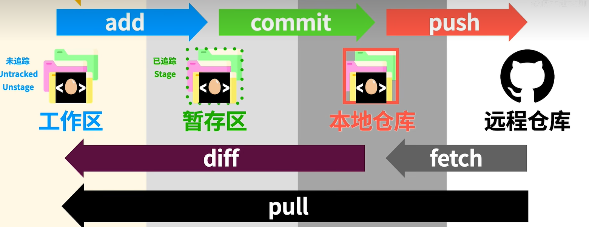
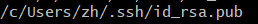
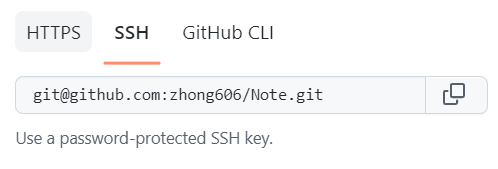

# Git

## **工作区域**

1. 工作区
2. 暂存区
3. 本地仓库
4. 远程仓库

## **文件状态**

1. 已提交(commited)：已提表示数据已经保存在本地仓库中
2. 已修改(modified)：已修改表示已经修改了文件，但未保存
3. 已暂存(staged)：已暂存表示对一个已修改的文件当前版本做了标记，使之包含在下次提交的快照中

## **与github连接**

git config --list

git config --global user.name "github name"

git config --global user.email "github email"

ssh-keygen -t rsa -C "github email"：创建一个和github连接的key

：将这个文件的内容复制到github上的ssh keys

known_hosts不存在：git clone+SSH地址

ssh -T git@github.com：测试是否连接成功

git remote add origin 仓库地址：将远程仓库和本地仓库关联并起别名

**仓库地址：**

## **命令**

git init：初始化本地仓库，告诉git这个文件夹需要版本控制，之后会出现.git文件夹，这是隐藏文件夹，所有git记录保存在这里

git status：查看工作目录与暂存区文件状态，使用此命令可以看到哪些修改被暂存到了，哪些没有，哪些文件没有被git tracked到

git add path：添加文件到暂存区（索引库），path可以是文件也可以是目录。git不仅能判断出path中修改的文件，还能判断出新添的文件

git restore --staged < file >：取消已暂存的文件 

git commit -m 注释：提交暂存区文件到本地版本库中

git log：显示提交信息

git branch name：创建新分支

git branch：查看分支

git checkout name：切换分支（会把文件从master分支拷贝一份）

git commit -a -m "注释"，在分支上修改文件后，可以用该命令提交到本地仓库

git merge name：将name分支合并到当前分支上

git branch -d name：删除分支

git branch -D name：强制删除分支，没有提示

git checkout -b name：创建分支并切换

git push origin master：本地仓库与云端仓库同步合并

git pull --rebase origin：拉取合并云端仓库，确保本地工作区是干净的，如果本地修改的内容没完全commit或者stash，就会rebase失败

**不想提交某些文件到本地版本库和远程仓库时：**

1. touch .gitignore
2. 将文件的名字和后缀添加到,gitignore中即可
3. 在分支上对文件进行删除操作时，master也会删除

## **git冲突**

1. 两个分支之间进行push、pull
   + 把远程的分支pull到本地
   + 把本地分支push到远程
2. 两个分支之间进行merge操作
   + 本地A分支merge到本地B分支

## **解决**

​	当push时发生冲突，造成这种情况是因为，本地master分支修改了文件，并且远程master的该文件也被修改了（此时我们不知道远程被修改了），解决方案就是先pull，手动选择要保留的行，然后删除其他行，然后add、commit、push

​	当merge发生冲突时，造成这种情况是因为，本地master分支修改了文件，然后add、commit，然后本地temp分支也修改了该文件，然后add、commit，然后切换到master分支进行merge，解决方案就是手动选择要保留的行，然后删除其他的行，然后add、commit。