## 配置

**安装线程库**

1. sudo apt-get install glibc-doc
2. sudo apt-get install manpages-posix-dev

**安装桌面版的虚拟工具条，支持windows和Linux之间的拖拽**

​	sudo apt-get install open-vm-tools-desktop

**目录文件绿色高亮的原因及解决办法**：

​	这是因为其他组权限里面有写入的权限，linux系统认为这是一个高风险的目录文件，因为任何人都可以进入到该目录并进行写入操作，所以就将该目录用绿色高亮显示，警示用户这个文件存在可能被恶意写入的风险。

​	sudo chmod 775 dir/ -R	(-R为递归应用在子目录上)

**安装vim编辑器**

​	sudo apt-get install vim vim-doc

**打开vim的配置文件**

​	sudo vim /etc/vim/vimrc

在文件最下面添加：

```bash
set number		//显示行号
set autoindent	//自动缩进
set cursorline	//突出显示当前行
set ruler		//打开状态栏标尺
set tabstop=4	//tab键为4个单位
```

**安装编译工具**

```bash
sudo apt-get install gcc
sudo apt-get install g++
```

安装mysql

```bash
sudo apt update
sudo apt-get install mysql-server
sudo apt-get-install mysql-client
sudo apt-get install libmysqlclient-dev
```

**运行安全脚本，设置MySQL服务root用户的密码**

```bash
sudo mysql_secure_installation
```

在Ubuntu系统中MySQL 5.7及之后的版本，MySQL的root用户被默认设置成通过auth_socket插件进行认证，而不是通过密码。为了能够以root用户通过密码的方式连接MySQL，你需要将其认证方式从 auth_socket 方式变更为mysql_native_password。

```mysql
sudo mysql
SELECT user,authentication_string,plugin,host FROM mysql.user;
ALTER USER 'root'@'localhost' IDENTIFIED WITH mysql_native_password BY 'password';
FLUSH PRIVILEGES;
```

**workbench连接linux mysql**

```mysql
/*首先将用户的连接的地址改变root 用户默认是localhost 也就是 127.0.0.1 , 将其改为% , 即绑定任意网卡*/
use mysql;	/*使用mysql库*/
select user,host from user;	/*查询信息*/
update user set host="%" where user="root";
flush privileges;
```

**TAB键代替Ctrl+N补全**

```c
function! CleverTab()
        if strpart( getline('.'), 0, col('.')-1 ) =~ '^\s*$'
                return "\<Tab>"
        else
                return "\<C-N>"
        endif
endfunction
inoremap <Tab> <C-R>=CleverTab()<CR>
```

**VMware突然没网**

```bash
sudo service network-manager stop
sudo rm /var/lib/NetworkManager/NetworkManager.state
sudo service network-manager start
```

## 基本命令

### vim

1. 批量缩进

   ```bash
   //1. shift+v 进入可视模式
   //2. 选中多行
   //3. shift+>|shift+<
   ```

2. 搜索关键字

   ```bash
   /+关键字	从文档当前位置向下查找关键字，按n查找下一个位置
   ?+关键字	从文档当前位置向上查找关键字，按n查找下一个位置
   ```
   
   

### Terminal

**常用命令：**

+ pwd：显示工作目录
+ cd：切换目录
+ ls：查看当前文件夹下的文件和目录
+ cp：拷贝
+ rm：删除
+ chmod rwx 文件或目录：更改文件或目录权限
+ mkdir：创建目录
+ touch：创建文件
+ ps -aux：查看进程状态
+ ps -eLf：查看系统所有线程信息
+ ps -Lf pid：查看指定进程中的线程信息

+ ps -ajx：查看进程间关系

1. less

   less 在查看之前不会加载整个文件, less打开大文件比vi之类的编辑器要快。可以上下滚动

2. objdump(查看目标文件或者可执行的目标文件的构成的gcc工具)

   objdump默认的汇编格式是**AT&T**。可以通过`-M`参数来修改反汇编的

```bash
objdump -D app | less			//反汇编所有section
objudmp -d test -M intel | less
```

3. 当编译多个文件生成一个可执行文件时，如果有一个文件需要改变，只需要将改变的文件编译成.o文件在与其他文件的.o文件链接为可执行文件即可，这样就可以不用将所有文件都重新编译，节省时间

```bash
g++ main.cpp hello.cpp -o app
g++ -c main.cpp -o main.o
g++ -c hello.cpp -o hello.o
g++ main.o hello.o -o app
```

4. ldd（list, dynamic, dependencies）(列出动态库的依赖关系) 

5. cat （命令的功能是将文件或标准输入组合输出到标准输出。这个命令常用来显示文件内容，或者将几个文件连接起来显示，或者从标准输入读取内容并显示）

   cat [选项] [文件]

6. echo（字符串显示、查看变量内容）

7. ls （缺省下ls用来打印当前目录的清单）

   白色的是普通文件，红色的是压缩文件，蓝色的目录，蓝绿色的是符号链接文件，绿色的是可执行文件。

8. cd （用于切换当前工作目录）

9. which （查看命令路径）

   which [命令]

10. pwd （查看当前工作目录）

11. mkdir （创建目录，可以一次创建多个，也可以创建带子目录的文件夹）

12. rmdir （删除空目录）

13. touch （创建文件，如果文件已存在就更新文件创建时间）

14. rm （删除文件或者目录）

15. mv （重命名或移动文件，如果目的文件是文件名就是改名字，如果是文件夹名就是移动到对应文件夹中）

16. cp （拷贝文件或目录）

17. ln [文件名] [链接名]  （硬链接，只能链接文件，不能链接目录）

18. ln -s [文件名] [链接名] （软链接）

19. wc （计算文件的byte数，字数、或是行数）

    -c 或 -bytes 或 -chars只显示bytes数

    -l 或 -lines 只显示行数

    -w 或 -words 只显示单词数

20. od （指定数据的显示格式）

    主要参数：

    c ASCII 或 反斜杠字符

    d[SIZE] 有符号十进制数，每个整数SIZE字节

    f[SIZE] 浮点数，每个整数SIZE字节

    o[SIZE] 八进制（系统默认值为02），每个整数SIZE字节

    u[SIZE] 无符号十进制数，每个整数SIZE字节

    x[SIZE] 十六进制数，每个整数SIZE字节

21. du （查看某个目录的大小）

    以M为单位：du -hm ./*

    以B为单位：du -hb ./*

    以K为单位，4k的整数倍：du -hk ./*

22. df （查看磁盘使用情况）

23. man man （查看手册）

    1. 可执行程序或shell命令
    2. 系统调用（内核提供的函数）
    3. 库调用（程序库中的函数）

    man ls

    man printf

    man 3 printf

    在vim中打开手册：章节号+shift+K

24. chmod （更改文件目录访问权限）

    chmod [mode] 文件名

25. chown （更改某个文件或目录的属主和属组）

26. find （在目录中搜索文件）

    find 查找路径 -name 要查找的文件名

27. grep （在指定的文件中搜索特定的内容，并将含有这些内容的行输出到标准输出。若不指定文件名，则从标准输入读取）

    [options]：

    -c：只输出匹配行的计数

    -i：不区分大小写（只适用于单字符）

    -h：查询多文件时不显示文件名

    -l：查询多文件时只输出包含匹配字符的文件名

    -n：显示匹配行及行号

    -s：不显示不存在或无匹配文本的错误消息

    -v：显示不包含匹配文本的所有行

    -R：连同子目录中所有文件一起查找

    grep "ret*" ./ -R（在此处 * 表示前一个字符有0-n个）

28. who （查看当前在线上的用户情况）

    login name：登录用户名

    terminal line：使用终端设备

    login time：登录到系统时间

29. ps （监控后台进程的工作情况）

    -e：显示所有进程

    -f：全格式

    -h：不显示标题

    -l：长格式

    -w：宽输出

    a：显示终端上的所有进程，包括其他用户的进程

    u：以用户为主的格式来显示程序状况

    r：只显示正在运行的进程

    x：显示没有控制终端的进程

30. jobs （用来显示当前shell下正在运行哪些作业）

31. fg （把指定的后台作业或挂起作业移到前台运行）

    fg 一个或多个进程的PID/命令名称/作业号

32. bg （把被挂起的进程移到后台进行）

33. kill （向指定进程发送信号）

34. env （查看当前进程环境变量）

35. top命令：可以查看操作系统的信息，如进程、CPU占用率、内存信息等

36. ps -eLf //查看系统所有线程信息

37. ps -Lf pid //查看指定进程中的线程信息

38. ps -ajx //查看进程间关系


## shell脚本

​	使用描述性语言依据格式编写的可执行文件

**流程：**

1. 创建一个shell脚本文件，文件后缀是.sh

2. 文件中写入命令

3. 脚本不需要编译，需要给脚本配置一个执行权限

   sudo chmod 0775 xxx.sh

4. 直接执行


**语法：**

+ 第一行是固定的：声明终端版本

  #!/bin/bash

  ```bash
  #!/bin/bash
  ```

+ 变量&常用命令：

  + 临时变量：
    1. 不存在类型，默认都是字符串
    
    2. 为了防止与命令重名，变量名都大写
    
    3. 变量实际上是符号名和符号值，是一对key--value
    
    4. 等号两侧不允许有空格
    
    5. 读取变量使用  
    
    6. 三个常用符号：“双引号”，‘单引号’，反引号
    
       双引号：字符串，可以识别特殊字符（变量）及其作用
    
       单引号：字符串，不能识别特殊字符（变量）及其作用
    
       反引号：可以包含命令，并且执行命令返回结果，结果可以被变量接受
    
  + 永久变量（环境变量）
  
    可以通过env命令查看
  
  + 位置变量
  
    1. 位置变量一共有9个，$1.... 9，也可以写成 {1}
    2. 位置变量用于命令传参，可以帮助程序获取到外部数据
  
  + 特殊变量
  
    1. $*：获取所有命令的参数，一起获取所有1、2、3...9
    2. $#：获取参数个数，类似于argc
    3. $!：获取上一个执行后台命令的PID，为空就是没有执行后台命令
    4. $?：获取上一个命令的返回值
    5. $$：获取当前进程的PID，shell脚本
    
  + 常用命令
  
    read：读取用户的标准输入
  
    expr：做四则运算，乘法需要转义\ *  
  
    test：测试命令，shell脚本判断真假使用
  
    1. 字符串判断
  
       ```bash
       test str1 = str2	#等号两端有空格，判断字符串是否相等
       test str1 != str2	#判断字符串不相等
       test -n str1 		#判断字符串是否不为空
       test -z str2		#判断字符串是否为空
       ```
  
    2. 数字判断
  
       ```bash
       test num1 -eq num2	#判断相等
       test num1 -ne num2	#判断不相等
       test num1 -ge num2	#判断大于等于
       test num1 -gt num2	#判断大于
       test num1 -le num2	#判断小于等于
       test num1 -lt num2	#判断小于
       ```
  
    3. 文件判断
  
       ```bash
       test -a/e filename	#判断文件是否存在
       test -d	filename	#判断文件是否是目录
       test -f filename	#判断文件是否是普通文件
       test -c filename	#判断文件是否是字符设备文件
       test -b filename	#判断文件时否是块设备
       test -r filename	#判断文件是否有读权限
       test -w filename	#判断文件是否有写权限
       test -x filename	#判断文件是否有执行权限
       ```
  
    4. 逻辑或与
  
       ```bash
       test xx -a yy	#与
       test xx -o yy	#或
       ```
  
  ```bash
  NAME=ZH
  echo $NAME
  echo "${NAME} is my name"
  TIME='date'
  echo "local time: ${TIME}"
  #永久变量
  echo "java:${JAVA_HOME}"
  #位置变量
  echo "$1 $2 $3 $4"
  #特殊变量
  echo "all paramrters:$*"
  echo "parameter number:$#"
  echo "get last command PID:$!"
  echo "get last command return:$?"
  echo "get local  process ID:$$"
  ```

+ 流程

  + 选择

    1. if选择

       ```bash
       if test 判断表达式
       	then
       		执行语句
       elif test 判断表达式
       	then
       		执行语句
       else
       	执行语句
       if
       #test 判断表达式，也可以写为[ 判断表达式 ]，中括号两端要有空格
       test -d ${FILENAME} == [ -d ${FILENAME} ]
       ```

    2. 多项选择（case)

       ```bash
       case ${变量} in
       	变量1)
       		执行语句
       		;;
       	变量2)
       		执行语句
       		;;
       	变量3)
       		执行语句
       		;;
       esac
       ```

  + 循环

    1. for

       ```bash
       for VAR in $1 $2 $3 $4 $5 $6
       do
       	执行语句
       done
       for((条件))
       ```

    2. while

       ```bash
       while 条件
       do
       	执行语句
       done
       ```

    3. 死循环

       ```bash
       while : 
       do
       	执行语句
       done
       
       while true
       do
       	执行语句
       done
       for((;;))
       ```

+ 函数

  ```bash
  func()
  {
  	执行语句
  	return int;		#如果不写return，会把最后一条命令的结果作为返回值
  }
  #调用函数：放在反引号里面执行，可以把返回结果赋值给变量
  ```
  
  ```bash
  #!/bin/bash
  
  FUNC()
  {
  	SUM=`expr $1 + $2`
  	echo ${SUM}
  }
  VAR=`FUNC $1 $2`
  echo "result:${VAR}"
  ```
  


## 正则表达式

​	规则表达式，regular expression，regex、regexp、RE，事先定义好的一些特定字符、以及这些特定字符的组合，组成一个“规则字符串”，用来对字符串进行过滤。

作用：过滤、匹配和提取

精髓：描述数据的关键信息，根据关键信息进行匹配和提取

数据规则：正则表达式是批量匹配与提取的技术，使用者必须先观察数据集，分析数据规则和特征，根据规则和特征编辑出对应的正则语句进行匹配

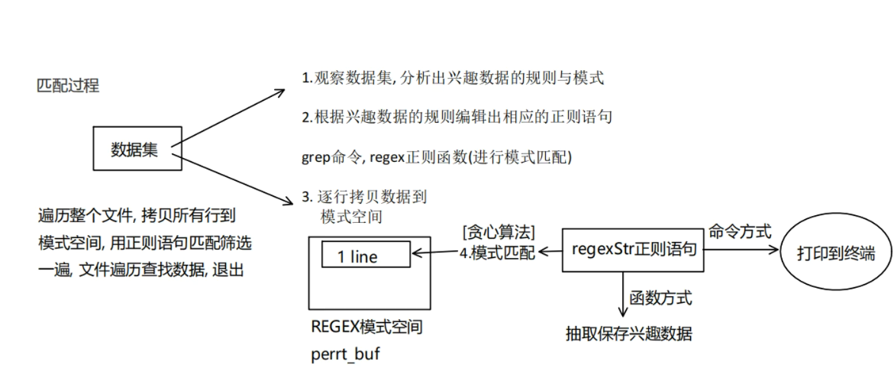


+ grep：grep '正则表达式' filename

+ *：表示前面的子表达式出现0-n次

+ ()：表示把多个字符组合成一个表达式。需要转义 \ ( \ )，例如：\ (aa \ )* 表示0-n个aa

+ +：匹配前面的子表达式1-n次，需要转义 \ +

+ ?：匹配前面的子表达式0-1次，需要转义 \ ?

  默认的正则表达式是贪婪匹配模式，可以通过?切换为非贪婪匹配模式

  贪婪匹配模式：尽可能多的去匹配

  非贪婪匹配模式：匹配到一个结果就立即返回，尽可能少的去匹配

+ .：匹配除\r、\n之外的任意单个字符，例如 a.. 匹配以a开头的三个字符，.*匹配任意字符包括空行

+ ^：以后面的字符为参考，匹配这行以该字符为行首，例如 ^a为匹配以a开头的行

+ $: 以前面的字符为参考，匹配这行以该字符为行末，例如为表示以a为末尾的行

+ ^$：匹配空行

+ |：逻辑或，需要转义 \ |，例如x\ |y匹配的是x或者y

+ [ ]：表示字符集合，匹配所包含的任意一个字符

  [a-z]：匹配小写字母

  [0-9]：匹配数字

  [A-Z]：匹配大写字母

  [^A-Z]：负值字符集合，匹配非大写字母

+ m和n均为非负整数，{ }需要转义，\ { \ }

  {m}：匹配前一个子表达式出现m次

  {m，}：表示前一个子表达式至少匹配m次

  {m，n}：表示前一个子表达式至少匹配m次，最多匹配n次

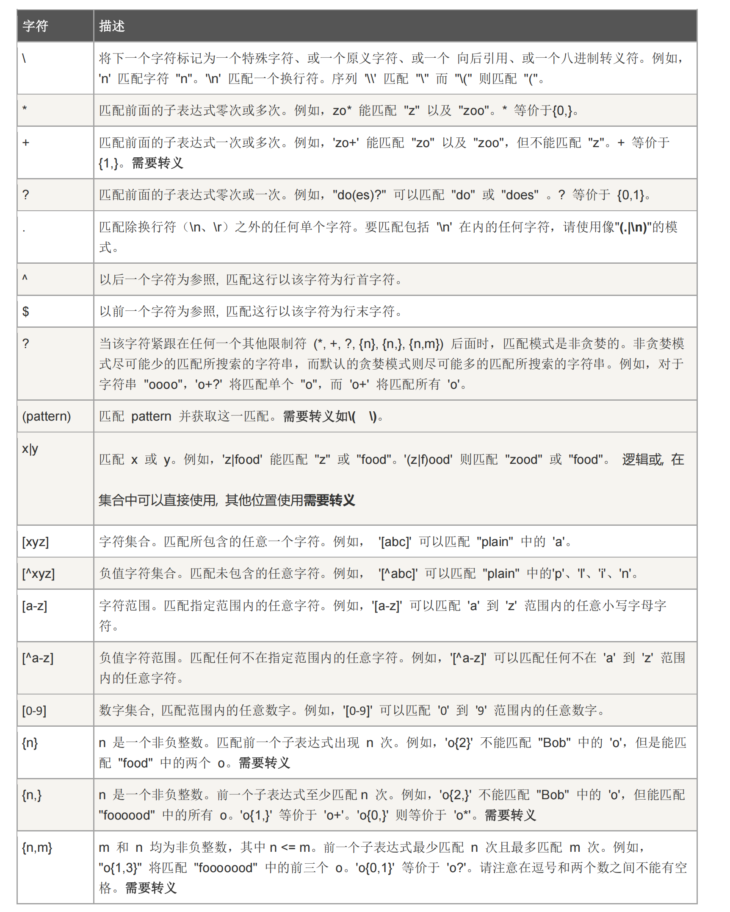

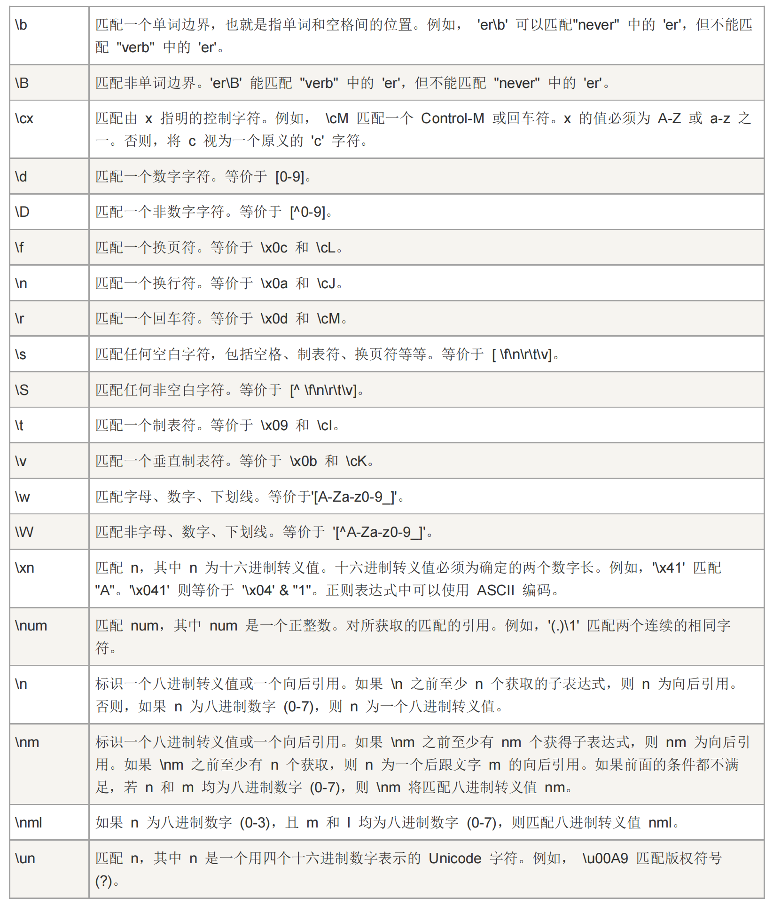

Linux下三个命令使用正则表达式：

+ grep：grep [参数] 表达式 [w文件]

  参数：

  -E：拓展正则表达式，就不需要进行转义了

  -G：基本正则表达式

  -n：打印行号和输出行

  -h：禁止输出文件前缀

  -i：不区分大小写

+ awk：可以收用域，通过awk语法对特定数据进行格式化和提取

+ sed：文件流处理，批处理文件比较方便，特别适合对多文件种相同的内容进行统计修改

匹配手机号：

简单：^1[3-8] [0-9]{9}$

复杂：^(13 [0-9] | 14 [57] | 18[012356789]) [0-9] {8} $

## **gcc参数**

-I 指定头文件目录，注意-I和之间没有空格 

-c 只编译，生成.o文件，不进行链接 

-g 包含调试信息 -On n=0∼3 编译优化，n越大优化得越多 

-Wall 提示更多警告信息 

-D 编译时定义宏，注意-D和之间没有空格 

-E 生成预处理文件 

-M 生成.c文件与头文件依赖关系以用于Makefile，包括系统库的头文件 

-MM 生成.c文件与头文件依赖关系以用于Makefile，不包括系统库的头文件

## GDB调试

GDB内置命令记忆功能，重复使用上一个命令只需要键入一次即可，按Enter即可重用

1. 编译时加入调试信息

   ```bash
   gcc test.cpp -g -o app
   ```

2. 启动GDB调试器

   ```bash
   gdb app
   ```

调试命令：

+ list(l) 行号/函数名    ：从指定行查看代码（显示10行）
+ run(r)    ：开始执行不调试
+ start    ：单步执行调试，程序执行后会在main()第一行代码暂停
+ step(s)    ：逐语句执行，如果在模块位置，进入到模块内部
+ next(n)    ：逐过程执行，如果是模块，不进入模块内部，直接运行，模块，返回结果
+ break(b) 行号/函数名    ：在执行位置加断点
+ info breakpoints    ：查看断点详细信息
+ delete(d) 断点1、断点2    ：根据断点编号删除断点
+ disable 断点编号    ：禁用断点，不会暂停
+ enable 断点编号    ：启用断点、恢复暂停断点
+ tbreak    ：临时断点（一次性断点）暂停一次自动销毁
+ print(p) 变量    ：输出程序的数据信息
+ set var 变量 = 值    ：可以在运行调试阶段修改变量数据
+ finish    ：跳出模块，返回调用位置
+ until 行号    ：跳出循环
+ display var    ：设置观察（跟踪观察变量）
+ undisplay 观察编号    ：取消观察

如果程序执行时需要外部参数，那么start和run也要传参

start argv[1] argv[2]

run argv[1] argv[2]

如果使用的是run执行方式，可以直接跳转到断点位置，如果使用的是start，可以通过continue命令跳转到断点位置

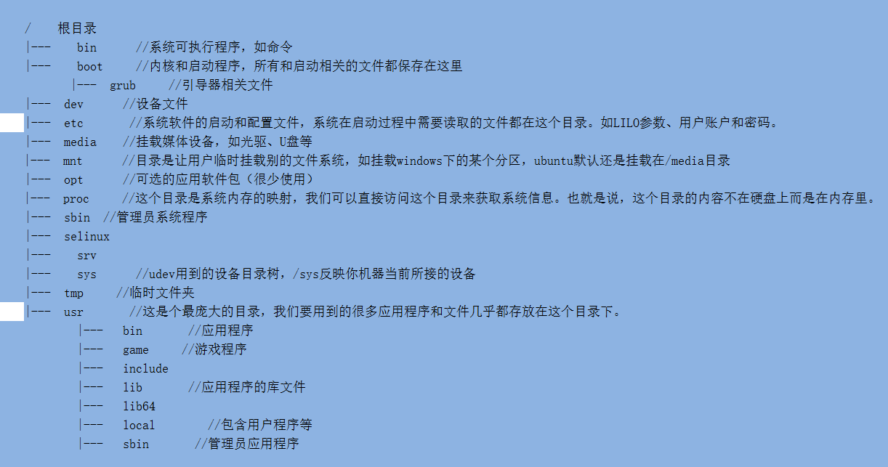

文件以 . 开头的均为隐藏文件

普通文件	-

目录	d

符号链接	l

块设备文件	b

字符设备文件	c

socket文件	s

管道	p


## MakeFile

**优点：**

1. 当更新了源文件是，只会重新编译修改的源文件，其它文件不会重新编译
2. 能够自动并发地发起对源文件的编译，加快编译速度(make -j)
3. 用通配符批量生成构建规则，避免针对每个源文件和中间文件重复写g++命令

**缺点：**

1. make在UNIX类系统上是通用的，但在windows上是不行的
2. 需要准确地指明每个项目之间的依赖关系，有头文件时特别头疼
3. make的语法非常简单，不向shell或python可以做很多判断
4. 不同的编译器有不同的flag规则，为g++准备的参数可能对msvc不适用

## CMake

1. 只需要写一份CMakeLists.txt,它就能在调用生成当前系统所支持的构建系统
2. CMake可以自动检测源文件和头文件之间的依赖关系，导出到Makefile里
3. CMake具有相对高级的语法，内置的函数和能够处理configure，install等常见需求
4. CMake可以自动检测当前的编译器，需要添加哪些flag。

+ CMake除了add_executable可以生成可执行文件外，还可以通过add_library生成库文件
+ add_library的语法与add_executable大致相同，除了他需要指定是动态库还是静态库
+ add_library(testlib STATIC test1.cpp test2.cpp)
+ add_library(testlib SHARED test1.cpp test2.cpp)
+ target_link_libraries(app PUBLIC test)                   //在可执行文件app中使用test库

**子模块**

+ 复杂的工程中，我们需要划分子模块，通常一个库一个目录
+ 
+ 把hellolib库的东西移到hellolib文件夹下了，里面的CMakeLists.txt定义了hellolib的生成规则
+ 要在根目录使用它，可以用CMake的add_subdiretory（添加子目录，并构建该子目录），子目录也包含一个CMakeLists.txt，其中定义的库在add_subdirectory之后就可以在外面使用
+ 子目录的CMakeLists.txt里路径名（比如hello.cpp）都是相对路径，肥肠方便

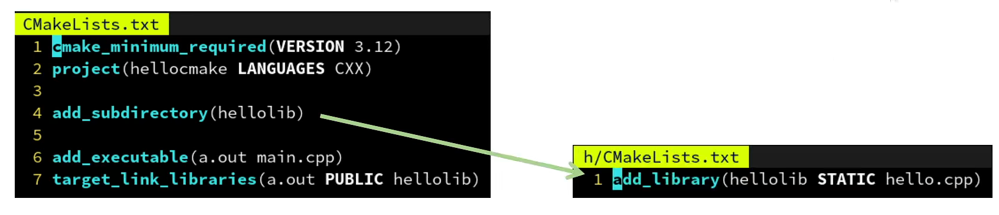

**子模块的头文件如何处理**

+ 因为hello.h被移动到了hellolib子文件夹里，因此main.cpp里也要改动引入hello.h的路径
+ 如果想要避免修改代码，我们可以通过target_include_directories指定a.out的头文件搜索目录
+ 甚至可以用<hello.h>来引入这个头文件了，因为通过target_include_directories指定的路径会被视为与系统路径等价
+ 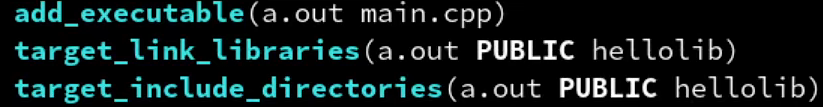
+ 但是这样如果另一个b.out也需要用hellolib这个库，那我们还需要再指定一遍搜索目录吗？
+ 答案是不需要，我们只需要在定义hellolib的头文件搜索目录，引用它的可执行文件CMake会自动添加这个路径
+ 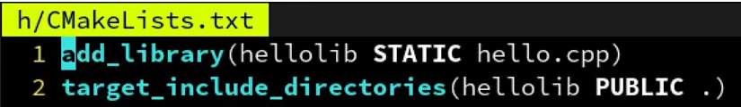
+ 这里用了.表示当前路径，因为子目录里的路径是相对路径，类似还有..表示上一层目录
+ 此外，如果不希望让引用hellolib的可执行文件自动添加这个路径，把PUBLIC改成PRIVATE即可。这就它们的用途：决定一个属性要不要在被link的时候传播

**目标的一些其他选项**

+ target_include_directories(myapp PUBLIC /usr/include/eign3)	//添加头文件搜索目录（一个可执行文件的搜索目录）
+ target_link_libraries(myapp PUBLIC hellolib)                                   //添加要链接的库
+ target_add_definitions(myapp PUBLIC MY_MACRO=1)                  //添加一个宏定义
+ target_add_definitions(myapp PUBLIC -DMY_MACRO=1)  
+ target_compile_options(myapp PUBLIC -fopenmp)                        //添加编译器命令行选项
+ target_sources(myapp PUBLIC hello.cpp other.cpp)                       //添加要编译的源文件

以及可以通过下列指令（不推荐）把选项加到所有接下来的目标去

+ include_directories(/opt/cuda/include)	//添加头文件的搜索目录	（所有可执行文件的搜索目录）									
+ link_directories(/opt/cuda)                         //添加库文件的搜索目录
+ add_definitions(MY_MACRO=1)                 //添加一个宏定义
+ add_compile_options(-fopenmp)              //添加编译器命令行选项
+ aux_source_directory(. CPP_LIST)             //搜索指定目录下的源文件，并且将源文件列表存放到CPP_LIST中

```bash
cmake -B bulid	//读取当前目录的CMakeLists.txt，并在bulid文件夹下生成bulid/Makefile
make -C bulid	//让make读取bulid/Makefile，并开始构建
//以下命令和上一个等价，但更跨平台
cmake --bulid bulid
bulid/a.out
```

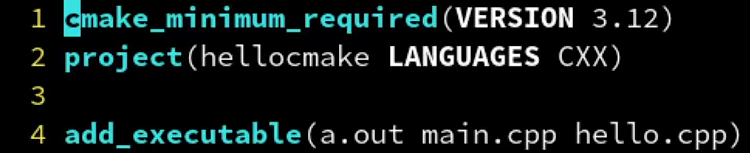

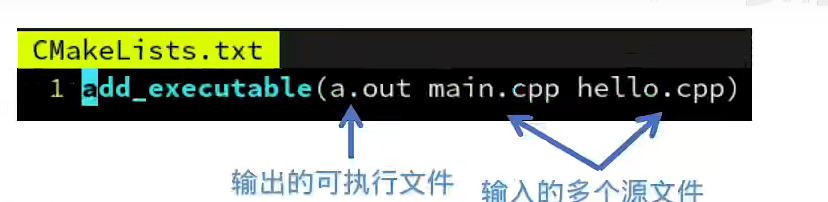

## 库

​	当有多个可执行文件时，它们之间用到的某些功能是相同的，我们想把这些共用的功能做成一个库，方便大家一起共享

​	库中的函数可以被可执行文件调用，也可以被其它库文件调用

### 静态库(.a/.lib)

​	可以看成是一组目标文件（.o/.obj）的集合，在链接阶段将代码直接插入到生成的可执行文件中，会导致体积变大，但是只需要一个文件就可以运行

1. 生成.o文件

   ```bash
   gcc -fPIC -c add.c sub.c mul.c des.c
   ```

​	生成.o文件时要加-fPIC这个参数，PIC表示位置无关代码。意思是当生成.o文件的过程中，需要写入一个函数在什么位置去调用，有两种写法，一种是这个函数的绝对地址，一种是函数的相对地址，与位置无关实际上使用的就是相对地址。如果使用两个共享库，库里面的函数的绝对地址是一样的，那么当两个库同时加载到进程里的时候就会发生冲突，所以这种情况一般都会使用相对地址

​	PIC是position independent code的缩写，也就是位置无关代码，一般在编译动态库so的时候加这个选项。区别在于：

​	不加-fPIC，代码在调用so动态库里面的函数时需要重定位代码引用的数据对象，重定位会修改代码段。所以每个使用该so库的进程都需要copy一份。

​	加-fPIC，动态库so使用函数和数据对象是根据GOT和PLT两张表来跳转和访问数据对象的，plt是延迟调用表，在函数被调用时加载，不同进程表里内容不同，这样可以复用同一个动态库so而不需要copy。

2. ar是工具链中的一个，用于生成静态库。rcs是建立一个索引

   ```bash
   ar rcs libmycal.a add.o sub.o mul.o des.o
   ```

3. 使用nm命令可以查看库中的内容

   ```bash
   nm libmycal.a
   ```

4. 编译并执行程序

   ```bash
   gcc main.c -I ../include ../lib/libmycal.a -o app
   ```

### 共享库(.so/.dll)

​	只在生成的可执行文件中生成“插桩”函数，当可执行文件被加载时会读取指定目录中的.dll文件，加载到内存中的空闲位置，并且替换相应的“插桩”指向的地址为加载后的地址，这个过程称为重定向。这样以后函数被调用就会跳转到动态加载的地址去。

1. 生成共享库有两种命令

   ```bash
   gcc -shared -Wl -o libmycal.a add.o sub.o mul.o des.o	//不加版本号
   ```

   ```bash
   gcc -shared -Wl,-soname,libmycal.so.1 -o libmycal.so.1.0.1 add.o sub.o mul.o des.o	//加版本号
   ```

2. 共享库有三种命令：soname、linkname、realname

   + libmycal.so.1.0.1是realname，是真是来链接的共享文件的名字
   + libmycal.so.1是soname，只包含主版本信息的共享库，实际上是一个符号链接，会指向realname的文件
   + linkname一般写成libmycal.so，是自己写的符号链接，在写gcc时使用的名字。1.0.1版本时，ln -s libmycal.so.1.0.1 libmycal.so，1.0.2版本时，ln -s -libmycal.so.1.0.2 libmycal.so，这样gcc命令不需要改变，都是gcc libmycal.so main.c -o app。在写Makefile进行项目管理时会使用到Linkname。

3. 生成共享库

   ```bash
   gcc -shared -Wl,-soname,libmycal.so.1 -o libmycal.so.1.0.1 *.o
   ```

4. 共享库加载

   在所有基于GNUglibc的系统中，在启动一个ELF二进制执行程序时，一个特殊的 程序“程序装载器”会被自动装载并运行。在linux中，这个程序装载器就是/lib/ldlinux.so.X(X是版本号)。它会查找并装载应用程序所依赖的所有共享库。被搜索的目录保

   存在/etc/ld.so.conf文件中。当然，如果程序的每次启动，都要去搜索一番，势必效率不 堪忍受。Linux系统已经考虑这一点，对共享库采用了缓存管理。ldconfig就是实现这一功能的工具，其缺省读取/etc/ld.so.conf文件，对所有共享库按照一定规范建立符号连接， 然后将信息写入/etc/ld.so.cache。  /etc/ld.so.cache的存在大大加快了程序的启动速度。

   所以，想要让共享库被找到，就必须把共享库的路径写入到/etc/ld.so.conf中

   ```bash
   sudo vi /etc/ld.so.conf
   ```

   因为这个文件通常在系统启动时运行才被读取，所以文件修改以后想要手动运行一下

   ```bash
   sudo ldconfig -v
   ```

5. 编译程序

   ```bash
   gcc -I ../include main.c ../lib/libmycal.so.1 -o app
   ```

6. 生成linkname（可选）

   ```bash
   ln -s libmycal.so.1.0.1 libmycal.so
   gcc -I ../include main.c ../lib/libmycal.so -o myapp
   ```

当so文件中的代码实现修改以后，只需要重新编译生成.so文件，而不需要重新编译可执行文件。

```bash
gcc -fPIC -c add.c
gcc -shared -Wl,soname,libmycal.so.1 -o libmycal.so.1.0.1 *.o
```

缺点：运行时能在同目录或者系统目录找到.dll才能运行

**.so不需要.a文件**

**DLL查找顺序**

Windows：可执行文件的同目录，其次是环境变量%path%

Linux：ELF格式可执行文件的RPATH,其次是/usr/lib等


## 文件

### **文件IO**

​	文件IO包含了对文件的基本访问操作方式，例如：读、写、修改特征、偏移、截断、重定向等内容。

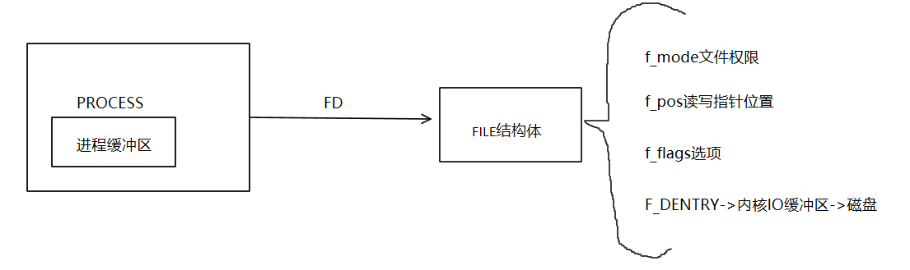

**一个进程默认打开3个文件描述符**

STDIN_FILENO 0

STDOUT_FILENO 1

STDERR_FILENO 2

新打开文件返回文件描述符表中未使用的最小文件描述符

文件或目录权限为文件目录默认权限减去umask得到初始文件权限，文件初始默认权限为0666，目录为0777。

read()、write()对常规文件不会阻塞，对终端设备（没有换行）或网络（没有收到数据包）则不一定。

系统会给打开的终端分配一个输入缓冲区，用户输入的内容存在这个缓冲区中，当程序调用read()时，会将输入缓冲区的内容拷贝到应用程序申请的缓冲区中。

1. 查看当前系统允许打开最大文件个数

   ```bash
   cat /proc/sys/fs/file-max
   ```

2. 当前默认设置最大打开文件个数1024

   ```bash
   ulimit -a
   ```

3. 修改默认设置最大打开文件个数为4096（临时修改，重启后失效）

   ```bash
   ulimit -n 4096
   ```


### 文件系统

文件系统是操作系统用于明确存储设备或分区上的文件的方法和数据结构。即存储设备上组织文件的方法。文件系统由三部分组成：文件系统的接口，对对象操纵和管理的软件集合，对象及属性。	

Windows现在文件系统都是NTFS的，以前U盘有FAT32文件系统的，当个文件不能超过4G，Linux的文件系统有ext2，现在最新的是ext4

扇区：是指磁盘上划分的区域。磁盘上的每个磁道被等分为若干个弧段，这些弧段便是磁盘的扇区，硬盘的读写以扇区为基本单位。每个扇区大小是512个字节

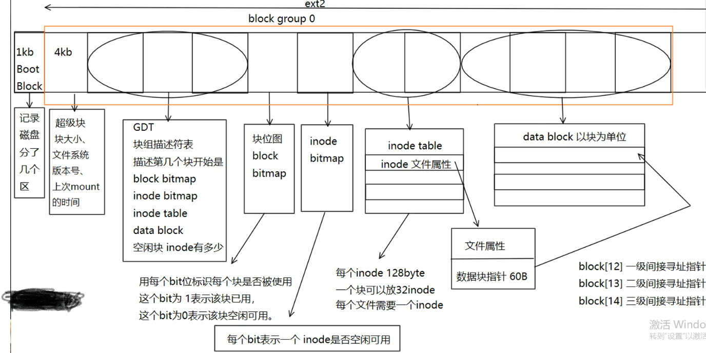

1块是4096个字节，多个block是用一个block group进行管理，文件系统由多个block group组成

**超级块：**主要存储的是块大小、文件系统版本号、上次挂载的时间

**GDT（group description table）：**不确定大小，可能由很多个块组成。描述的是第几个块开始时block bitmap，第几个块开始是inode bitmap，第几个块开始是inode table，第几个块是data block和空闲块。也就是标记了每一种块的起始位置

**块位图：**用每个bit标识每个块是否被使用，标识的块如果被使用，对应的位就会被置为1，如果块没有被使用，对应的位就是0

**inode位图：**用每个bit标识每个inode是否被使用。inode就是用来存储文件类型（常规、目录、符号链接等）、权限、文件大小、创建\修改\访问时间等。简而言之，inode就是用来存储文件属性和数据块指针。

**inode表：**一系列的inode存储在一起，形成了一个inode table。每个文件都需要一个inode，与inode位图配合使用，inode 位图存储的就是inode表中的某个inode节点是否被使用。每个inode中存储是文件属性和文件块指针，文件块指针有60个字节，每个指针4个字节，可以存储15个指针

**data block：**

1. 对于常规文件，文件的数据存储在数据块中。
2. 对于目录，该目录下的所有文件名和目录名存储在数据块中，注意文件名保存在它所在目录的数据块中，除文件名之外，ls -l命令看到的其它信息都保存在该文件的inode中。注意这个概念：目录也是一种文件，是一种特殊类型的文件。
3. 对于符号链接，如果目标路径名较短则直接保存在inode中以便更快地查找，如果目标路径名较长则分配一个数据块来保存。
4. 设备文件、FIFO和socket等特殊文件没有数据块，设备文件的主设备号和次设备号保存在inode中

存储一个a文件，文件内容是“hello world"。

1. 首先通过boot block查看磁盘分区，找到要存储的磁盘
2. 到GDT表中，读取块位图，inode位图、inode table和data block的起始位置
3. 通过inode位图找到空闲的inode节点，写入文件属性
4. 通过块位图找出空闲的data block，向空闲的data block中写入文件内容，并把data block的地址赋值给写入文件属性的那个inode节点

数据块寻址

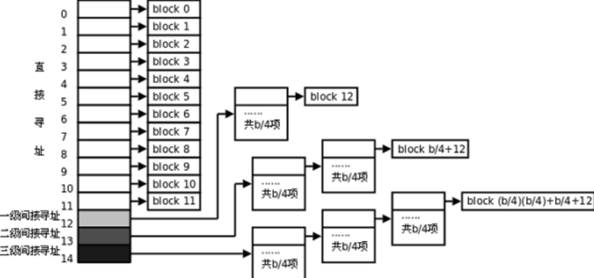

4K/4 = 1024个地址，每个地址都会指向一个4K的block，可以存储1024*4k = 4M

1024*4M = 4G

1024*4G = 4T


**删除文件**

1. 通过stat命令可以查看某个文件的inode编号
2. 知道文件的inode编号，先去GDT表中找到inode table的起始位置，通过计算，找到inode编号对应的inode节点的地址，就可以读取文件属性和数据块指针。然后就可以删除操作
3. 先把inode bitmap对应的位置为0
4. 通过读取到的数据块指针计算出数据块在块位图中的位置，把块位图对应的位置置为0，就相当于把存数据的data block释放掉了
5. 把inode节点中的数据块指针置为空


### 硬链接与软链接

硬链接(hard link)：在Linux文件系统中，多个文件名指向同一个索引节点（inode）。这种情况文件就称为硬链接。硬链接文件就相当于文件的另外的一个入口。

软链接(symbolic link)：软连接又叫做符号链接，它几乎可以等价于windows下的快捷方式，仅包含链接文件的路径，因此能链接目录，也能跨文件系统链接。


### **文件系统函数**

stat命令

```bash
stat /
```

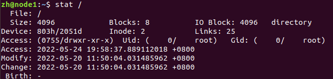

```c
#include<sys/types.h>
#include<sys/stat.h>
#include<unistd.h>

int stat(const char *path,struct stat *buf);
int fstat(int fd,struct stat *buf);
int lstat(const char *path,struct stat *buf);

//stat 跟踪符号链接，lstat不跟踪符号链接
//stat fstat检索到的内容不同，只有参数不同。lstat如果pathname是符号链接，则它返回有关链接本身的信息，而不是它所引用的文件
```

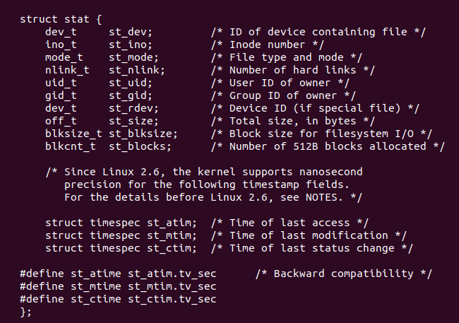

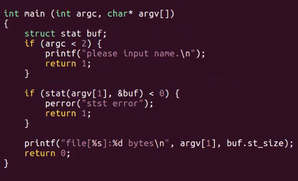


**access()：**检查调用进程是否可以对指定的文件执行莫，某种操作

```c
#include<unistd.h>
int access(const char* pathname,int mode);
mode:
R_OK //是否有读权限
W_OK //是否有写权限
X_OK //是否有执行权限
F_OK //测试一个文件是否存在
```

**chmod()**

```bash
include<sys/stat.h>
#include<sys/types.h>
#include<unistd.h>
#include<stdio.h>
//八进制转十进制
int convert(int o)
{
	int d = 0 ;
	int count = 1;
	while(o != 0) {
		d = d + (o % 10) * count;
		count *= 8;
		o /= 10;
	}
	printf("d=%d\n", d);
	return d;
}
int main(int argc, char* argv[])
{
	if(argc < 3) {
		printf("./chmod mode file\n");
		return 1;
	}
	//判断文件在不在
	if(access(argv[2], F_OK) < 0) {
		perror("access");
		return 1;
	}else {
//改变权限
int mode = atoi(argv[1]);
mode = convert(mode);
if(chmod(argv[2], mode) < 0) {
perror("chmod");
return 1;
}
}
printf("chmod success\n");
return 0;
}
```


**chown()：**更改文件的所有者和组。chown使用时必须拥有root权限


**utime()：**将filename指定的inode的访问和修改时间分别更改为时间的actime和modtime字段

```c
int utime(const char* filename,const struct utimbuf *times);
struct utimbuf{
    time_t actime;
    time_t modtime;
}
```


**truncate()/ftruncate()：**将文件截断成大小，丢弃部分内容，将一个空文件拓展为指定大小用\0填充

```c
int truncate(const char *path,off_t length);
int ftruncate(int fd,off_t length);
```


**link()：**创建一个硬链接。当rm删除文件时，只是删除了目录下的记录项和把inode硬链接计数减1，当硬链接计数减为0时，才会真正的删除文件

```c
int link(const char *oldpath,const char *newpath);
```

**symlink()：**创建一个符号链接，其中包含字符串目标

```c
int symlink(const char* oldpath,const char* newpath);
```

**readlink()：**该符号链接所指向的文件名字，不读取文件内容

```c
ssize_t readlink(const char* path,char* buf,size_t bufsize);
```

**unlink()：**从文件系统删除一个名称。如果该名称是文件的最后一个链接，并且没有进程打开该文件，则该文件被删除，并且它正在使用的空间可供重用。如果该名称是文件的最后一个链接，但有进程在使用该文件，则该文件将保持存在，直到最后一个引用它的文件描述符关闭

```c
int unlink(const char* pathname);
```


**dup()：**用来复制一个现存的文件描述符，使两个文件描述符指向同一个file结构体。结构体中的引用计数++，多个文件描述符可以共享文件资源，例如：文件读写指针位置。

**dup2()：**重定向可以将正确的输出方向变为自定义方向。

```c
int dup(int oldfd);
int dup2(int oldfd,int newfd);
//old：想要复制的文件描述符
//newfd：想要与oldfd指向相同的file结构体的新的文件描述符。
```


**fcntl()：**改变一个已打开的文件的属性，可以重新设置读、写、追加、非阻塞等标志。

```c
//get flags
int flags = fcntl(STDIN_FILENO,F_GETFL);
//set flags
flags |= O_NONBLOCK;
fcntl(STDIN_FILENO,F_SETFL,flags);
```


**lseek()：**和标准I/O库的fseek类似，可以移动当前读写位置，可以获取文件大小

```c
off_t lseek(int fd,off_t offset,int whence);
```


### **虚拟文件系统**

为什么需要虚拟文件系统？

​	可以通过挂载，可以把不同文件系统的盘挂载到linux系统下。不管是什么样的文件系统，都可以打 开、创建、删除文件。不同的文件系统中读写文件的方法肯定是不一样的，那么不同文件系统的盘之间 是怎么互相访问的呢？ 这个时候就需要使用到虚拟文件系统。在文件系统和实际打开、读写文件的中间增加一层虚拟的文 件系统，根据实际不同的文件系统去调用对应的驱动层函数，开发是只要调用open、read、write函数 即可，不需要关系底层实际是什么样的文件系统。

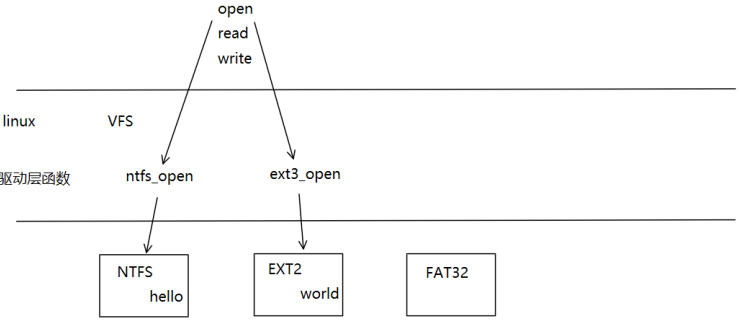


**虚拟文件系统是怎样工作的？**

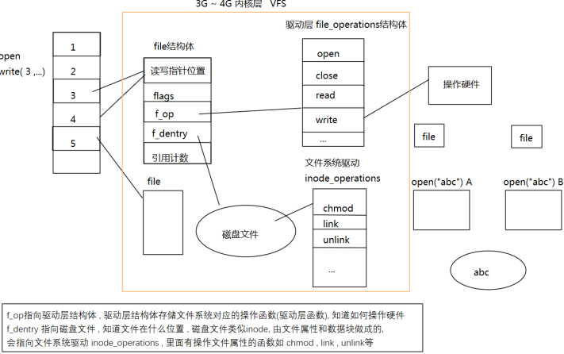

​	打开文件的时候，文件描述符的数组会分配一个最小号的描述符，文件描述符会指向一个file结构 体。这个file结构体里面包含读写指针位置、flags（标志，不用关心）、f_op、f_dentry和引用计数。其 中比较重要的是f_op和f_dentry。

​	f_op指向的是驱动层的file_operation结构体，它是知道当前文件系统实际是一个什么类型的文件系统的，驱动层是专门操作硬件的。

​	f_dentry是指向磁盘文件的。磁盘文件类似于inode，里面有文件属性和数据块，会指向文件系统的 驱动inode_operations，里面有操作文件属性的函数chmod、link、unlink等，可以对文件属性进行操作。

​	实际上f_op和f_dentry，一个是操作文件实际存放位置的，一个是操作文件属性的。只要调用open 函数就会创建一个file结构体，文件描述符就是用来指向file结构体的。

​	会有一种情况是两个文件描述符指向同一个file结构体。那么通过这两个文件描述符分别想file结构 体里面写入“hello”和‘world“，那么最后文件中存入的内容是什么呢？因为是使用同一个file结构体，那么 f_op指针使用的时候总有一个先后顺序，指向的也是同一块区域，那么些数据时，读写指针只是不停的 向后移动，最后写入文件中的是”helloworld“。

​	如果是两个进程打开同一个文件“abc”，那么两个进程分别向文件中写入“hello”和‘world“，那么最后 文件中存入的内容是什么呢？file结构体是存在于虚拟文件系统里面的，虚拟文件系统存在于进程中，进 程空间是0~4G，进程空间中的3~4G是内核空间，进程之间是相互独立的空间。调用open函数就会创建 一个file结构体，不同的进程就会创建不同的file结构体，就会与两个f_op指针，两个读写指针，那么每 个读写指针都有自己的起始位置，所以两个文件都是从头开始写，那么文件最后只会有后写入的内容 “world”。


## Socket套接字

**socket套接字基础**

​	socket套接字是系统提供用于网络应用开发的一系列Api接口，各个平台语言都有对Socket套接字的支持（兼容性开平台能力强）

​	Linux系统下，everything is file,所以将网络套接字socket抽象成了文件，可以通过处理的方式操作访问socket，进行网络通信


**网络信息结构体**

​	可以将自定义网络信息替换socket中的地址信息

​	双方进行网络通信，可以通过网络信息结构体将对方的网络信息传出

```c
struct sockaddr_in addr;
addr.sin_family = AF_INET|AF_INET6;
addr.sin_addr.s_addr = 大端序IP地址;
addr.sin_port = 大端序端口;
```

**大小端转换函数**

​	大端序/网络字节序：低地址存储高字节，高地址存储低字节

​	小端序/主机字节序：低地址存储低字节，高地址存储高字节

```c
#include<arpa/inet.h>
//h=host to n=net l=long=ip s=short=port
大端序ip = htonl(小端序ip);
大端序port = htons(小端序port);
小段序ip = ntohl(大端序ip);
小端序port = ntohs(大端序port);

//p = presentation n = numeric
//地址的表达格式通常是ASCII字符串，数值格式则是存放到套接字地址结构中的二进制值
const char *inet_ntop(int family,const void *addrptr,char *strptr,size_t len);
//成功返回指向结果的指针，否则返回NULL.
int inet_pton(int family,const char *strptr,void *addrptr);
//成功返回1，若输入不是有效的表达格式返回0，若出错则为-1.
```

**创建Socket**

```c
#include<sys/socket.h>
int sockfd = socket(AF_INET,SOCK_STREAM,0);
//argv1 = 指定IP协议版本，AF_INET(ipv4) AF_INET6(ipv6)
//argv2 = 指定传输层协议，SOCK_STREAM(流式协议)	SCOK_DGRAM(报文协议)
//argv3 = protocol = 0,表示默认协议STREAM默认协议为TCP,DGRAM默认协议为UDP
return value:
	成功返回Sockfd,失败返回-1并且ERRNO被设置
```

**bind**

​	设置socket网络信息

​	一个sockfd被创建后，会自带默认网络信息，ip=本机任意ip port=随机端口，如果用户需要定制sockfd中的网络信息，就需要使用bind进行设置（将套接字与特定的 IP 地址和端口绑定起来），经典的C/S架构中，通常Server需要绑定设置，Client是否需要绑定看需求。

```C
struct sockaddr; //旧网络信息结构体
int reval = bind(int sockfd,struct sockaddr *addr,sizeof(addr));
return value:
	成功返回0，失败返回-1，并且ERRNO被设置
```

**listen**

​	监听Server端网络事件

```c
listen(int sockfd,128);//监听的socket与监听序列
return value:
	成功返回0，失败返回-1并且设置ERRNO.
```

**accept**

​	服务端等待建立连接（阻塞函数）

```c
int clientfd = accept(int serverfd,struct sockaddr *clientaddr,socklen_t size);
argv1 = 阻塞在特定sockfd等待连接;
argv2 = 连接成功传出对方的网络信息结构体;
argv3 = 传入预存储网络信息结构体大小，传出实际结构体大小;
return value:
	成功返回客户端的sockfd,失败返回-1，并且设置ERRNO;
```

**connect** 

​	客户端主动请求建立连接

```C
connect(int clientfd,struct sockaddr *serveraddr,sizeof(serveraddr));
argv1 = 请求端的sockfd;
argv2 = 对端的网络信息结构体;
argv3 = 网络信息结构体大小;
return value:
	成功返回0，失败返回-1，并设置ERRNO;
```

**信息收发**(TCP)

```c
int recvsize = recv(int sockfd,char *buffer,size_t rsize,int flags);
//默认阻塞读取sockfd数据
int ssize = send(int sockfd,char *buffer,size_t wsize,int flags);
//默认阻塞写出sockfd数据
write() or read()
```

**信息收发**(UDP)

```C
recvfrom(int sockfd,char *buffer,size_t rsize,int flags,struct sockaddr *addr,socklen_t *size);
//既可以读取数据，也可以传出发送方的网络信息结构体
sendto(int sockfd,void *buffer,size_t size,int flags,struct sockaddr *addr,size_t wsize);
//可以指定网络信息地址，向特定网络用户发送数据
```

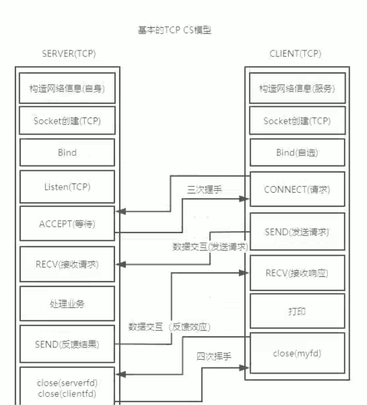

**使用nc测试链接**

```bash
nc ip port
```


## 服务器

**服务器基础**

​	服务器在网络中为网络用户提供数据消息，资料文件等等，大多数企业服务器是Internet中的一个数据仓库。

**服务器种类**

- WEB服务器（HTTP服务器）

  常见于经典的BS架构中，浏览器/web服务模型

- 邮件服务器（Mail Server)

  所有的邮件的收发中转都是利用Mail Server实现的，网络用户的邮件转发与存储都需要通过该服务器进行

- FTP服务器（FTP Server）

  专门为用户提供文件存储服务，经典的上传下载服务器

+ 应用软件服务器

  CS架构中，软件服务器软件提供数据支持，具体提供哪些服务与软件业务相关

+ 处理服务器

  对处理能力和算力有较高的要求，具备高并发性，可以及时有效的处理大量用户业务

+ 代理服务器

+ 文件服务器/数据库服务器

  持久化层，用于保存用户信息用户数据，缓存配置等等

  

**服务器系统**

+ windows服务器系统

  Windows2000Server、Windows2003Server

+  Unix与Linux服务器系统

  目前最为广泛的服务器搭载系统，性能较强，稳定性安全性好

**服务器软件**

+ Apache服务器

  世界范围内影响力和市场占有率比较高的服务器软件，是经典的web服务器（www服务）

  服务器配置模型中，多进程并发模型比较经典。

+ IIS服务器

  微软开发的WEB服务器，使用HTTP协议进行数据交互

+ Nginx服务器

  流行的WEB服务器，专注于性能提升与优化，提高业务处理能力，并发能力强大（线程并发模型）

开发者无需自行开发服务器，只需要安装配置服务器软件就可以获取强大的服务器特性与并发处理能力

**服务器的特性与任务**

**服务器特性：**

+ 服务器需要较强的处理能力

+ 服务器需要较强的稳定性
+ 可靠性\安全性强
+ 可管理性强、可扩展性强

**服务器任务**：

+ 服务器有较强的存储能力（便于共享软硬件资源）持久化用户数据信息
+ 服务器的数据中转（网络穿透）

**服务器常见问题与解决方案：**

+ 客户端与服务器直接相连的隐患：

  1. 将服务器真实地址直接暴露给用户可能造成安全隐患
  2. 大量用户直接连接服务器设备，服务器出现异常宕机，所有连接失效，客户端无法访问
  3. 随着用户数量激增，服务器处理能力有限，当服务器处理到达极限，会出现延迟卡顿等情况，不能很好的相应客户端

+ 代理服务器的作用：

  用户完全面向代理服务器，所有的请求都是向代理服务器发送的，代理服务器从真实服务器获取结果，对用户进行反馈

+ 高可用性问题

+ 负载均衡理念

  负载均衡是高可用架构的重要概念，将工作负载分发到多个服务器中，可以充分提高万盏、应用、数据库的服务性能和可靠性

  大量用户访问同一服务器，可能导致处理缓慢，服务器到达处理极限，可以映入负载均衡器与扩容处理服务器的方式，提高处理能力


**常用的SOCKET套接字函数进行二次包裹**

​	对套接字api进行包裹，内部加入错误处理性质

```C
int MySocket(int domain,int type,int protocol)
{
    int reval;
    if((reval = socket(domain,type,protocol)) == -1){
        perror("socket create failed");
        exit(-1);
    }
   	return reval;
}
```


### **服务器端设计与开发**

​	服务端是典型的被动端，具有一对多处理能力，可以帮助用户完成大量的业务分析与处理并实时反馈响应

+ 单进程服务端接收并响应客户端需求

+ 多进程服务端接受并响应客户端需求（并发）

  优点:

  + 多线程为每个客户端分配处理单元，提高并发性
  + 拥有较强的稳定性，某一个处理单元崩溃不会影响整个服务模型
  
  缺点：
  
  + 每个客户端都为其创建一个进程，有较大的系统开销，进程数量限制
  
  + 处理进程与客户端绑定，如果客户端频繁的连接与断开，服务端就会频繁创建销毁处理进程（产生大量系统开销）
  
  + 子进程结束后必须回收（僵尸进程），回收较为复杂
  
    阻塞回收、非阻塞轮巡回收、捕捉信号回收都不行，捕捉函数会打断阻塞函数（accept)，所以创建新的线程来进行信号捕捉，在主控线程中完成信号屏蔽
  
+ 多线程服务端接受并响应客户端需求（并发）

  优点：

  + 相比多进程开销更小，更轻量
  + 多线程资源共享更方便

  缺点:

  + 多线程如果共享资源，必须考虑线程安全问题（死锁）
  + 稳定性较差，如果线程内发生异常，内核通常以进程为单位杀死异常进程

+ 多路IO复用技术

  多路IO复用技术，可以监听多个网络IO上的网络事件

  **accept()为什么是阻塞的？**

  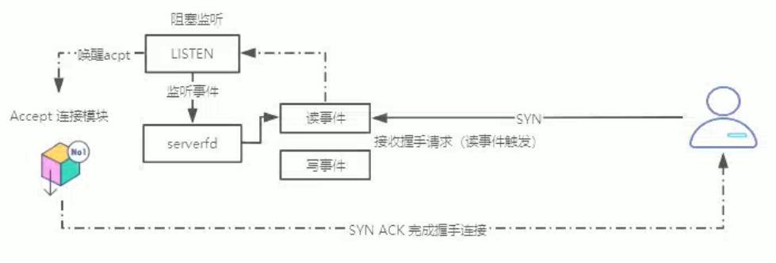

  **recv()为什么是阻塞的？**

  

  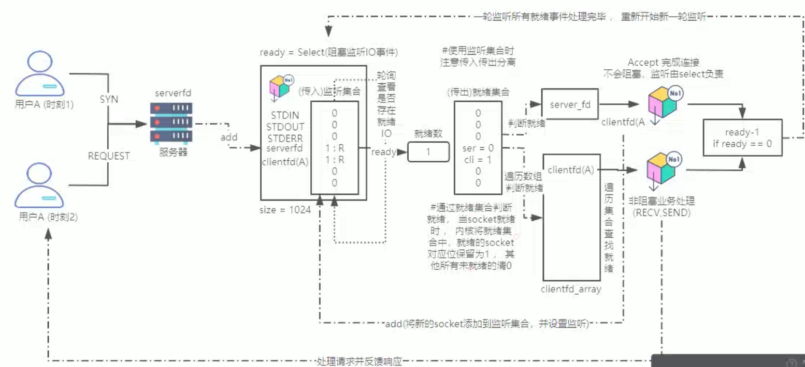

#### 生产者消费者模型

任务容器

```c
typedef struct{
	int front;	//头索引
    int rear;	//尾索引
    int max;	//任务容器最大数
    int cur;	//当前任务数
    task_t *taskqueue;	//任务队列
}queue_t;
```

**模块分析：**

​	pthread_add_task(queue_t *,task_t);	//生产任务的模块，那个线程调用该模块、就是生产者线程

​	void *pthread_consumer_job(void * arg);	//消费者线程默认工作，执行后等待任务并处理，参数为任务队列

```c
int pthread_add_task(queue_t *p,task_t task)
{
    pthread_mutex_lock(&lock);
    while(p->max == p->cur)
        pthread_cond_wait(&not_full,&lock);
    p->taskqueue[p->front].pfun = task.pfun;
    p->taskqueue[p->front].arg = task.arg;
    ++(p->cur);
    p->front = (p->front+1)%p->max;
    pthread_mutex_unlock(&lock);
    pthread_cond_signal(&not_empty);
    return 0;
}
```

```c
void *pthread_consumer_job(void *arg)
{
    task_t task;
    queue_t *p = (queue_t)arg;
    while(1){
        pthread_mutex_lock(&lock);
        while(p->cur == 0)
            pthread_cond_wait(&not_empty,&lock);
        task.pfun = p->taskqueue[p->rear].pfun;
        task.arg = p->taskqueue[p->rear].arg;
        --(p->cur);
        p->rear = (p->rear+1)%p->max;
        pthread_mutex_unlock(lock);
        pthread_cond_signal(&nor_full);
        task.pfun(task.arg);
	}
}
```


#### **select**

```c
#include<sys/select.h>
fd_set set;							//监听集合类型，1024的监听限制源于fd_set
FD_ZERO(fd_set *set);				//初始化监听结合，将所有的监听项初始化为0
FD_SET(int sockfd,fd_set *set);		//将某个监听集合中，特定的socket对应位置1，该函数用于设置socket监听
FD_CLR(int sockfd,fd_set *set);		//将某个监听集合中，特定的socket对应位置0，该函数用于取消socket监听
FD_ISSET(int sockfd,fd_set *set);	//判断某个监听集合中，某个socket位是0还是1并直接返回，如果该函数结合就绪集合使用，可										  以帮助开发者判断出哪个socket就绪并处理
//select开启轮询监听socket事件
int ready = select(int nfds,fd_set *readfds,fd_set *writefds,fd_set *errfds,struct timeval *timeout);
//argv1 = nfds 此轮监听的socket监听数量，一般传入最大的文件描述符+1，
//argv2 = readfds  如果将监听集合传入进来，表示监听该集合中所有socket读事件，传NULL表示不想监听
//argv3 = writefds 如果将监听集合传入进来，表示监听该集合中所有socket写事件，传NULL表示不想监听
//argv4 = errfds   如果将监听集合传入进来，表示监听该集合中所有socket异常事件，传NULL表示不想监听
//timeout参数的结构体类型，根据情况设置可改变select工作模式
struct timeval{
    senconds = 0; //秒
    msenconds = 0;//微秒
}tv;
//argv5 = timeout 可以选择三种select工作模式
//timeout = NULL; select采用阻塞模式监听，无就绪就一直等待
//timeout = tv;	定义时间结构体，并初始化成0，表示select采用阻塞模式监听，无就绪就立即返回
//timeout = tv;	定义时间结构体，根据需求设置时间(秒\微秒)，表示select采用定时阻塞，在固定时间阻塞等待，到时后立即返回
//return value:
	//select监听成功，返回就绪数量ready;
	//如果select因非阻塞返回，返回值为0
	//select调用失败，返回-1
```

 


**select 模型优缺点：**

+ 优点：

  + 单进程让服务端拥有基本的一对多能力
  + 实现较为简单
  + 跨平台能力比较强（各个系同兼容）
  + 如果网络IO监听模型对时间精度有要求，支持微秒级别定时监听

+ 缺点：

  + select受fd_set监听集合类型的影响，最大监听数为1024（不能满足服务端高并发要求）
  + select监听采用的轮询方式，（随着轮询数量的增加，IO处理性能呈线性下降），轮询模型可能导致事件处理不及时
  + select 启动监听时传入监听集合，监听到就绪后内核修改为就绪集合，该就绪集合无法作为监听集合再次使用，所以用户必须将传入传出进行分离，比较麻烦
  + select监听到就绪后只返回就绪的数量，没有返回谁就绪，开发者需要自行遍历查找就绪的socket并处理，开销较大，比较耗时

    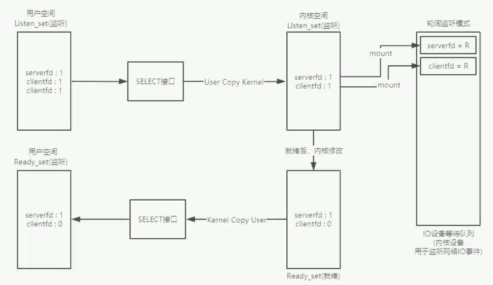

  + select每轮监听都要向内核空间重新拷贝监听集合，将集合中设置的socket，挂载到等待队列中设置监听，这种做法会导致大量的拷贝开销与挂载开销
  

#### poll

**函数接口：**

```c
#include<poll.h>
struct pollfd{
    fd = sockfd	//如果需要监听则赋值sockfd，关闭监听赋值-1
    events =  	//传入设置监听事件
    revents = 	//传出就绪事件
}
struct pollfd Listen_set[4096];	//poll自定义长度监听集合，每个成员为pollfd结构体
int ready = poll(struct pollfd *listen_set, int nfds,int timeout);
//argv1 = poll模型监听集合（用户自定义长度结构体数组）
//argv2 = poll监听最大数，与监听集合大小一致
//argv3 = timeout,可以更改poll模型工作模式
//timeout = -1 阻塞监听模式
//timeout = 0  非阻塞监听
//timrout > 0  定时阻塞监听，默认毫秒级别定时，如果平台不支持向上取秒
```


**poll模型的利弊：**

+ 优点：
  + 单进程让服务端拥有基本的一对多能力
  + 实现较为简单
  + poll模型突破了1024的监听限制（poll没有使用fd_set，而是允许用户自定义长度监听集合数组，还是采用轮询监听）
  + poll模型将传入监听事件与传出就绪事件进行了分离
  + 与传统的select设置监听方式不同，select采用批处理方式进行监听设置，但是poll模型允许对集合中不同的socket设置不同的监听事件，socket监听设置更为灵活，并且有更多网络事件可以监听
+ 缺点：
  + 与select模型基本一致


#### epoll

**函数接口**

```c
#include<sys/epoll.h>
int epfd = epoll_create(int max);	//创建epoll监听集合（红黑树），成功返回树文件描述符
//max = epoll监听数量

epoll_ctl(int epfd,int cmd,int sockfd,struct epoll_event *ee);	//监听树的增删改查
//epfd = 监听树的文件描述符
//cmd = EPOLL_CTL_ADD(监听树节点添加)|EPOLL_CTL_DEL(监听树节点删除)|EPOLL_CTL_MOD(监听树节点修改)
//sockfd = 与监听树中某个监听节点对应
//ee = 监听树节点类型，用于设置监听
struct epoll_event{
    events = //设置监听事件 EPOLLIN|EPOLLOUT
    struct data{
        int fd;//监听的sockfd
    }
}
	
int ready = epoll_wait(int epfd,struct epoll_event *events,int maxevents,int timeout);
//epfd = 设置监听树
//events = 就绪队列，有事件就绪，内核传出就绪的节点到此队列中
//maxevents = 最大就绪数，一般与最大监听数一致
//timeout = 等待超时，可以根据需求改变epoll工作模式
//timeout = -1 阻塞等待监听
//timeout = 0 非阻塞监听
//timeout > 0 定时阻塞
```


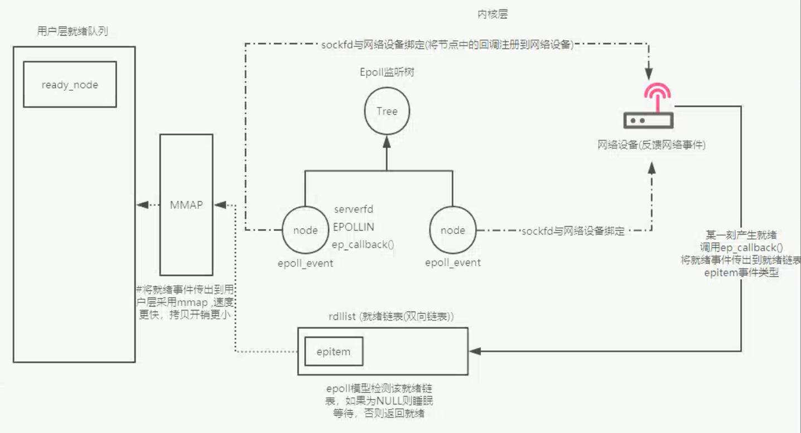

**epoll模型的利弊：**

+ 优点：
  + 采用的是网络设备绑定+回调机制监听反馈事件，不需要轮询监听 ，效率高开销小，没有监听数量限制，可以实现百万级监听（监听能力出众）
  + 当epoll模型监听到sockfd事件就绪，可以直接传出就绪的sockfd到就绪队列，用户只需遍历就绪队列依次处理就绪即可（使用方便）
  + 相比select与poll，epoll业务处理更及时：1.不需要轮询监听 2.不需要查找就绪，大大提高业务处理的实时性
  + epoll的监听树实在内核空间创建的，用户使用时只需要将准备的节点挂载拷贝到内核监听树中即可，而且监听树内部有去重机制，最大限度的保证每个节点只拷贝一次并且只挂载一次（减少不必要的系统开销）
+ 缺点：
  + epoll监听核心是红黑树（近似平衡二叉树），如果对监听集合访问较频繁，会导致系统开销增大（维护监听树的成本较高）
  + 监听能力比较强，单进程情况下业务处理能力与其他模型一致

**epoll sock就绪事件处理**

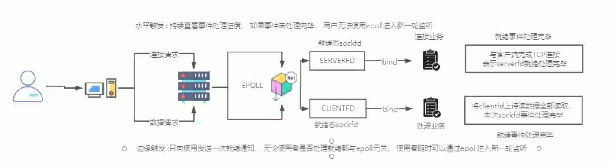

#### **水平触发(EPOLLLT)**

​	可以对不同的socket设置监听模式，默认为水平触发，当第一轮监听，监听到sockfd就绪后，使用者必须将就绪事件处理完毕（建立连接或读取全部数据），否则无法使用epoll_wait进行第二轮监听，未处理完就绪事件前调用epoll_wait,会立即返回未处理的数量

+ 优点：

  可以协助督促使用者即使处理完所有sock事件，保证就绪事件处理的及时性有效性

+ 缺点：

  系统开销较大，epoll不停轮询检测事件处理情况，并反复向上层发送处理通知

#### **边缘触发(EPOLLET)**

​	可以将sockfd监听模式设置为边缘触发模式，当第一轮监听，监听到sockfd就绪后，epoll指向使用者发送一次处理通知，也仅有一次，后续使用者是否处理就绪与epoll无关，随时都可以调用epoll_wait进行新一轮监听

+ 优点：

  epoll开销较小，因为监听到就绪只返回一次就绪，发送一次通知，不会持续检测就绪事件处理进度

+ 缺点：

  因为边缘模式下的sockfd就绪，epoll只反馈一次通知，需要使用者即使将事件或事件数据处理掉，否则事件处理不及时，可能会出现事件数据丢失问题

**单进程IO复用模型（select poll epoll）**

​	单进程模型中，客户端的请求业务不能过于复杂，如果过于复杂导致服务端进程处理时间过长（服务端其他业务停摆）

+ 如果业务处理简单（ms，us，内可以处理完毕）秒内也可以处理大量客户端业务
+ 单进程模型需要对业务复杂度进程限制，还要对业务量进行限制（不能很好提供服务）


#### 多路IO复用+线程池服务端模型

**服务端特性概述：**

+ 在服务器中加入epoll模型（网络IO监听）
+ 线程池并发处理业务（并发处理）
  + 提高线程重用性（避免频繁创建销毁线程）
  + 线程管理能力比较强（根据需求扩容缩减）
  + 预创建处理线程，可以更为及时有效地为客户端服务
+ 处理线程不与客户端绑定（影响并发），处理线程可以重用为不同的客户端服务
+ 线程池不与业务绑定，使用者自行定义实现业务并传递给线程池，线程负责执行即可
+ 服务端任务传递采用生产者消费者模式（epoll生产者，线程池消费者）
+ 管理者角色，负责对线程池进行监控，完成线程控制（扩容与缩减）

**服务端处理流程图：**

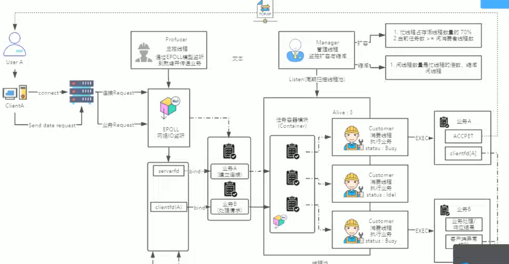

**服务端模块分析：**

```c
//结构体定义
typedef struct{
    void *(*t_addr)(void*);//任务地址
    void *t_arg;
}task;

pthread_mutex_t task_lock;		//任务锁
int epfd,						//监听树文件描述符

typedef struct{
    //线程池阈值
    int threadpool_shutdown;	//任务队列开关
    int thread_max;  			//线程最大值
    int thread_min;  			//线程最小值
    int thread_busy; 			//线程繁忙数
    int thread_alive;		  	//线程有效数量
    int thread_exitcode;		//用于线程缩减
    pthread_t *consumer_tids; 	//消费者线程tid数组
    pthread_t manager_tid;      //管理者线程tid
    int thread_exitcode;		//用于缩减线程
    task *task_queue;			//任务的环形队列
    int front;					//任务队列的头索引
    int rear;					//任务队列的尾索引
    int max;					//任务队列最大数
    int cur;					//任务队列当前任务数
    pthread_mutex_t mlock;	    //互斥锁
    pthread_cond_t not_full;	//生产者条件变量
    pthread_cond_t not_empty;	//消费者条件变量
}thread_pool_t;	//线程池类型

//服务端模型模块分析
void thread_pool_error(const char *strerror,int exitcode);
//如果strerror非空则是标准错误处理，如果为空则是线程函数错误处理
int thread_pool_net_init(void);											//成功返回serverfd,失败返回-1
int thread_pool_epoll_init(int sockfd);									//成功返回监听树描述符，失败返回-1
thread_pool_t *thread_pool_create(int Max,int Min,int QueueMax);		//线程池创建初始化，成功返回线程池地址
int thread_pool_destroy(thread_pool_t*);								//释放销毁线程池资源
int thread_pool_epoll_listen(int epfd，thread_pool_t *p,int serverfd);  //网络IO事件监听
int thread_pool_add_task(thread_pool_t*,task);							//生产者向线程池中添加任务
void *thread_pool_consumer_task(void *arg);								//消费者默认工作，创建时传递线程池参数
void *thread_pool_manager_task(void *arg);								//管理者默认工作，创建时传递线程池参数
int if_thread_alive(pthread_t);											//测试一个线程是否存活
void *task_accept(void *arg);											//tcp连接业务
void *task_response(void *arg);											//业务处理与响应
```

#### **非阻塞读取网络(sockfd)**

1. 通过fcntl函数修改sockfd属性，将其设置为非阻塞sockfd
2. recv(sock,buf,sizeof(buf),MSG_DONTWAIT),非阻塞读网络IO

#### **epollet+非阻塞**

​	epollet只发送一次通知，所以线程要处理完所有的数据，有可能一次处理不完，就要多次循环处理，如果阻塞接受数据，线程就与任务绑定了 
