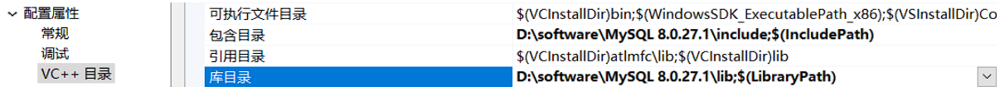
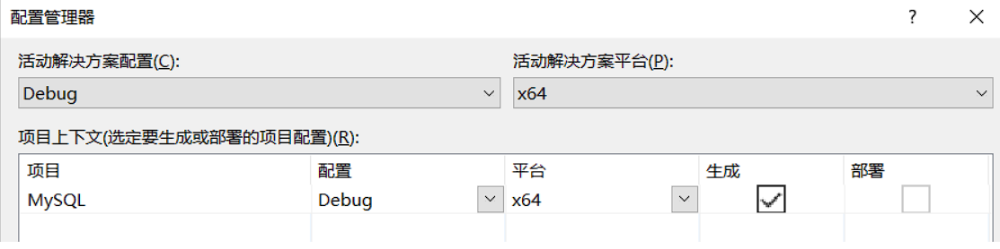
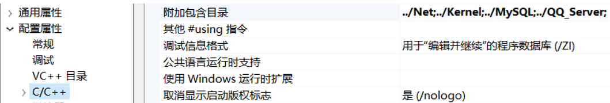
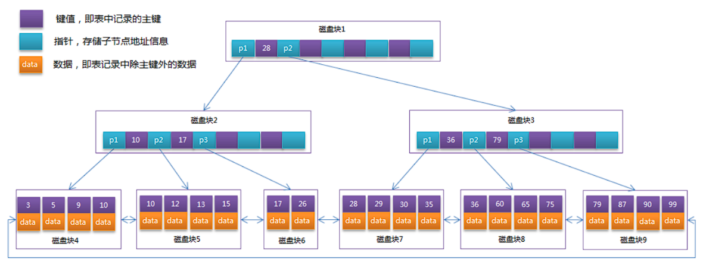
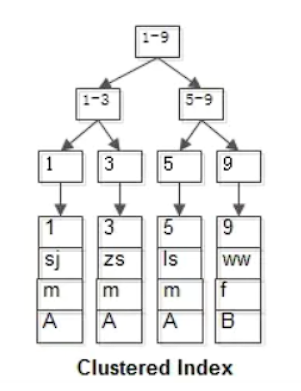
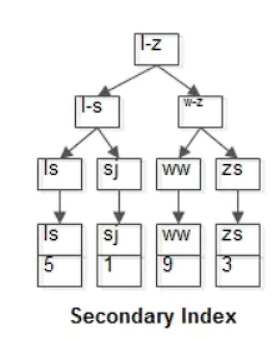
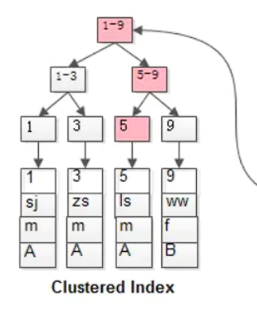
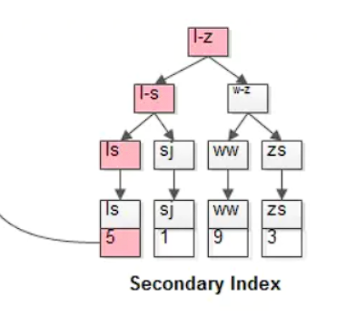

配置MySQl头文件，库文件所在的目录



将项目改为64位



配置头文件




**关系数据库：MySQL、SQLSERVER、ORACLE**

**MySQL：MyISAM存储引擎（5.5.8之前），innodb**

###  **InnoDB和MyISAM区别**

|              | InnoDB         | MyISAM |
| ------------ | -------------- | ------ |
| 事务         | 支持           | 不支持 |
| 存储限制     | 64TB           | 无     |
| 锁粒度       | 行锁           | 表锁   |
| 崩溃后的恢复 | 支持           | 不支持 |
| 外键         | 支持           | 不支持 |
| 全文检索     | 5.7 版本后支持 | 支持   |

MySQL中 ‘ ’ 表示字符串

**varchar**是字符串，**char**是字符数组

**_** 代表任意一个字符

表之间的关系如果是n-n，可能会产生中间表

select 执行的顺序：**1. 查表 (2. 分组) (3. 条件) 4.列**

slelect语句可以作为条件、列、表去用


# 范式

​	要想设计一个好的关系，必须使关系满足一定的约束条件，此约束已经习经形成了规范，按照这种规范设计，可以使结构简洁清晰，不会因为增删改出现异常

元组：表的一行

属性：表的一列

候选码：若关系中的某一属性组的值能唯一地标识一个元组，而其子集不能，则称该属性组为候选码

主码：若一个关系有多个候选码，则选其中的一个作为主码

主属性：候选码的诸属性称为主属性

非主属性：不包含在任何候选码中的属性称为非主属性

**第一范式：**属性不可拆分

例如属性联系方式包括座机和手机，这样就不满足第一范式


**第二范式：**不允许对组合主键的部分依赖（组合关键字不可拆）

**第三范式：**不允许传递依赖


**BCNF（鲍伊斯-科得范式）**：不存在关键字段决定关键字段


### **分页查找**

语法：limit a,b;	表示从a，开始偏移b个，a是索引，b是个数

```mysql
select * from student limit 1,3;
```

### **去重**

​	去除单列重复。或多列组合重复

```mysql
select distinct s,c from sc;
```


# **聚合函数**

1. **count统计个数**

```mysql
select count(*) 李姓老师的个数 from teacher where tname like '李%';
```

```mysql
select count(tname) 李姓老师的个数 from teacher tname like '李%';
```

​	count(*)与count(tname)的区别：如果tname这一列没有NULL，那么结果是一样的，如果有NULL的数据，count(tname)不会计算数据为NULL的那一行

2. **sum求和**

```mysql
select sum(score) from sc where c = '01';
```

3. **min最小**

```mysql
select min(s) 最小学号 from student;
```

4. **max最大**

```mysql
select max(s) 最大学号 from student;
```

5. **avg平均值**

```mysql
select avg(score) from sc where c = '01';
```


### **分组**

**为什么需要分组？**

​	求和或者平均值的时候，不加条件只能求所有的，加上条件只能求某个人或者某个学科的总分或者平均分，那么想要求每个同学或者每一科的总分和平均分的时候应该怎样操作呢？这个时候就需要用到分组

语法：group by + 根据 + having + 条件

```mysql
select s,sum(score) from sc group by s;
```

**分组排序**

语法：order by + 根据 + asc/desc

查询学生的总成绩并进行排名（如果不写排序规则，默认是升序排列）

```mysql
select s,sum(score) score from sc group by s order by score desc;
```

查询男生、女生个数

```mysql
select sex,count(*) from student group by sex;
```


### **where having区别**

分组之前用where，分组之后用having

WHERE是一个约束声明，使用WHERE约束来自数据库的数据，WHERE是在结果返回之前起作用的，**WHERE中不能使用聚合函数**。

HAVING是一个过滤声明，是在查询返回结果集以后对查询结果进行的过滤操作，**在HAVING中可以使用聚合函数**。另一方面，**HAVING子句中不能使用除了分组字段和聚合函数之外的其他字段**。

```mysql
select s,sum(score) from sc group by s having score > 666 order by score;
```

### **sql语句关键字执行顺序**

- from
- on
- join
- where
- group by(开始使用select中的别名，后面的语句中都可以使用)
- avg,sum等聚合函数
- having
- select
- distinct
- order by
- limit

# 视图

​	为了简化过于复杂的sql查询语句，而提出的概念。由一张表或者多张表导出的虚拟表（不能提高效率，如果视图基于一张表可以更新，否则不能更新，不满足范式的要求）

```mysql
create view myview as(
	select student.*,
	(select score from sc where c = '01' and sc.s = student.s)sc1,
	(select score from sc where c = '02' and sc.s = student.s)sc2,
	from student);
```

```mysql
select *from myview where myview.sc1 > myview.sc2;
```

```mysql
drop view myview;
```

**优点：**

1. **sql语句在网络传输中，使用视图可以减少流量。**
2. 它简化了操作。此时我们完全不用关心视图是怎么处理数据的，我们只需要知道如何使用这个结果集即可，视图相当于一个中间层。
3. **它更加安全。比如我们可以让用户有权去访问某个视图，但是不能访问原表，这样就可以起到保护原表中某些数据的作用。**
4. 降低耦合。假如我们以后要修改原表的结构，那么我们可以通过修改视图的定义即可，而不用修改应用程序，对访问者是不会造成影响的，一般来说，这样代价会更小。

**缺点：**

1. 性能：从数据库视图查询数据可能会很慢，特别是如果视图是基于其他视图创建的。

2. 表依赖关系：将根据数据库的基础表创建一个视图。每当更改与其相关联的表的结构时，都必须更改视图。

# 多表查询

1. 内联：表1 inner join 表2 on 连接条件

   查找选张三老师课程的学生信息:内联(在表的后面加上另一张表的符合条件的行)

   ```mysql
   select s.* from teacher t
   	inner join course c on t.tnum = c.tnum		//老师教了哪些课
   	inner join sc on c.cnum = sc.cnum = c.cnum	//学生学了什么课
   	inner join student s on sc.snum = s.snum	//学生信息
   	where tname = '张三'；
   ```

   查找课程01成绩比02成绩大的人

   ```mysql
   select student.*,sc.score,sc1.score from student
   	inner join sc on student.snum = sc.snum and cnum = '01'
   	inner join sc sc1 on student.snum = sc.snum and cnum = '02'
   	where sc.score > sc1.score;
   ```

2. 左联(以左表为主，它会返回左表中的所有记录和右表中满足连接条件的记录。) 

3. 右联(以右表为主，它会返回右表中的所有记录和左表中满足连接条件的记录。)

# 函数

```mysql
#重写结束符
delimiter /
create function myfun(a int,b,int)
returns int
begin
	declare c int default 0;		#局部变量
	set c = a+b;
	return c;
end /
delimiter ;
```

```mysql
select myfun(6,6);
```

```mysql
drop function myfun;
```

```mysql
drop function if exists myfun;
delimiter /
create function myfun(a int)
returns int
begin
	declare sum int default 0;
	declare i int default 0;
	out_label:begin
	while(1)
	do
		set sum = sum+i;
		set i = i+1;
		if(i > a)
			then leave out_label;
		end if;
	end while；
	end out_label;
	return sum;
end /
delimiter ;	
```

```mysql
drop function if exists myfun;
delimiter /
create function myfun(a int)
return varchar(45)
begin
	declare c varchar(45) default '';
	if(a = 0) then set c = 'zh';
	elseif(a < 0) then set c = 'zhong';
	else set c = 'zz';
	end if;
	return c;
end /
delimiter ;
```

**变量**

+ 会话变量

  ```mysql
  set @a = myfun(6,6);	#生命周期直到用户退出登录，不用定义类型
  ```

+ 系统变量

  ```mysql
  set @@		#生命周期一直存在
  ```

# 存储过程

​	存储过程是在大型数据库系统中，一组为了完成特定功能的SQL语句集，它存储在数据库中，一次编译永久有效，用户通过指定存储过程的名字并给出参数来执行。

​	存储过程是数据库中的一个重要对象。在数据量特别庞大的情况下利用存储过程能达到倍速的效率的提升

**优点：**

1. 减少网络流量，存储过程直接在服务器端运行，减少了与客户机的交互
2. 加快系统运行速度
3. 使用灵活

```mysql
delimiter /
create procedure myproc(a int,out b int)
begin
	select * from user limit a;
	set b = (select count(*) from user);
end /
delimiter ;

set @c = 3;
call myproc(@c,@c);
select @c;
```

### **函数与存储过程区别**

存储过程可以包括SQL语句，而且可以通过参数返回多个返回值，函数不能包括SQL语句，只能返回一个返回值。

# prepare

 	参数可以为各种数据类型，如数值型、字符型等。想让参数为表的名字，可以使用prepare语法

语法：

```mysql
PREPARE statement_name FROM sql_text;	/*定义*/
EXECUTE statement_name [USING variable [,variable...]]	/*执行预处理语句*/
DEALLOCATE PREPARE statement_name	/*删除定于*/
```

```mysql
PREPARE prod FROM "select * from student limit ?,?";
SET @a = '1';
SET @b = '2';
EXECUTE prod USING @a,@b;
DEALLOCATE PREPARE prod;
```

# 触发器

​	是一种特殊的存储过程，当指定事件（插入、修改、删除）发生时，系统自动调用。

​	 new(新的数据)	old(原始数据)

```mysql
delimiter /
create trigger myinsert
after	update	on	user
for each row
begin
	update userstate set u_qq = new.u_qq where u_qq = old.u_qq;
end /
delimiter ;

update user set u_qq = 606 where u_name = 'zh';
```


# 事务

​	对一系列的数据库操作（比如插入多条数据）进行统一的提交或回滚操作，如果插入成功，那么一起成功，如果中间有一条出现异常，那么回滚之前的所有操作。

​	只有InnoDB支持事务

**特性：**

1. 原子性 Atomicity ：一个事务（transaction）中的所有操作，或者全部完成，或者全部不完成，不会结束在中间某个环节。事务在执行过程中发生错误，会被恢复（Rollback）到事务开始前的状态，就像这个事务从来没有执行过一样。即，事务不可分割、不可约简。
2. 一致性 Consistency ：在事务开始之前和事务结束以后，数据库的完整性没有被破坏。这表示写入的资料必须完全符合所有的预设约束、触发器、级联回滚等。
3. 隔离性 Isolation ：数据库允许多个并发事务同时对其数据进行读写和修改的能力，隔离性可以防止多个事务并发执行时由于交叉执行而导致数据的不一致。事务隔离分为不同级别，包括读未提交（Read uncommitted）、读提交（read committed）、可重复读（repeatable read）和串行化（Serializable）。
4. 持久性 Durability ：事务处理结束后，对数据的修改就是永久的，即便系统故障也不会丢失。软、硬件崩溃后，InnoDB数据表驱动会利用日志文件重构修改。

​	可靠性和高速度不可兼得， innodb_flush_log_at_trx_commit选项 决定什么时候吧事务保存到日志里。

```mysql
#开启事务				START TRANSACTION 或 BEGIN
#提交事务（关闭事务）		COMMIT
#放弃事务（关闭事务）		ROLLBACK
start transaction;
update bank set money = money + 100 where name = 'zh';
update bank set money = money - 100 where name = 'zhong';
rollback;
commit;
```

**事务的并发问题？**

实际场景下，事务并不是串行的，所以会带来如下三个问题：

1. 脏读：事务 A 读取了事务 B 更新的数据，然后 B 回滚操作，那么 A 读取到的数据是脏数据。
2. 不可重复读：事务 A 多次读取同一数据，事务 B 在事务 A 多次读取的过程中，对数据作了更新并提交，导致事务 A 多次读取同一数据时，结果不一致。
3. 幻读：系统管理员 A 将数据库中所有学生的成绩从具体分数改为 ABCDE 等级，但是系统管理员 B 就在这个时候插入了一条具体分数的记录，当系统管理员 A 改结束后发现还有一条记录没有改过来，就好像发生了幻觉一样，这就叫幻读。不可重复读与幻读的区别可以通俗的理解为：前者是数据变了，后者是数据的行数变了。

**事务隔离**

​	事务隔离是为了解决脏读、不可重复读、幻读问题

+ READ UNCOMMITTED（未提交读）：事务中的修改，即使没有提交，对其他事务也都是可见的。

  会导致脏读。

+ READ COMMITTED（提交读）：事务从开始直到提交之前，所做的任何修改对其他事务都是不可见的。

  会导致不可重复读。

  这个隔离级别，也可以叫做“不可重复读”。

+ REPEATABLE READ（可重复读）：一个事务按相同的查询条件读取以前检索过的数据，其他事务插入了满足其查询条件的新数据。产生幻行。

  会导致幻读。

+ SERIALIZABLE（可串行化）：强制事务串行执行。

| 事务隔离级别                 | 脏读 | 不可重复读 | 幻读 |
| ---------------------------- | ---- | ---------- | ---- |
| 读未提交（read-uncommitted） | 是   | 是         | 是   |
| 读已提交（read-committed）   | 否   | 是         | 是   |
| 可重复读（repeatable-read）  | 否   | 否         | 否 X |
| 串行化（serializable）       | 否   | 否         | 否   |

- MySQL 默认的事务隔离级别为可重复读（repeatable-read） 。
- 上图的 `<X>` 处，MySQL 因为其间隙锁的特性，导致其在可重复读（repeatable-read）的隔离级别下，不存在幻读问题。也就是说，上图 `<X>` 处，需要改成“否”！！！！

1. READ UNCOMMITTED & READ COMMITTED：

   通过Record Lock算法实现了行锁，但READ UNCOMMITTED允许读取未提交数据，所以存在脏读问题。而READ COMMITTED允许读取提交数据，所以不存在脏读问题，但存在不可重复读问题。

2. REPEATABLE READ：

   使用Next-Key Lock算法实现了行锁，并且不允许读取已提交的数据，所以解决了不可重复读的问题。另外，该算法包含了间隙锁，会锁定一个范围，因此也解决了幻读的问题。

3. SERIALIZABLE：

   对每个SELECT语句后自动加上LOCK IN SHARE MODE，即为每个读取操作加一个共享锁。因此在这个事务隔离级别下，读占用了锁，对一致性的非锁定读不再予以支持。

### MVCC

​	InnoDB默认的隔离级别是RR（REPEATABLE READ），RR解决脏读、不可重复读、幻读等问题，使用的是MVCC。MVCC全称Multi-Version Concurrency Control，即**多版本的并发控制协议**。它最大的优点是读不加锁，因此读写不冲突，并发性能好。InnoDB实现MVCC，多个版本的数据可以共存，主要基于以下技术及数据结构：

1. 隐藏列：InnoDB中每行数据都有隐藏列，隐藏列中包含了本行数据的事务id、指向undo log的指针等。
2. 基于undo log的版本链：每行数据的隐藏列中包含了指向undo log的指针，而每条undo log也会指向更早版本的undo log，从而形成一条版本链。
3. ReadView：通过隐藏列和版本链，MySQL可以将数据恢复到指定版本。但是具体要恢复到哪个版本，则需要根据ReadView来确定。所谓ReadView，是指事务（记做事务A）在某一时刻给整个事务系统（trx_sys）打快照，之后再进行读操作时，会将读取到的数据中的事务id与trx_sys快照比较，从而判断数据对该ReadView是否可见，即对事务A是否可见。

**事务可以嵌套吗？**

​	可以，因为嵌套事务也是众多事务分类中的一种，它是一个层次结构框架。有一个顶层事务控制着各个层次的事务，顶层事务之下嵌套的事务被称为子事务，它控制每一个局部的变换。

需要注意的是，MySQL数据库不支持嵌套事务。


# 锁

​	锁是数据库系统区别于文件系统的一个关键特性，锁机制用于管理对共享资源的并发访问。下面我们以MySQL数据库的InnoDB引擎为例，来说明锁的一些特点。

**锁的类型：**

​	MySQL 的共享锁和排他锁，就是读锁和写锁。

+ 共享锁：不堵塞，多个用户可以同时读一个资源，互不干扰。
+ 排他锁：一个写锁会阻塞其他的读锁和写锁，这样可以只允许一个用户进行写入，防止其他用户读取正在写入的资源。

**锁的粒度？**

- 表锁：系统开销最小，会锁定整张表，MyIsam 使用表锁。
- 行锁：最大程度的支持并发处理，但是也带来了最大的锁开销，InnoDB 使用行锁。

**锁的算法：**

InnoDB存储引擎有3种行锁的算法，其分别是：

- Record Lock：单个行记录上的锁。
- Gap Lock：间隙锁，锁定一个范围，但不包含记录本身。
- Next-Key Lock∶Gap Lock+Record Lock，锁定一个范围，并且锁定记录本身。

**间隙锁**

​	InnoDB存储引擎有3种行锁的算法，间隙锁（Gap Lock）是其中之一。间隙锁用于锁定一个范围，但不包含记录本身。它的作用是为了阻止多个事务将记录插入到同一范围内，而这会导致幻读问题的产生。

 **悲观锁？乐观锁？**

+ 悲观锁

它指的是对数据被外界（包括本系统当前的其他事务，以及来自外部系统的事务处理）修改持保守态度，因此，在整个数据处理过程中，将数据处于锁定状态。悲观锁的实现，往往依靠数据库提供的锁机制（也只有数据库层提供的锁机制才能真正保证数据访问的排他性，否则，即使在本系统中实现了加锁机制，也无法保证外部系统不会修改数据）。

在悲观锁的情况下，为了保证事务的隔离性，就需要一致性锁定读。读取数据时给加锁，其它事务无法修改这些数据。修改删除数据时也要加锁，其它事务无法读取这些数据。

+ 乐观锁

相对悲观锁而言，乐观锁机制采取了更加宽松的加锁机制。悲观锁大多数情况下依靠数据库的锁机制实现，以保证操作最大程度的独占性。但随之而来的就是数据库性能的大量开销，特别是对长事务而言，这样的开销往往无法承受。

而乐观锁机制在一定程度上解决了这个问题。乐观锁，大多是基于数据版本（ Version ）记录机制实现。何谓数据版本？即为数据增加一个版本标识，在基于数据库表的版本解决方案中，一般是通过为数据库表增加一个 “version” 字段来实现。读取出数据时，将此版本号一同读出，之后更新时，对此版本号加一。此时，将提交数据的版本数据与数据库表对应记录的当前版本信息进行比对，如果提交的数据版本号大于数据库表当前版本号，则予以更新，否则认为是过期数据。

#### InnoDB行级锁实现

InnoDB行级锁是通过给索引上的索引项加锁来实现的。只有通过索引条件检索数据，InnoDB才使用行级锁，否则，InnoDB将使用表锁。

当表中锁定其中的某几行时，不同的事务可以使用不同的索引锁定不同的行。另外，不论使用主键索引、唯一索引还是普通索引，InnoDB都会使用行锁来对数据加锁。

**死锁**

​	死锁是指两个或两个以上的事务在执行过程中，因争夺锁资源而造成的一种互相等待的现象。若无外力作用，事务都将无法推进下去。

**死锁的发生必须具备以下四个必要条件：**

+ 互斥条件：指进程对所分配到的资源进行排它性使用，即在一段时间内某资源只由一个进程占用。如果此时还有其它进程请求资源，则请求者只能等待，直至占有资源的进程用毕释放。
+ 请求和保持条件：指进程已经保持至少一个资源，但又提出了新的资源请求，而该资源已被其它进程占有，此时请求进程阻塞，但又对自己已获得的其它资源保持不放。
+ 不剥夺条件：指进程已获得的资源，在未使用完之前，不能被剥夺，只能在使用完时由自己释放。
+ 环路等待条件：指在发生死锁时，必然存在一个进程——资源的环形链，即进程集合 {P0，P1，P2，•••，Pn} 中的 P0 正在等待一个 P1 占用的资源；P1 正在等待 P2 占用的资源，……，Pn 正在等待已被 P0 占用的资源。

**解决死锁**问题最简单的一种方法是超时，即当两个事务互相等待时，当一个等待时间超过设置的某一阈值时，其中一个事务进行回滚，另一个等待的事务就能继续进行。

除了超时机制，当前数据库还都普遍采用wait-for graph（等待图）的方式来进行死锁检测。较之超时的解决方案，这是一种更为主动的死锁检测方式。InnoDB存储引擎也采用的这种方式。wait-for graph要求数据库保存以下两种信息：

- 锁的信息链表；
- 事务等待链表；

通过上述链表可以构造出一张图，而在这个图中若存在回路，就代表存在死锁，因此资源间相互发生等待。这是一种较为主动的死锁检测机制，在每个事务请求锁并发生等待时都会判断是否存在回路，若存在则有死锁，通常来说InnoDB存储引擎选择回滚undo量最小的事务。

# 索引

​	索引是一个单独的、存储在磁盘上的数据库结构，包含着对数据表里所有记录的引用指针。

​	使用索引可以快速找出在某个或多个列中有一特定值的行，所有MySQL列类型都可以被索引，对相关列使用索引是提高查询操作速度的最佳途径。

​	索引是在存储引擎中实现的，MySQL中索引的存储类型有两种，即BTREE和HASH，MyISAM和InnoDB存储引擎只支持BTREE索引。

**优点：**

1. 通过创建唯一索引，可以保证数据库表中每一行数据的唯一性。
2. 可以大大加快数据的查询速度，这也是创建索引的主要原因。
3. 在实现数据的参考完整性方面，可以加速表和表之间的连接。

4. 在使用分组和排序子句进行数据查询时，也可以显著减少查询中分组和排序的时间。(索引之所以查的快，是因为先将数据排好序，若该字段正好需要排序，则正好降低了排序的成本。)

**缺点：**

1. 创建索引和维护索引要耗费时间，并且随着数据量的增加所耗费的时间也会增加。
2. 索引需要占磁盘空间，除了数据表占数据空间之外，每一个索引还要占一定的物理空间，如果有大量的索引，索引文件可能比数据文件更快达到最大文件尺寸。
3. 当对表中的数据进行增加、删除和修改的时候，索引也要动态地维护，这样就降低了数据的维护速度。

**索引原理**

​	InnoDB存储引擎就是用 B+Tree 实现其索引结构，B+TREE是一种平衡二叉树。从上一节中的 B-Tree 结构图中可以看到，每个节点中不仅包含数据的 key 值，还有 data 值。而每一个页的存储空间是有限的，如果 data 数据较大时将会导致每个节点（即一个页）能存储的 key 的数量很小，当存储的数据量很大时同样会导致 B-Tree 的深度较大，增大查询时的磁盘 I/O 次数，进而影响查询效率。**在 B+Tree 中，所有数据记录节点都是按照键值大小顺序存放在同一层的叶子节点上，而非叶子节点上只存储 key 值信息，这样可以大大加大每个节点存储的 key 值数量，降低 B+Tree 的高度。**

- 非叶子节点只存储键值信息。
- 所有叶子节点之间都有一个链指针。
- 数据记录都存放在叶子节点中。



**B+Tree 有哪些索引类型？**

​	在 B+Tree 中，根据叶子节点的内容，索引类型分为主键索引和非主键索引。

​	主键索引的叶子节点存的数据是整行数据( 即具体数据 )。在 InnoDB 里，主键索引也被称为聚集索引（clustered index）。
​	非主键索引的叶子节点存的数据是整行数据的主键，键值是索引。在 InnoDB 里，非主键索引也被称为辅助索引（secondary index）。
​	辅助索引与聚集索引的区别在于辅助索引的叶子节点并不包含行记录的全部数据，而是存储相应行数据的聚集索引键，即主键。当通过辅助索引来查询数据时，需要进过两步：

+ 首先，InnoDB 存储引擎会遍历辅助索引找到主键。
+ 然后，再通过主键在聚集索引中找到完整的行记录数据。


InnoDB**聚集索引**的叶子节点存储行记录，因此， InnoDB必须要有，且只有一个聚集索引：

1. 如果表定义了PK，则PK就是聚集索引；
2. 如果表没有定义PK，则第一个not NULL unique列是聚集索引；
3. 否则，InnoDB会创建一个隐藏的row-id作为聚集索引;

### 回表查询

​	先定位主键值，再定位行记录，它的性能较扫一遍索引树更低。所以在查询时，可以尽量用聚集索引来查（也就是用主键来查询）

```mysql
t(id PK,name KEY,sex,flag);
#画外音:id是聚集索引，name是普通索引
#表中有4条记录
1,s,m,A
2,z,m,A
5,l,m,A
9,w,f,B
```



两个B+树索引分别如上图：

1. id为PK，聚集索引，叶子节点存储行记录；
2. name为KEY，普通索引，叶子节点存储PK值，即id；

**普通索引查询过程：**

​	通常情况下，需要扫描两遍索引树

```mysql
select *from t where name = 'lisi';
```



如**粉红色**路径，需要扫码两遍索引树：

1. 先通过普通索引定位到主键值id=5；
2. 在通过聚集索引定位到行记录；

这就是所谓的**回表查询**，先定位主键值，再定位行记录，它的性能较扫一遍索引树更低。所以在查询时，可以尽量用聚集索引来查（也就是用主键来查询）

### **索引的最左匹配特性**

​	当 B+Tree 的数据项是复合的数据结构，比如索引 `(name, age, sex)` 的时候，B+Tree 是按照从左到右的顺序来建立搜索树的。

**索引是越多越好吗？**

​	索引并非越多越好，一个表中如有大量的索引，不仅占用磁盘空间，还会影响INSERT、DELETE、UPDATE等语句的性能，因为在表中的数据更改时，索引也会进行调整和更新。

**只要创建了索引，就一定会走索引吗？**

​	不一定。比如，在使用组合索引的时候，如果没有遵从“最左前缀”的原则进行搜索，则索引是不起作用的。

**什么时候需要重建索引呢？**

1. 表上频繁发生update,delete操作；
2. 表上发生了alter table ..move操作（move操作导致了rowid变化）。

**直接重建索引：**

```mysql
alter index indexname rebuild; alter index indexname rebuild online;
```

**使用场景**

1. 对非常小的表，大部分情况下全表扫描效率更高。

2. 对中大型表，索引非常有效。

3. 特大型的表，建立和使用索引的代价随着增长，可以使用分区技术来解决。
4. 当唯一性使某种数据本身的特征是，指定唯一索引，使用唯一索引需能确保定义的列的数据完整性以提高查询速度
5. 在频繁进行排序或分组的列上建立索引，如果待排序的列有多个可以在这些列上建立组合索引

### **创建注意事项**

1. 最适合索引的列是出现在 `WHERE` 子句中的列，或连接子句中的列，而不是出现在 `SELECT` 关键字后的列。
2. 在条件表达式中经常用到的不同值较多的列上建立索引，在不同值很少的列上不要建立索引。比如在学生表的“性别”字段上只有“男”与“女”两个不同值，因此就无须建立索引，如果建立索引不但不会提高查询效率，反而会严重降低数据更新速度。
3. 避免对经常更新的表进行过多的索引，并且索引中的列要尽可能少。应该经常用于查询的字段创建索引，但要避免添加不必要的字段。
4. 数据量小的表最好不要使用索引，由于数据较少，查询花费的时间可能比遍历索引的时间还要短，索引可能不会产生优化效果。
5. 当唯一性是某种数据本身的特征时，指定唯一索引。使用唯一索引需能确保定义的列的数据完整性，以提高查询速度。
6. 在频繁进行排序或分组（即进行group by或order by操作）的列上建立索引，如果待排序的列有多个，可以在这些列上建立组合索引

### **使用注意事项**

1. 复合索引遵循前缀原则
2. 不在索引列上做任何操作，例如计算、函数、类型转换，会导致索引失效而转向全表扫描；
3. 应尽量避免在 `WHERE` 子句中使用 `!=` 或 `<>` 操作符，否则将引擎放弃使用索引而进行全表扫描。优化器将无法通过索引来确定将要命中的行数,因此需要搜索该表的所有行。
4. LIKE以通配符开头（%abc）MySQL索引会失效变成全表扫描的操作
5. 字符串不加单引号会导致索引失效（可能发生了索引列的隐式转换）；
6. 少用or，用它来连接时会索引失效。

### **索引分类**

1. 普通索引和唯一索引

​	普通索引时MySQL中的基本索引类型，允许在定义索引的列中插入重复值和空值

​	唯一索引要求索引列的值必须唯一，但允许有空值。如果是组合索引，则列值的组合必须唯一

​	主键索引是一种特殊的唯一索引，不允许有空值

2. 单项索引和组合索引

   单列索引即一个索引只包含单个列，一个表中可以有多个单列索引

   组合索引是指在表的多个字段组合上创建的索引，只有在查询条件中使用了这些字段的左边字段时，索引在会被使用。使用组合索引时遵循最左边前缀集合

3. 全文索引

   全文索引类型为FULLTEXT，在定义索引的列上支持值的全文查找，允许在这些索引列中插入重复值和空值。全文索引可以在CHAR、VARCHAR或者TEXT类型的列上创建

### **使用**

1. 在创建表的时候创建索引：

   在id字段上使用UNIQUE关键字创建唯一索引：

   ```mysql
   CREATE TABLE table_name [col_name data_type] [UNIQUE|FULLTEXT|SPATIAL] [INDEX|KEY] [index_name] (col_name [length]) [ASC|DESC]
   ```

   ```mysql
   create table t1(id INT NOT NULL,name char(30) NOT NULL,UNIQUE INDEX uniqIdx(id));
   ```

2. 在已存在的表上创建索引:

   ALTER TABLE创建索引的基本语法如下：

   ```mysql
   ALTER TABLE table_name ADD  [UNIQUE|FULLTEXT|SPATIAL] [INDEX|KEY] [index_name] (col_name[length],...) [ASC|DESC]
   ```

   在bookId字段上建立名称为UniqidIdx的唯一索引：

   ```mysql
   alter table book add unique index uniqinIdx(bookId);
   ```

   CREATE INDEX创建索引的基本语法如下：

   ```mysql
   CREATE [UNIQUE|FULLTEXT|SPATIAL] INDEX index_name  ON table_name (col_name [length],...) [ASC|DESC]
   ```

   ```mysql
   CREATE UNIQUE INDEX UniqidIdx ON book (bookId);
   ```


### **数据库优化**

针对查询，我们可以通过使用索引、使用连接代替子查询的方式来提高查询速度。

针对慢查询，我们可以通过分析慢查询日志，来发现引起慢查询的原因，从而有针对性的进行优化。

针对插入，我们可以通过禁用索引、禁用检查等方式来提高插入速度，在插入之后再启用索引和检查。

针对数据库结构，我们可以通过将字段很多的表拆分成多张表、增加中间表、增加冗余字段等方式进行优化。

###  **该如何优化MySQL的查询？**

1. 使用索引

2. 优化子查询，

   使用子查询，可以进行SELECT语句的嵌套查询，即一个SELECT查询的结果作为另一个SELECT语句的条件。子查询可以一次性完成很多逻辑上需要多个步骤才能完成的SQL操作。

   子查询虽然可以使查询语句很灵活，但执行效率不高。执行子查询时，MySQL需要为内层查询语句的查询结果建立一个临时表。然后外层查询语句从临时表中查询记录。查询完毕后，再撤销这些临时表。因此，子查询的速度会受到一定的影响。如果查询的数据量比较大，这种影响就会随之增大。

   在MySQL中，可以使用连接（JOIN）查询来替代子查询。连接查询不需要建立临时表，其速度比子查询要快，如果查询中使用索引，性能会更好。

### **该如何优化插入数据？**

1. 禁用唯一性检查

   插入数据之前执行set unique_checks=0来禁止对唯一索引的检查，数据导入完成之后再运行set unique_checks=1。这个和MyISAM引擎的使用方法一样。

2. 禁用外键检查

   插入数据之前执行禁止对外键的检查，数据插入完成之后再恢复对外键的检查。

3. 禁用自动提交

   插入数据之前禁止事务的自动提交，数据导入完成之后，执行恢复自动提交操作。

###  **表中包含几千万条数据该怎么办？**

1. 优化SQL和索引；
2. 增加缓存，如memcached、redis；
3. 读写分离，可以采用主从复制，也可以采用主主复制；
4. 使用MySQL自带的分区表，这对应用是透明的，无需改代码，但SQL语句是要针对分区表做优化的；
5. 做垂直拆分，即根据模块的耦合度，将一个大的系统分为多个小的系统；
6. 做水平拆分，要选择一个合理的sharding key，为了有好的查询效率，表结构也要改动，做一定的冗余，应用也要改，sql中尽量带sharding key，将数据定位到限定的表上去查，而不是扫描全部的表。