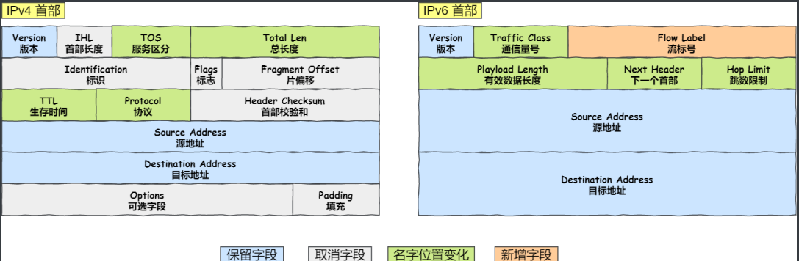

#### **OSI七层模型**

+ **应用层**（提供应用程序间通信）：HTTP、HTTPS、FTP、DNS、DHCP、Telnet、SMTP、SSH
+ 表示层（数据格式转换）：数据加解密、数据解压缩、图片、视频编解码
+ 会话层（建立、维护、管理会话）：session会话管理、服务器验证用户登录、断电续传
+ **传输层**（提供应用进程之间的逻辑通信）：TCP、UDP、线程、端口、SOCKET
+ **网络层**（寻址和路由选择，分组转发数据）：防火墙、IP地址、路由器、ARP、RARP
+ **数据链路层**（提供链路管理（数据分帧、物理地址寻址mac、重发等））：交换机、网卡
+ **物理层**（提供比特流传输）：光缆、电缆

#### TCP

​	TCP传输控制协议，提供一种面向连接的、可靠的、基于字节流的 传输层通信协议，有流量控制和差错控制，使用TCP协议的应用比如邮件的接受和发送、文件传输、远程登录。需要数据稳定和完成性比较高的场景多使用TCP协议

+ ⾯向连接：⼀定是「⼀对⼀」才能连接，不能像 UDP 协议可以⼀个主机同时向多个主机发送消 息，也就是⼀对多是⽆法做到的
+ 可靠的：⽆论的⽹络链路中出现了怎样的链路变化，TCP 都可以保证⼀个报⽂⼀定能够到达接收端
+ 字节流：消息是「没有边界」的，所以⽆论我们消息有多⼤都可以进⾏传输。并且消息是「有序的」，当「前⼀个」消息没有收到的时候，即使它先收到了后⾯的字节，那么也不能扔给应⽤层去 处理，同时对「重复」的报⽂会⾃动丢弃

##### 三次握手

1. 客户端会随机初始化序号，将此序号放在TCP首部的序号字段中，同时把SYN标志位置为1，表示是SYN报文，发送给服务端，之后客户端处于SYN-SEND状态
2. 服务端收到客户端的SYN报文，需要应答收到的SYN报文同时建立连接，就是回复一个包既做应答又做建立连接。将ACK标志位置为1，序号ack = x+1,将SYN标志位置为1，序号seq = y，是随机生成的，之后服务端处于SYN-RCVD。
3. 客户端收到服务端发送的报文后，回复最后一个应答报文，将ACK标志位置为1，序号ack = y+1，之后客户端处于 ESTABLISHED状态，服务端收到报文后，也处于 ESTABLISHED状态。

**为什么是三次挥手？不是两次也不是四次**

​	为了实现可靠传输，发送方和接收方始终需要同步序号。由于TCP是一个双向通信协议，也就是全双工，通信双方都有能力发送信息，并接受响应。因此，通信双方都需要随机产生一个初始的序列号，并且把这个初始值告诉对方。只有经过三次握手才能确保双方收和发都是没问题的。

##### 四次挥手

1. 主动方向被动方发送一个TCP首部FIN标志位被置为1的报文，之后主动方进入FIN_WAIT1状态
2. 被动方接受到报文后，就像主动方发送ACK应答报文，接着被动方进入CLOSED_WAIT状态。此时被动方不能立刻断开连接，因为可能还有一些数据在路上，还有一些收到的数据内有处理完，需要处理一段时间。主动方收到被动方的ACK应答报文后，进入FIN_WAIT_2状态
3. 等待被动方处理完数据后，也向主动方发送FIN报文，之后被动方进入LAST_ACK状态。ACK、FIN标志位置为1
4. 主动方收到被动方的FIN报文后，回一个ACK应答报文，之后进入TIME_WAIT状态。
5. 被动方收到了ACK应答报文后，就进入了CLOSED状态，至此被动方已经完成连接的关闭
6. 主动方在经过2MSL时间后，自动进入CLOSED状态，至此主动方页完成连接的关闭

**为什么是四次挥手？**

​	主动方断开连接时，可能有数据在网络中没有到达，还有可能被动方有一些数据没有处理完，需要处理一段时间，所以被动方向主动方发送的FIN报文不能和ACK报文一起发送，需要等待一段时间以后单独发送一个FIN报文，所以需要四次挥手

##### **为什么TIME_WAIT状态等待2MSL？**

​	MSL是报文最大生存时间，它是任何报文在网络上存在的最长时间，超过这个时间报文将被丢弃。2MSL这段时间保证数据包可以一去一回，防止四次挥手的第四次数据包丢包后，无法重传数据报，导致被动方无法正常关闭。假如第四个包丢了，那么1个MSL时间后，被动方会给主动方重传一个FIN报文，2倍的MSL时间正好能够收到被动方重传的FIN包的时间，所以是等待2MSL时间。


##### 重传机制

**超时重传**

​	发送方发送数据时，会开启一个定时器，发送数据后开始计时，如果时间到也没有收到对方回复的确认包，就重新发送一遍数据

​	没有收到回复确认包有两种情况：**一种是发送的数据包丢失了**，还有一种是**对方回复的确认包丢失了**，超时后还会再发送一遍刚才的数据，这时候对方收到这个数据发现是刚才已经处理过的数据了，就会丢弃这个包，但还是会发送回复确认包给对方。

**快速重传**

​	快速重传的⼯作⽅式是当收到三个相同的 ACK 报⽂时，会在定时器过期之前，重传丢失的报⽂段


​	快速重传机制只解决了⼀个问题，就是超时时间的问题，但是它依然⾯临着另外⼀个问题。就是重传的时候，是重传之前的⼀个，还是重传所有的问题。 ⽐如对于上⾯的例⼦，是重传 Seq2 呢？还是重传 Seq2、Seq3、Seq4、Seq5 呢？因为发送端并不清楚这连续的三个 Ack 2 是谁传回来的

##### 滑动窗口

​	TCP每发送一个数据，都需要进行一次应答。当收到了上一个应答，在发下一个数据，但这种方式效率比较低。数据包往返时间越长，通信的效率就越低。
  为了解决这个问题，TCP引入了窗口概念。即在接收窗口范围内的数据，无需等待确认，可以继续发送窗口内数据，直到把发送窗口数据传输完毕。

​	窗⼝的实现实际上是操作系统开辟的⼀个缓存空间，发送⽅主机在等到确认应答返回之前，必须在缓冲 区中保留已发送的数据。如果按期收到确认应答，此时数据就可以从缓存区清除

**窗口大小就是指无需等待确认应答，而可以继续发送数据的最大值**


当发送的第一个包丢了，对方不会发回复确认包，等待一段时间后，再把所有的包重新发送一遍。如果其他包丢了，对方就会把前几个包的回复确认包发送过来，之后窗口从未收到的第一个包开始发送。

图中的 ACK 600 确认应答报⽂丢失，也没关系，因为可以通过下⼀个确认应答进⾏确认，只要发送⽅ 收到了 ACK 700 确认应答，就意味着 700 之前的所有数据「接收⽅」都收到了。这个模式就叫**累计确认**或者**累计应答**


###### **窗口大小由哪一方决定？**

TCP 头里有一个字段叫 `Window`，也就是窗口大小。

**这个字段是接收端告诉发送端自己还有多少缓冲区可以接收数据。于是发送端就可以根据这个接收端的处理能力来发送数据，而不会导致接收端处理不过来。**

**所以，通常窗口的大小是由接收方的窗口大小来决定的。**

发送方发送的数据大小不能超过接收方的窗口大小，否则接收方就无法正常接收到数据。


###### 发送方窗口


- \#1 是已发送并收到 ACK确认的数据：1~31 字节
- \#2 是已发送但未收到 ACK确认的数据：32~45 字节
- \#3 是未发送但总大小在接收方处理范围内（接收方还有空间）：46~51字节
- \#4 是未发送但总大小超过接收方处理范围（接收方没有空间）：52字节以后

在下图，当发送方把数据「全部」都一下发送出去后，可用窗口的大小就为 0 了，表明可用窗口耗尽，在没收到 ACK 确认之前是无法继续发送数据了。


在下图，当收到之前发送的数据 `32~36` 字节的 ACK 确认应答后，如果发送窗口的大小没有变化，则滑动窗口往右边移动 5 个字节，因为有 5 个字节的数据被应答确认，接下来 `52~56` 字节又变成了可用窗口，那么后续也就可以发送 `52~56` 这 5 个字节的数据了。


**发送方的四个部分**


- `SND.WND`：表示发送窗口的大小（大小是由接收方指定的）；
- `SND.UNA`（*Send Unacknoleged*）：是一个绝对指针，它指向的是已发送但未收到确认的第一个字节的序列号，也就是 #2 的第一个字节。
- `SND.NXT`：也是一个绝对指针，它指向未发送但可发送范围的第一个字节的序列号，也就是 #3 的第一个字节。
- 指向 #4 的第一个字节是个相对指针，它需要 `SND.UNA` 指针加上 `SND.WND` 大小的偏移量，就可以指向 #4 的第一个字节了。

可用窗口大小：SND.WND -（SND.NXT - SND.UNA）

###### 接受方窗口


- \#1 + #2 是已成功接收并确认的数据（等待应用进程读取）；
- \#3 是未收到数据但可以接收的数据；
- \#4 未收到数据并不可以接收的数据；

- `RCV.WND`：表示接收窗口的大小，它会通告给发送方。
- `RCV.NXT`：是一个指针，它指向期望从发送方发送来的下一个数据字节的序列号，也就是 #3 的第一个字节。
- 指向 #4 的第一个字节是个相对指针，它需要 `RCV.NXT` 指针加上 `RCV.WND` 大小的偏移量，就可以指向 #4 的第一个字节了。

##### **流量控制**

​	接收方传递信息给给发送方，使其不要发送数据太快，是一种端到端的控制。主要的方式就是返回的ACK中会包含自己的接受窗口的大小，并且利用大小来控制发送方的数据发送。

##### 拥塞控制

​	在⽹络出现拥堵时，如果继续发送⼤量数据包，可能会导致数据包时延、丢失等，这时 TCP 就会重传 数据，但是⼀重传就会导致⽹络的负担更重，于是会导致更⼤的延迟以及更多的丢包，这个情况就会进 ⼊恶性循环被不断地放⼤.... 所以，TCP 不能忽略⽹络上发⽣的事，它被设计成⼀个⽆私的协议，当⽹络发送拥塞时，TCP 会⾃我 牺牲，降低发送的数据量。 于是，就有了拥塞控制，控制的⽬的就是避免「发送⽅」的数据填满整个⽹络。

**拥塞控制主要是四个算法：**

1. 慢启动 
2. 拥塞避免
3. 快重传
4. 快恢复

**慢启动：**不要一开始就发送大量的数据，先探测一下网络的拥塞程度，也就是说由小到大逐渐增加拥塞窗口的大小。当发送⽅每收到⼀个 ACK，拥塞窗⼝ cwnd 的⼤⼩就会加 1。


ssthresh（slow start threshold）：慢启动门限

cwnd（congestion window）：拥塞窗口

cwnd<ssthresh时，使用慢启动

cwnd>ssthresh时，使用拥塞避免

cwnd=ssthresh时，慢启动与拥塞避免任意

**拥塞避免：**让拥塞窗口缓慢增长，即经过一个往返时间RTT拥塞窗口加1，而不是加倍。收到一个ACK时，cwnd加1/cwnd。


**拥塞发生**

发⽣超时重传（网络拥塞）的拥塞发⽣算法

+ ssthresh 设为 cwnd/2 

+ cwnd 重置为1

+ 进入慢启动

  

 发⽣**快速重传**（丢包）的拥塞发⽣算法

+ cwnd = cwnd/2 
+ ssthresh = cwnd ；
+ 进入快速恢复算法

**快恢复**

​	快速重传和快速恢复算法⼀般同时使⽤，快速恢复算法是认为，你还能收到 3 个重复 ACK 说明⽹络也不那么糟糕，所以没有必要像 RTO 超时那么强烈

+ cwnd = ssthresh+3
+ 重传丢失的数据报
+ 如果再收到重复的ACK，那么cwnd增加1
+ 如果收到新数据的ACK，把cwnd设置为第一步中的ssthresh，原因是该 ACK确任了新的数据，说明从 duplicated ACK 时的数据都已收到，该恢复过程已经结束，可以回到恢复之前的状态了，也即再次进⼊拥塞避免状态


##### **TCP为什么可靠？**

1. 三次握手和四次挥手

2. 重传和确认机制

3. 合理的分段

4. 校验重新排序

5. 滑动窗口

6. 拥塞窗口

TCP不能发广播，一对一传输

#### UDP

​	UDP用户数据报协议，提供一种无连接的、高效率、低可靠性的数据传输服务，使用UDP协议的应用比如音视频聊天、在线游戏。需要数据时效性比较高的场景多使用UDP协议。

**特点：**

1. 面向非连接，可以是1对1，也可以是1对多（组播和广播）
2. 通讯方式：数据报文，数据报不可以拆分
3. 传输效率高
4. 会丢包，没有校验，可能出现乱序

##### **TCP和UDP区别**

1. 连接：

   + TCP是面向连接的传输层协议，传输数据前先要建立连接
   + UDP是不需要连接，即可传输数据
2. 服务对象

   + TCP是一对一的两点服务，即一条连接只有两个端点
   + UDP支持一对一、一对多、多对多的交互通信
3. 可靠性

   + TCP是可靠交付数据的，数据可以无差错、不丢失、不重复、按需到达
   + UDP是尽最大努力交付、不保证可靠交付数据
4. 拥塞控制、流量控制

   + TCP有拥塞控制和流量控制机制，保证数据传输的安全性
   + UDP则没有，即使网络非常拥堵了，也不会影响UDP的发送速率
5. 首部开销

   + TCP首部长度较长，会有一定的开销，首部在没有使用选项字段时时20个字节，如果使用了选项字段则会变长的
   + UDP首部只有8个字节，并且时固定不变的，开销较小
6. 传输方式

   + TCP时流式传输，没有边界，但保证顺序和可靠
   + UDP时一个包一个包的发送，是没有边界的，但可能会丢包和乱序
7. 分片不同

   + TCP的数据大小如果大于MSS大小，则会在传输层进行分片，目标主机收到后，也同样在传输层组装TCP数据包，如果中途丢失了一个分片，只需要传输丢失的这个分片
   + UDP 的数据⼤⼩如果⼤于 MTU ⼤⼩，则会在 IP 层进⾏分⽚，⽬标主机收到后，在 IP 层组装完数 据，接着再传给传输层，但是如果中途丢了⼀个分⽚，则就需要重传所有的数据包，这样传输效率 ⾮常差，所以通常 UDP 的报⽂应该⼩于 MTU
8. 使用场景
   + UDP适用于实时应用（IP电话，视频会议，直播）
   + TCP适用于要求可靠传输的应用（文件传输）

##### **UDP如何保证可靠？**

+ 在应用层添加seq/ack机制，确保数据发送到对端
+ 在应用层添加发送和接受缓冲区，主要是用户超时重传

#### 专业名词

**SOCKET：**是通信的基石，是支持TCP/IP协议的网络通信的基本操作单元，包含进行网络通信必须的五种信息：连接使用的协议，本地主机的IP地址，本地进程的协议端口、远地主机的IP地址、远地进程的协议端口

**RTT（Round-Trip Time往返时延)：**在计算机网络中它是一个重要的性能指标，表示从发送端发送数据开始，到发送端收到来自接受端的确认（接收端收到数据后立即发送确认），一共经历的时延

RTT由三个部分决定：即链路的传播时间、末端系统的处理时间以及路由器的缓存中的排队和处理时间

**RTO（Retransmission TImeout超时重传时间）：**TCP每发送一个报文段，就对此报文段设置一个超时重传计时器。此计时器设置的超时重传时间RTO应当略大于TCP报文段的平均往返实验RTT，一般可取RTO = 2RTT

**MTU**：maximum transmission unit，最大传输单元，由硬件规定，如以太网的MTU为1500字节。以太网帧的范围是64-1518字节，帧头14个字节，包括源MAC（6个字节）、目的MAC（6个字节）、上一层协议的类型short（2个字节），帧尾4个字节，包括数据帧尾校验和（4个字节）。

**MSS**：maximum segment size，最大分节大小，为TCP数据包每次传输的最大数据分段大小，一般由发送端向对端TCP通知对端在每个分节中能发送的最大TCP数据。MSS值为MTU值减去IPv4 Header（20 Byte）和TCP header（20 Byte）得到。




图片/视频编解码就是对数字图片/视频进行压缩或解压缩的过程。就叫做编解码。视频信息之所以存在大量可以被压缩的空间，是因为其中本身就存在大量的数据冗余。其主要类型有：

1. 时间冗余：视频相邻的两帧之间内容相似，存在运动关系
2. 空间冗余：视频的某一帧内部的相邻像素存在相似性
3. 编码冗余：视频中不同数据出现的概率不同
4. 视觉冗余：观众的视觉系统对视频中不同的部分敏感度不同

**交换机（又称二层交换机）：**交换功能

**三层交换机：**交换功能和部分路由功能

**路由器：**交换功能和路由功能（选择最佳路径）

**单播（unicast）：**是指封包在计算机网络的传输中，目的地址为单一目标的一种传输方式。

**组播（multicast）：**也叫多播，多点广播或群播。指把信息同时传递给一组目的地址。它使用策略是最高效的，因为消息在每条网络链路上只需传递一次，而且只有在链路分叉的时候，消息才会被复制。组播类似于微信的群组功能，利用交换机或者是路由器，只有在这个群组内的设备才能收到消息

**广播（broadcast）：**是指封包在计算机网络中传输时，目的地址为网络中所有设备的一种传输方式。实际上，这里所说的“所有设备”也是限定在一个范围之中，称为“广播域”。

**ARP：**地址解析协议（address revolution protocol），是根据IP地址获取物理地址的一个TCP/IP协议

怎么通过ARP协议获取mac地址

​	PC1想要给PC2发消息，但是不知道PC2的mac地址，只知道PC2的IP地址。PC1要先发一个ARP请求，ARP报文里只填了源mac地址和源IP地址、目的IP地址。ARP协议利用以太网的广播功能，将ARP请求以广播的形式发送，交换机或WIFI设备收到广播包时，会将此数据发给同一局域网的其他所有主机，其他主机收到后发现不是自己的IP则丢弃，PC2收到后，发现请求包里有自己的IP地址，返回一个ARP回应包，PC1收到后就知道了PC2的mac地址。


**ARP代理：**当发送广播ARP请求时，本地网络上不会有主机回应（因为IP地址时外网的），此时路由器将会响应该请求，则发送源误认为路由器就是目的主机，会将报文全部转发给它，再由路由器转发报文到外网，则该路由器就被称为ARP代理。

**免费ARP：**在主机开机配置时，会发送一个目的IP地址为自己IP地址的ARP请求报文，该报文称为免费ARP，其作用如下：

1. 让主机确认本地网络上是否有与自己IP地址相同的主机，若有，则会返回一个错误报文。
2. 告诉整个广播域，目前某个IP所对应的MAC地址是什么--这一行为就像是在发宣传单，而宣传单是不需要回应的。若接受主机ARP缓存中本身就有发送源主机的IP--MAC对，则会更新，否则，会缓存发送源的IP--MAC对。

**DNS：**域名解析（Domain name resolution），DNS服务器将好记的域名解析成IP地址

查询域名对应的IP地址

```bash
nslookup www.baidu.com
```

#### **IP地址分类**


#### **子网掩码**

​	又叫网络掩码，地址掩码，自网络遮罩，就是说把自网络遮起来了，不让外界窥探到。用来将某个IP地址划分成网络地址和主机地址，从左到右连续的1，1对应的位网络位，0对应的是主机位。


**网关：**又称网间连接器、协议转换器。就是连接两个子网之间的设备或软件。（网关是具有路由功能的IP地址，就是说网关必须要有路由功能，默认的主机号都是0）


**广播地址：**用于向网络中的所有设备进行广播。具有正常的网络号部分，而主机号部分全为1的IP地址称之为广播地址（直接广播地址）。

**直接广播地址：**向指定网段内发送数据，可以跨路由器传输

**有限广播地址：**指的是32位全为1（255.255.255.255）的IP地址，用于本网广播。像局域网内任意网段发送数据，不能跨路由器传输。

使用有限广播时需要设置广播权限：

```c++
BOOL flag = TRUE;
setsockopt(sock,SOL_SOCKET,SO_BROADCAST,(const char*)&flag,sizeof(flag));
addrServer.sin_addr.S_un.S_addr = inet_addr(255.255.255.255);
```

**非默认子网掩码：**


**IP地址&子网掩码 = 对外IP地址**

**如果两个IP地址的对外IP地址相同说明两个IP在同一个子网内**	

#### ping

它用的是 **ICMP** 协议，与 IP 协议同级，属于 **网络层**

+ ping 命令执行的时候，源主机首先会构建一个 **ICMP 回送请求消息**数据包
+ 打个 IP 数据包(然后，由 ICMP 协议将这个数据包连同地址 192.168.1.2 一起交给 IP 层。)
+ 加入 Mac 头信息
+ 接收端 拆解包
+ 接收端 构建响应包

#### TCP 粘包和拆包

​	TCP是个“流”协议，所谓流，就是没有界限的一串数据。TCP底层并不了解上层业务数据的具体含义，它会根据TCP缓冲区的实际情况进行包的划分，所以在业务上认为，一个完整的包可能会被TCP拆分成多个包进行发送，也有可能把多个小的包封装成一个大的数据包发送，这就是所谓的TCP粘包和拆包问题。

####  URL到页面全过程

1. 输入地址
2. 浏览器查找域名的 IP 地址
   + 客户端首先会发出一个 DNS 请求，问 www.server.com 的 IP 是啥，并发给本地 DNS 服务器（也就是客户端的 TCP/IP 设置中填写的 DNS 服务器地址）。
   + 本地域名服务器收到客户端的请求后，如果缓存里的表格能找到 www.server.com，则它直接返回 IP 地址。如果没有，本地 DNS 会去问它的根域名服务器：“老大， 能告诉我 www.server.com 的 IP 地址吗？” 根域名服务器是最高层次的，它不直接用于域名解析，但能指明一条道路。
   + 根 DNS 收到来自本地 DNS 的请求后，发现后置是 .com，说：“www.server.com 这个域名归 .com 区域管理”，我给你 .com 顶级域名服务器地址给你，你去问问它吧。”
   + 本地 DNS 收到顶级域名服务器的地址后，发起请求问“老二， 你能告诉我 www.server.com 的 IP 地址吗？”
   + 顶级域名服务器说：“我给你负责 www.server.com 区域的权威 DNS 服务器的地址，你去问它应该能问到”。
   + 本地 DNS 于是转向问权威 DNS 服务器：“老三，www.server.com对应的IP是啥呀？” server.com 的权威 DNS 服务器，它是域名解析结果的原出处。为啥叫权威呢？就是我的域名我做主。
   + 权威 DNS 服务器查询后将对应的 IP 地址 X.X.X.X 告诉本地 DNS。
   + 本地 DNS 再将 IP 地址返回客户端，客户端和目标建立连接。
3. 浏览器向 web 服务器发送一个 HTTP 请求
4. 服务器的永久重定向响应
5. 服务器处理请求
6. 服务器返回一个 HTTP 响应
7. 浏览器显示 HTML
8. 浏览器发送请求获取嵌入在 HTML 中的资源（如图片、音频、视频、CSS、JS等等）

#### HTTP和HTTPS 区别

1. HTTP 是超文本传输协议，信息是明文传输，存在安全风险的问题。HTTPS 则解决 HTTP 不安全的缺陷，在 TCP 和 HTTP 网络层之间加入了 SSL/TLS 安全协议，使得报文能够加密传输。

2. HTTP 连接建立相对简单， TCP 三次握手之后便可进行 HTTP 的报文传输。而 HTTPS 在 TCP 三次握手之后，还需进行 SSL/TLS 的握手过程，才可进入加密报文传输。
3. HTTP 的端口号是 80，HTTPS 的端口号是 443。
4. HTTPS 协议需要向 CA（证书权威机构）申请数字证书，来保证服务器的身份是可信的。
