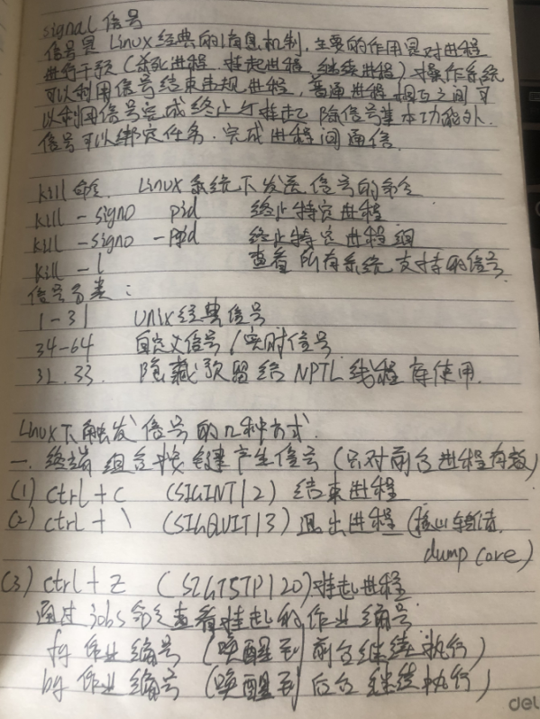
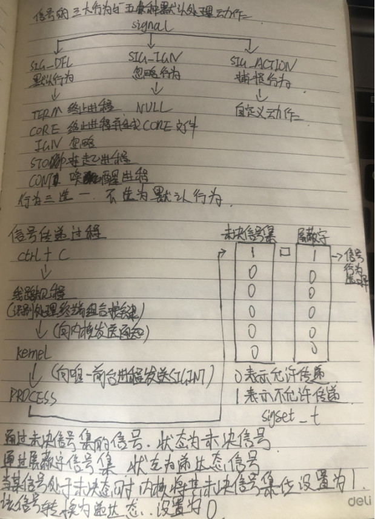
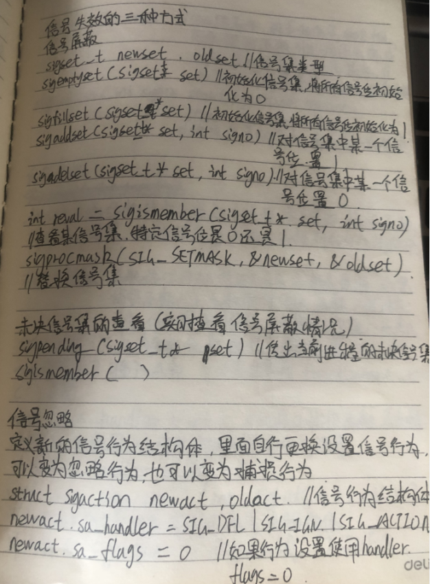
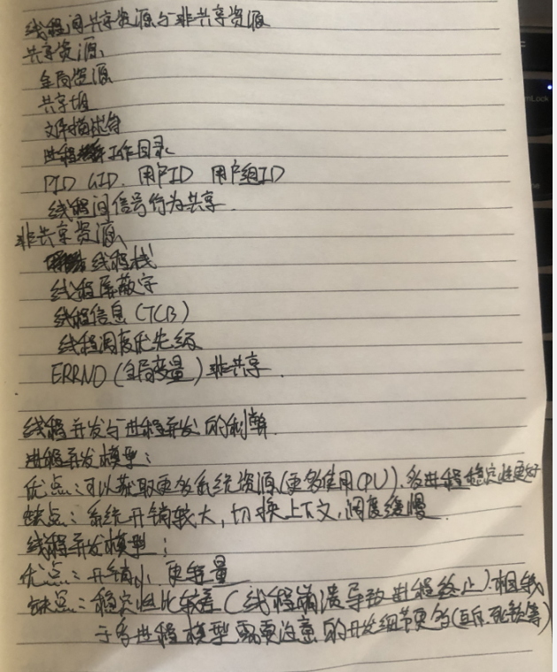

####   进程\线程

**进程**

+ 独立性：进程是系统进行资源分配的和调度的一个独立单位
+ 结构性：进程由程序、数据、进程控制块三部分组成
+ 动态性：进程是程序的一次执行过程，是临时的，有生命周期的，是动态产生、动态消亡的
+ 并发性：任何进程都可以同其他进程一起并发执行

**线程**：是cpu调度和执行工作的基本单元（包括线程栈和内核对象）

**进程与线程的区别与联系：**

+ 一个进程由一个或多个线程组成
+ 进程之间相互独立，但同一个进程下的各个线程之间共享程序的内存空间（包括代码段、数据集、堆等）
+ 线程上下文切换比进程上下文切换要快的多

```c++
CreateThread(NULL,			//安全等级
            0,				//线程栈大小，默认1MB
            &ThreadProc,	//线程函数的地址
            (void*)666,		//线程函数的参数
            0,				//创建线程的初始状态，0-创建即执行，CREATE_SUSPENDED-创建即挂起
            NULL			//线程ID)
```

```c++
_beginThreadex是c|c++运行时库里的函数，是对CreateThread的封装
```

每个线程分配一个stack，每个进程分配一个heap

**内核对象**

​	每一次对CreateThread()成功调用，系统就会在内部为新的线程分配一个内核对象。内核对象是实现线程管理的函数，通过句柄我们可以得到内核对象，内核对象是提供给用户与系统内核之间交互的接口，内核对象包含计数器、挂起计数器、信号、以及线程上下文等

个人理解：内核对象用于管理进程、线程和文件等诸多种类的大量资源。进程的虚拟内存空间分为内核层和应用层，每个内核对象，其实就是一块内存块，这个内存块位于操作系统的内核地址空间（内核层），而用户的应用程序运行在应用层，内核对象是由操作系统内核分配的，并只能由操作系统内核访问。因此，应用程序不能直接操作内核对象，需要用Windows系统给定的函数来操作。每一个内核对象都有特定的创建函数和操作函数。


**线程退出**：线程退出时会有信号

```c++
if(handle){
	quitflag = true;
    if(WAIT_TIMEOUT == WaitForSingleObject(handle,100)){	//阻塞函数，如果线程没有结束成功（可能线程中有循环的工作）
        TerminateThread(handle,-1);
    }
    CloseHandle(handle);	//关闭句柄（内核对象），计数器减一
    handle = NULL;
}
SuspendThread();	//挂起计数器+1
ResumeThread();		//挂起计数器-1
```

**线程的基本状态**


**sleep不能精准延时：**sleep的时间是告诉系统多长时间内不占用时间片，进入阻塞态，时间过后，进入就绪状态，线程被添加到就绪队列中，等待时间片的轮换。

**并发问题：**多个线程或进程同时对一个资源进行读写操作，而导致结果错误或多次执行结果不一致

**解决并发问题的办法：线程同步**

**线程同步：**通过协调线程执行的顺序，避免多个线程同时操作同一个资源导致并发问题，使多次执行结果一致

**线程同步方式（win)：**原子访问、关键段、内核对象：互斥量 （同一时刻只允许一个线程访问一个代码段）、事件（人工事件）、信号（因为可以设置初始化的信号数量，所以可以控制指定线程数工作）

互斥量与关键段的区别：1.作用范围（关键段只能在一个进程中使用，互斥量可以在不同进程使用）

​										   2.灵活、安全（互斥量更灵活和安全，因为可以设置等待时间，如果拥有互               												斥量的进程或者线程被强制结束，互斥量会被释放）

​										   3.效率（关键段效率更高，互斥量每次使用要切换到内核模式）	

**常见的并发问题：**买票，双11下单

**进程间通信：**事件、互斥量、信号量、dll、SOCKET、消息、共享内存

+ 关键段（临界区） 同一时刻只允许一个线程访问一个代码段

+ （1）直接阻塞

  （2）旋转锁（等待一会，还是运行态，如果一段时间过后，还在阻塞，变为阻塞态）

  （3）异步

+ 注意事项：

  （1）在同一进程

  （2）如果关键段中的线程被强制杀死，会影响其他线程

```c++
#include<Windows.h>
class MyCrit
{
private:
	CRITICAL_SECTION cs;
public:
	MyCrit()
	{
		InitializeCriticalSection(&cs);
	}
	~MyCrit()
	{
		DeleteCriticalSection(&cs);
	}
	void Lock()
	{
		EnterCriticalSection(&cs);
	}
	void UnLock()
	{
		LeaveCriticalSection(&cs);
	}
	
};
```


#### 进程切换上下文

进程是由内核管理和调度的，所以进程的切换只能发生在内核态。

所以，**进程的上下文切换不仅包含了虚拟内存、栈、全局变量等用户空间的资源，还包括了内核堆栈、寄存器等内核空间的资源。**

通常，会把交换的信息保存在进程的 PCB，当要运行另外一个进程的时候，我们需要从这个进程的 PCB 取出上下文，然后恢复到 CPU 中，这使得这个进程可以继续执行

+ 保护被中断进程的处理器现场信息

+ 修改被中断进程的进程控制块有关信息，如进程状态等

+ 把被中断进程的进程控制块加入有关队列
+ 选择下一个占有处理器运行的进程
+ 根据被选中进程设置操作系统用到的地址转换和存储保护信息
  + 切换页目录以使用新的地址空间
  + 切换内核栈和硬件上下文（包括分配的内存，数据段，堆栈段等）

+ 根据被选中进程恢复处理器现场

#### 线程切换上下文

+ 保护被中断线程的处理器现场信息

+ 修改被中断线程的线程控制块有关信息，如线程状态等

+ 把被中断线程的线程控制块加入有关队列

+ 选择下一个占有处理器运行的线程

+ 根据被选中线程设置操作系统用到的存储保护信息
  + 切换内核栈和硬件上下文（切换堆栈，以及各寄存器）

+ 根据被选中线程恢复处理器现场

#### 多线程和多进程

+ 一个线程属于一个进程，一个进程包含多个线程
+ 一个线程挂掉，对应的进程挂掉，多线程也挂掉。一个进程挂掉，不会影响其他进程，多进程稳定
+ 进程系统开销显著大于线程开销。线程需要的系统资源更少
+ 多个进程在执行时拥有各自独立的内存单元。多个线程共享进程的内存，如代码段、数据段、扩展段；但每个线程拥有自己的栈段和寄存器组。
+ 通信方式不一样

#### 用户态和内核态

​	用户空间的代码只能访问一个局部的内存空间，而内核空间的代码可以访问所有内存空间。因此，当程序使用用户空间时，我们常说该程序在**用户态**执行，而当程序使用内核空间时，程序则在**内核态**执行。

**应用程序如果需要进入内核空间，就需要通过系统调用**


​	内核程序执行在内核态，用户程序执行在用户态。当应用程序使用系统调用时，会产生一个中断。发生中断后， CPU 会中断当前在执行的用户程序，转而跳转到中断处理程序，也就是开始执行内核程序。内核处理完后，主动触发中断，把 CPU 执行权限交回给用户程序，回到用户态继续工作。

​	内核态拥有最高权限，可以访问所有系统指令；用户态则只能访问一部分指令。

什么时候进入内核态：系统调用、异常、中断

#### 中断

​	中断是系统用来响应硬件设备请求的一种机制，操作系统收到硬件的中断请求，会打断正在执行的进程，然后调用内核中的中断处理程序来响应请求。

**为了解决中断处理程序执行过长和中断丢失的问题，将中断过程分成了两个阶段，分别是「上半部和下半部分」**。

- **上半部用来快速处理中断**，一般会暂时关闭中断请求，主要负责处理跟硬件紧密相关或者时间敏感的事情。
- **下半部用来延迟处理上半部未完成的工作**，一般以「内核线程」的方式运行。

**硬中断：主要是负责耗时短的工作，特点是快速执行**

**软中断：主要是负责上半部未完成的工作，通常都是耗时比较长的事情，特点是延迟执行；**


#### 缺页中断

+ **缺页异常**：malloc和mmap函数在分配内存时只是建立了进程虚拟地址空间，并没有分配虚拟内存对应的物理内存。当进程访问这些没有建立映射关系的虚拟内存时，处理器自动触发一个**缺页异常，引发缺页中断**。
+ **缺页中断**：缺页异常后将产生一个缺页中断，此时操作系统会根据页表中的**外存地址**在外存中找到所缺的一页，将其调入**内存**。
+ **一般中断和缺页中断的区别：**缺页中断与一般中断一样，需要经历四个步骤：保护CPU现场、分析中断原因、转入缺页中断处理程序、恢复CPU现场，继续执行。 缺页中断与一般中断区别： （1）在指令执行期间产生和处理缺页中断信号 （2）一条指令在执行期间，可能产生多次缺页中断 （3）缺页中断返回的是执行产生中断的一条指令，而一般中断返回的是执行下一条指令。


#### **分时复用原则**

​	多任务操作系统，cpu转移复用是一个重要特征，可以让多进程共享cpu资源，每个进程会以时间片为单位使用特定时长，交替使用

#### **保存与恢复处理器现场**

​	解决寄存器冲突的问题

​	cpu用来保存临时数据的寄存器有限，为了让多进程很好地使用寄存器不引发冲突，在进程切换时通过保存/恢复处理器现场（保存临时数据及运算过程）的方式多进程共享使用寄存器，每一个进程被中断继续后都能正常向下执行，一个成熟的多任务系统，分时复与保存恢复处理器现场，这两个都是不可获取的。

#### 死锁

​	当两个线程为了保护两个不同的共享资源而使用了两个互斥锁，那么这两个互斥锁应用不当的时候，可能会造成两个线程都在等待对方释放锁，在没有外力的作用下，这些线程会一直相互等待，就没办法继续运行，这种情况就是发生了**死锁**。

- 互斥条件；
- 持有并等待条件；
- 不可剥夺条件；
- 环路等待条件

#### Linux虚拟内存分布


+ 代码段：存放程序执行代码
+ 数据段：存放程序中已经初始化的全局变量和静态变量的一块内存区域
+ BSS段：存放未初始化的全局变量和静态变量的一块内存区域
+ 堆区：动态申请内存用，堆从低地址向高地址增长
+ 共享区：包括动态库和共享内存等，低地址向高地址增长
+ 栈区：包括局部变量、函数参数值、函数调用的上下文等、
+ 命令行参数
+ 环境变量
+ PCB

#### 虚拟内存

​	操作系统为每一个进程分配一个独立的地址空间，但是虚拟内存。进程持有的虚拟地址会通过 CPU 芯片中的内存管理单元（MMU）的映射关系，来转换变成物理地址，然后再通过物理地址访问内存。主要有两种方式，分别是**内存分段和内存分页**

**分页是把整个虚拟和物理内存空间切成一段段固定尺寸的大小**。这样一个连续并且尺寸固定的内存空间，我们叫**页**（*Page*）


页表是存储在内存里的，**内存管理单元** （*MMU*）就做将虚拟内存地址转换成物理地址的工作。

内存分页由于内存空间都是预先划分好的，也就不会像内存分段一样，在段与段之间会产生间隙非常小的内存，这正是分段会产生外部内存碎片的原因。而**采用了分页，页与页之间是紧密排列的，所以不会有外部碎片。**

但是，因为内存分页机制分配内存的最小单位是一页，即使程序不足一页大小，我们最少只能分配一个页，所以页内会出现内存浪费，所以针对**内存分页机制会有内部内存碎片**的现象。

**在分页机制下，虚拟地址分为两部分，页号和页内偏移。页号作为页表的索引，页表包含物理页每页所在物理内存的基地址，这个基地址与页内偏移的组合就形成了物理内存地址，见下图。**


**总结一下，对于一个内存地址转换，其实就是这样三个步骤：**

- 把虚拟内存地址，切分成页号和偏移量；
- 根据页号，从页表里面，查询对应的物理页号；
- 直接拿物理页号，加上前面的偏移量，就得到了物理内存地址。

在 32 位的环境下，虚拟地址空间共有 4GB，假设一个页的大小是 4KB（2^12），那么就需要大约 100 万 （2^20） 个页，每个「页表项」需要 4 个字节大小来存储，那么整个 4GB 空间的映射就需要有 `4MB` 的内存来存储页表。

**多级页表**


如果使用了二级分页，一级页表就可以覆盖整个 4GB 虚拟地址空间，但如果某个一级页表的页表项没有被用到，也就不需要创建这个页表项对应的二级页表了，即可以在需要时才创建二级页表。做个简单的计算，假设只有 20% 的一级页表项被用到了，那么页表占用的内存空间就只有 4KB（一级页表） + 20% * 4MB（二级页表）= `0.804MB`，这对比单级页表的 `4MB` 是不是一个巨大的节约？

**TLB**

把最常访问的几个页表项存储到访问速度更快的硬件，在 CPU 芯片中，加入了一个专门存放程序最常访问的页表项的 Cache，**这个 Cache 就是 TLB（*Translation Lookaside Buffer*）** ，通常称为页表缓存、转址旁路缓存、快表等。

**段页式内存管理**

段页式内存管理实现的方式：

- 先将程序划分为多个有逻辑意义的段，也就是前面提到的分段机制；
- 接着再把每个段划分为多个页，也就是对分段划分出来的连续空间，再划分固定大小的页；


段页式地址变换中要得到物理地址须经过三次内存访问：

- 第一次访问段表，得到页表起始地址；
- 第二次访问页表，得到物理页号；
- 第三次将物理页号与页内位移组合，得到物理地址。

#### malloc

​	malloc() 并不是系统调用，而是 C 库里的函数，用于动态分配内存，虚拟内存

- 方式一：通过 brk() 系统调用从堆分配内存
- 方式二：通过 mmap() 系统调用在文件映射区域分配内存；

方式一实现的方式很简单，就是通过 brk() 函数将「堆顶」指针向高地址移动，获得新的内存空间。如下图：


方式二通过 mmap() 系统调用中「私有匿名映射」的方式，在文件映射区分配一块内存，也就是从文件映射区“偷”了一块内存。如下图：


**什么场景下 malloc() 会通过 brk() 分配内存？又是什么场景下通过 mmap() 分配内存？**

malloc() 源码里默认定义了一个阈值：

- 如果用户分配的内存小于 128 KB，则通过 brk() 申请内存；
- 如果用户分配的内存大于 128 KB，则通过 mmap() 申请内存；

#### **volatile**

​	提醒编译器它后面所定义的变量随时都有可能改变，因此编译后的程序每次需要存储或读取这个变量的时候，都会直接从变量地址中读取数据。如果没有volatile关键字，则编译器可能优化读取和存储，可能暂时使用寄存器中的值，如果这个变量由别的程序更新了的话，将出现不一致的现象。

#### 大小端

**大异小同**

大端：低地址存数据的高位，网路字节序

小端：低地址存数据的地位，x86，ARM


```c++
void judge_bigend_littleend()
{
    union
    {
        int i;
        char c;
    }un;
    un.i = 1;

    if (un.c == 1)
        printf("小端\n");
    else
        printf("大端\n");
}
```

```c++
void judge_bigend_littleend()
{
    int i = 1;
    char c = (*(char*)&i);

    if (c)
        printf("小端\n");
    else
        printf("大端\n");
}
```

#### 库

+ 静态库：可以看成是一组目标文件（.o/.obj）的集合，在链接阶段将代码直接插入到生成的可执行文件中，会导致体积变大，但是只需要一个文件就可以运行

  **缺点：**

  + 空间浪费
  + 静态库对程序的更新、部署会带来麻烦。如果静态库更新了，所有使用它的程序都需要重新编译、发布给用户（对用户来说只是很小的更新，却需要重新下载程序）

+ 动态库：在链接阶段，将引入库（函数名，函数位置）拷贝到.exe中。(.lib 动态库的导入库 .dll动态库)（exe和dll在同级目录下运行）。

无论是静态库或者是动态库，都需要lib,静态库中本身就包含了实际执行的代码，而导入库只包含了地址符号表等，确保程序找到对应函数的一些基本地址信息。其实际的执行代码位于动态库中

如果想要使用库文件，需要引入头文件(动态库的显示加载不需要），要不然会发生编译错误，因为库文件在链接阶段生效。

静态库中的所有代码外面可以直接用

动态库中的所有代码为私有的

**将函数和类导出为外界可用有两种方式：**

1. 适用于类和函数，导出为程序类型

   

2. 添加->新建项->代码->模块定义文件（适用于函数，不适用于类，以c语言导出）

   

   LIBRARY+库的名字   @+函数的位置

   ```c++
   extern "C"	//以什么语言进行编译
   ```

   

**使用库：**

0. 拷贝库文件和头文件到当前工程下

1. 导入依赖库
2. 添加依赖库的头文件

**导入库的三种方式：**

1. 

```c++
#pragma comment(lib,"./lib/static.lib");	//隐式加载，在链接期加载 
```

2. 属性->链接器->附加依赖项->相对路径

3. 动态库特殊的加载方式：显示加载，运行时加载，只需要.dll

   ```c++
   //1. 加载库
   HMODULE hMoudle = LoadLibrary(L"Lib.dll");
   //2. 获取函数地址
   PFUN pfun = (PFUN)GetProcAddress(hMoudle,"add");
   cout<<(*pfun)(6,6)<<endl;
   //3. 卸载库
   FreeLibrary(hMoudle);
   ```


#### fork

​	fork()调用一次返回两次（两个进程执行一个函数），在父进程中返回子进程的pid(pid > 0)，在子进程中返回0(pid==0)

**读共享，写复制**

​	fork创建子进程的时候，系统为了减少损耗，并不是一开始就复制了一份物理内存给子进程，而是复制了一份虚拟地址给子进程，父子进程的虚拟地址映射到相同的物理地址。该物理地址被标记为只读。当系统需要对该地址进行写的时候，此时系统才会调用exec函数给子进程复制一份自己的物理地址，然后他们各自的物理地址被标记为可写。

```c
pid_t pid = getpid()	#返回调用进程的id;
pid_t pid = getppid()	#返回调用进程父进程的id
```

**execve系统函数：**

+ execl：每一个参数都为字符串
+ execle：自定义环境变量
+ execlp：无需填写命令的详细地址
+ execv：将参数放在数组中，然后传递数组地址
+ execvp

```c
execl("/home/zh/proc/copy","copy",argv[1],argv[2],index,size,NULL);
execlp("./copy","copy",argv[1],argv[2],index,size,NULL);
//如果子进程需要完成自定义任务，需要在fork()之后，execl()之前完成
```


#### 僵尸进程

​	父子进程模型中，子进程先于父进程结束，父进程又没有回收子进程，子进程会先变为僵尸进程

危害：

+ 有内存泄露（PCB是庞大的结构体，内部成员众多许多成员还额外占用内存空间）
+ 僵尸进程导致PCB残留，影响新进程的创建

```c
pid_t pid = wait(int *status);	//阻塞回收，父进程通过该函数回收子进程的资源
pid_t pid = waitpid(pid_t pid,int *status,int opt);	//默认情况下waitpid()也是阻塞回收，可以通过设置opt设置为非阻塞
argument pid:
-1:回收任意子进程;
>0:通过pid指定回收一个子进程;
0:同组回收方案，可以帮助调用进程将本进程组所有子进程回收;
<0:跨组回收方案，-pgid,到指定进程组回收子进程;
argument status:
回收成功传出子进程的结束原因,父进程可以校验，如果不需要则传NULL;
argument opt:
WNOHANG:非阻塞关键字;
return value:
-1:回收失败;
>0:回收成功，返回僵尸进程的pid;
0:非阻塞返回
```

#### 进程间通信

消息队列（SystemV，Posix）

 管道（匿名管道PIPE，命名管道FIFO）

内存共享映射（mmap）

网络套接字（socket)

信号（signal)


##### **管道**

**匿名管道（PIPE）**

使用pipe在内核空间创建一个缓冲区（环形队列）大小为4kB.，创建管道返回两个描述符，fd[0]为读端描述符，fd[1]为写端描述符，使用匿名管道，必须确定通信的方向，例如，父写子读，父子进程要将自身不用的那端关掉

**特性**

+ 流通性（可以利用此介质传递）
+ 暂存数据
+ 方向性（数据流通方向）

```c
#include<unistd.h>
int pipe (int fd[2])
```

**特殊情况**

+ 写端存在未向管道写数据，读端读取管道内数据，管道为空读端阻塞
+ 写端结束，读端读取完管道剩余的内容，再次读返回-1，读取结束
+ 读端存在但未读数据，写端持续向管道内写数据，写满管道后，写端阻塞
+ 读端结束，写端尝试向管道内写数据，内核向写端发送信号，杀死写端进程

**缺点**

1. 使用受限，只能完成亲缘间进程通信（父子进程）
2. 默认传输无格式字节流（不便于读取解析与处理）
3. 单工使用

**有名管道 FIFO**

​	有名管道帮助Linux下不相干的进程完成数据通信


**特殊情况**


##### mmap内存共享映射


##### 信号









#### 进程间关系

##### 进程组关系


##### 进程会话关系


##### 孤儿进程


**守护进程（精灵进程）**


#### 线程




#### **线程间通信**

+ 互斥锁
+ 读写锁
+ 条件变量


